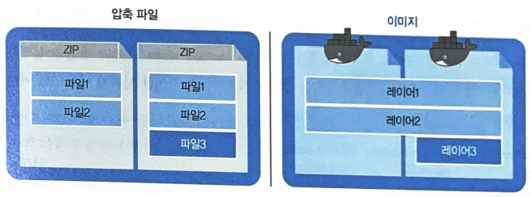
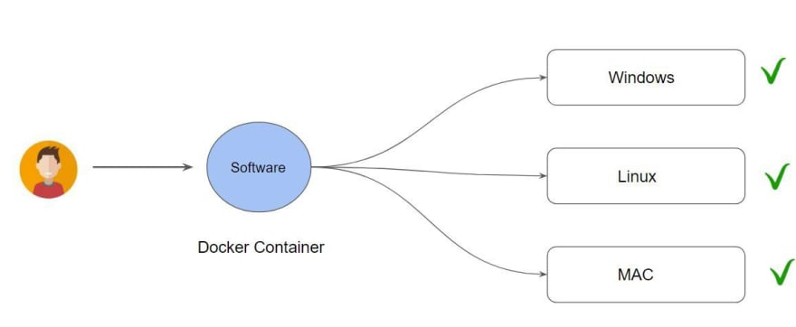
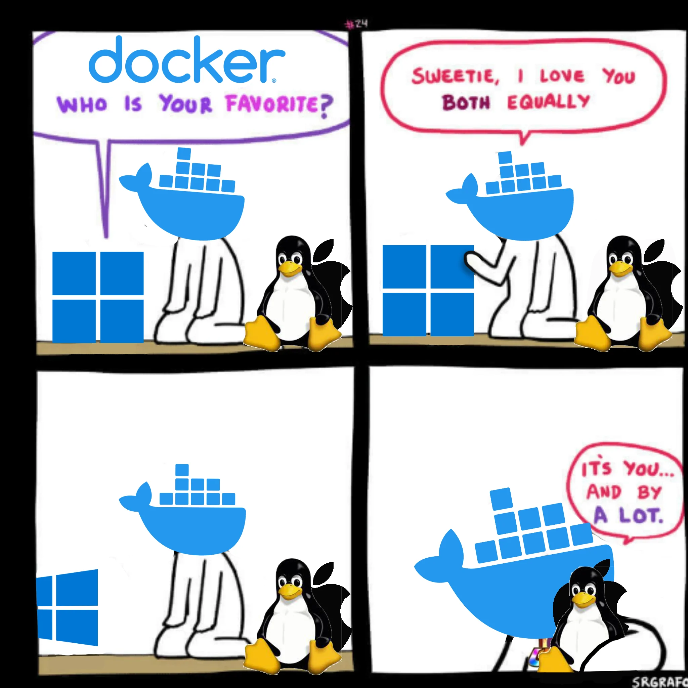
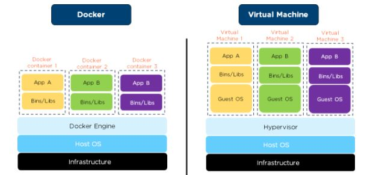
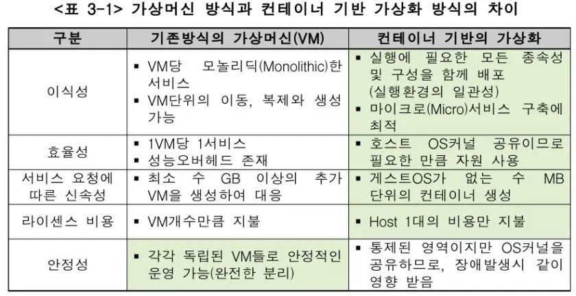
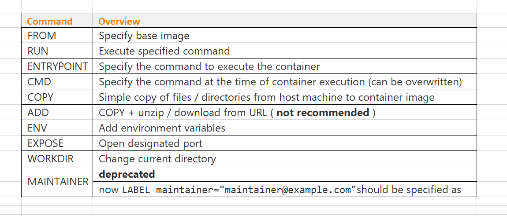
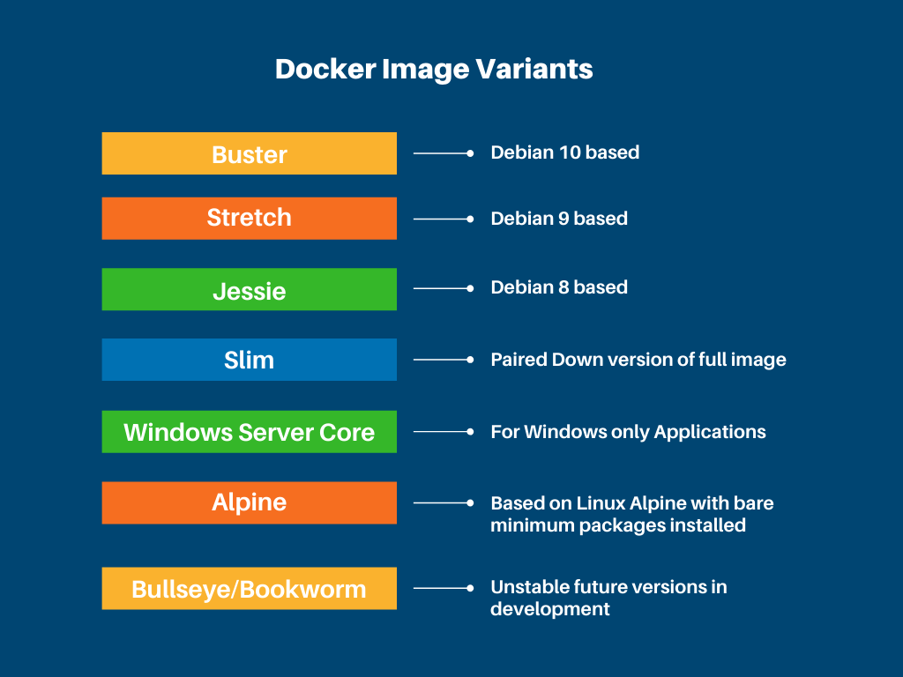
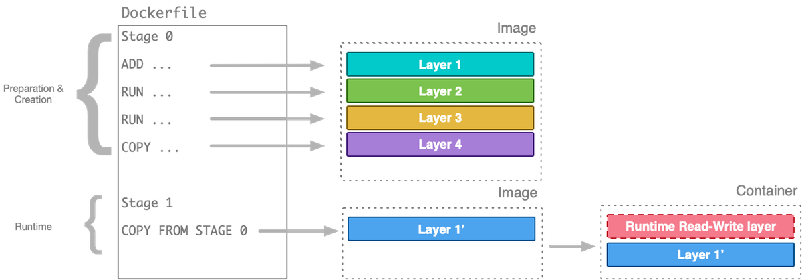

  
# 도커

[Online Playground](https://labs.play-with-docker.com/)

### 1. 도커란?

1. 애플리케이션 개발, 운반, 실행을 위한 오픈소스 가상화 플랫폼 

    \- **가상화?** 하드웨어(물리적 자원)를 효율적으로 활용하기 위해서 하드웨어 공간 위에 가상의 머신을 만드는 기술

2. 컨테이너 기술을 기반으로 한 가상화 플랫폼 

    \- **컨테이너?** 호스트 os의 기능을 그대로 사용하면서 프로세스를 격리해 독립된 환경을 만드는 기술

> "도커 = 독립된 가상의 환경을 통해 하드웨어를 효율적으로 활용하는 기술 + [운반](https://hub.docker.com/search?q=)"

---


도커 이미지 - 밀키트 \
도커 컨테이너 - 음식 \
도커 파일 - 밀키트 공정 

--- 

### 1-1. 도커 이미지 (밀키트)

- 컨테이너를 정의하는 읽기 전용 템플릿 -> 애플리케이션을 실행시키는데 필요한 모든 것이 준비되어 있음, 이거 하나면 애플리케이션 실행 가능
- 코드에 필요한 라이브러리 및 종속성에 대한 정의와 실행되는 코드를 포함
- Layer: 기존 이미지에 추가적인 코드/파일이 존재할 때 이미지를 처음부터 다시 다운로드 받는 대신 새롭게 필요한 부분만 추가하기 위한 개념 -> 빌드 속도, 용량 관리에 이점
    - https://creboring.net/blog/how-docker-divide-image-layer/
     


### 1-2. 도커 컨테이너 (음식)

- 인스턴스화된(실행된) Docker 이미지, 도커 이미지를 기반으로 실행되는 프로세스 -> 애플리케이션
- BORA (Build Once, Run AnyWhere) - 이미지를 한 번 빌드하면 어느 환경에서나 동일한 동작을 보장한다
     
    

- VS 가상머신

     
    - 정리
     
    
### 1-3. 도커 파일 (밀키트 공정)

- 컨테이너 내부에 설치할 소프트웨어, 설정값, 실행 명령 등을 명시하는 스크립트 형태의 파일
- "Dockerfile"을 작성하고 빌드하면 도커 이미지 생성

    ``` Dockerfile
    # FROM: 기반이 되는 도커 이미지
    FROM golang:1.14.1-alpine3.11

    # COPY: 빌드할 머신에 있는 파일을 복사
    COPY ./main.go ./

    # RUN: 빌드 시 명령어를 실행
    RUN go build -o main .

    # ENTRYPOINT: 컨테이너가 기동할 때 실행하는 명령어
    ENTRYPOINT ["./main"]
    ```
- Dockerfile Cheat Sheet
     

### 1-4. 도커 CLI

 

### 1-5. 도커 레지스트리 (=깃허브)

- 로컬에만 이미지를 저장하는 게 아니라 깃허브처럼 원격에 올려서 관리하고 싶다 -> 도커 레지스티리
- 종류
    - 도커 허브
    - GCR
    - ECR
    - ...

### 2. 도커 컨테이너 심화

- 1 컨테이너 1 프로세스: 컨테이너는 원래 하나의 프로세스를 시키기 위한 환경을 패키징함으로써 프로세스를 쉽게 실행하기 위한 도구
- 변경 불가능한 인프라 이미지 생성: 외부에서 파일을 가져와서 활용하는 경우, 외부 파일이 변경되거나 삭제되면 컨테이너 실행 결과도 달라지는 문제가 발생할 수 있음
- 도커 이미지는 최대한 경량으로
    - 릴리즈 버전
         
    - 멀티 스테이지 빌드
         
- 프로세스를 실행하는 계정의 권한을 최소화: root는 조금 위험할 수 있다
