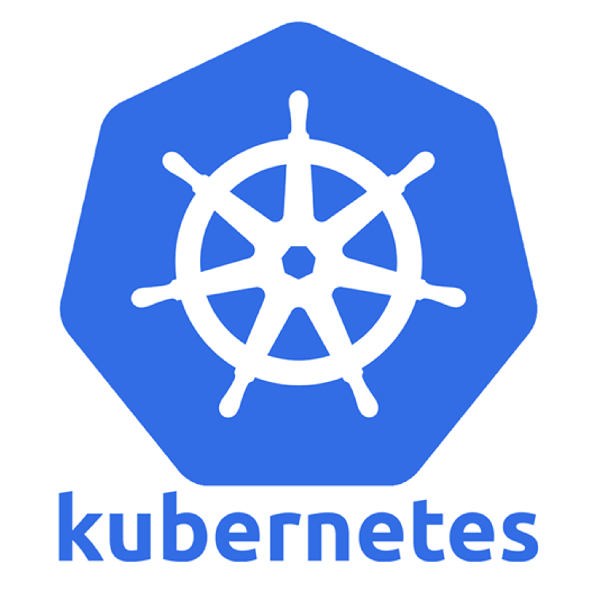
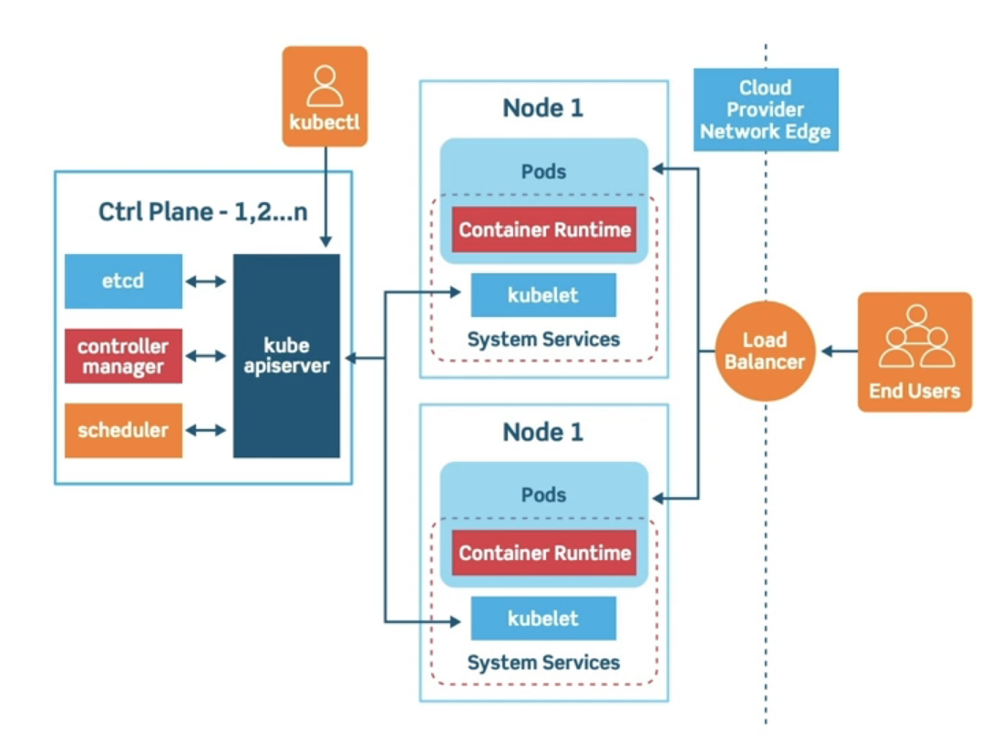
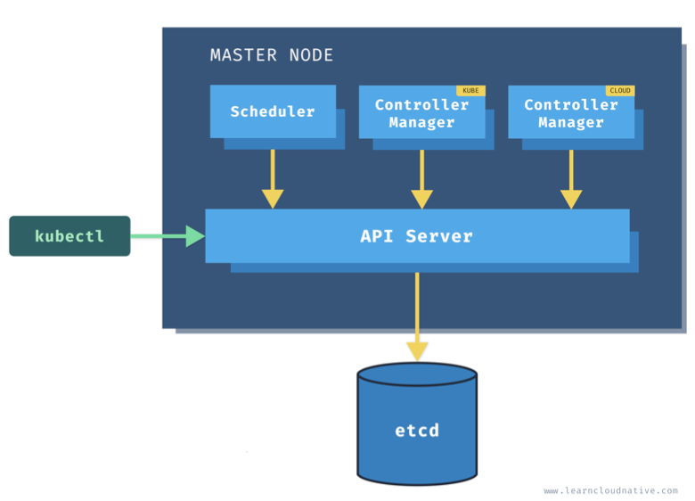
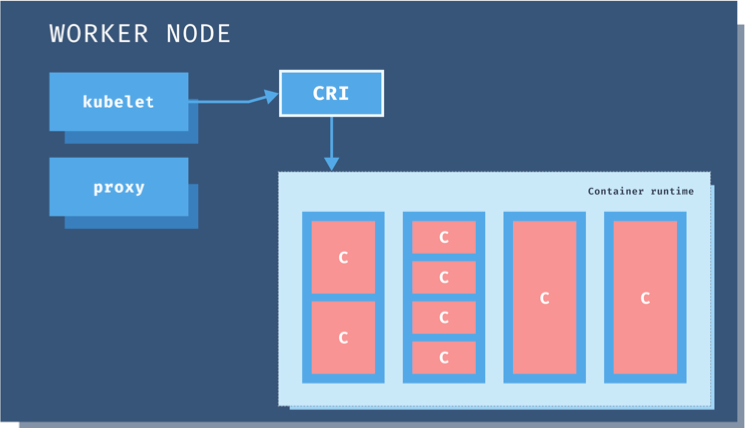

# 쿠버네티스

### 1. 쿠버네티스란?

> 컨테이너화된 애플리케이션의 배포, 확장 등을 관리하는 것을 자동화하기 위한 플랫폼 (컨테이너 오케스트레이션 엔진)

### 1-1. 쿠버네티스 클러스터

- 쿠버네티스 노드
  > 컨테이너가 기동하는 노드
- 쿠버네티스 마스터
  > 쿠버네티스 노드를 관리하는 노드

### 1-2. 쿠버네티스 마스터

- 스케쥴러
  > 각 노드의 리소스 사용 상태 관리
- 컨트롤러 매니저
  - Cloud 컨트롤러 매니저
    > 클라우드 provider들(aws, gcp, azure 등)과 통신
  - Kube 컨트롤러 매니저
    > etcd 리소스 상태 변화 감지 및 클러스터 리소스에 반영
- Kube API Server
  > 쿠버네티스 리소스와 클러스터의 상태 관리 및 동기화를 위한 API 제공
- etcd
  > 분산 key-value 저장소로 클러스터의 상태 저장

### 1-3. 쿠버네티스 노드

- pod
  - 가장 작은 배포 단위
  - 컨테이너 그룹
  - 같은 네트워크 환경을 공유
- node
  - 같은 리소스를 공유

### 2. 쿠버네티스 특징

### 2-1. 선언적 코드를 사용한 관리(IaC)

- YAML 형식이나 JSON 형식으로 작성한 매니페스트를 통해 배포하는 컨테이너로 주변 리소스를 관리 가능 -> IaC (Infrastructure as Code)

### 2-2. 스케일링/오토 스케일링

- 같은 컨테이너 이미지를 기반으로 한 여러 레플리카를 배포 -> 부하 분산 & 다중화 구조 (스케일링)
- 부하에 따라 레플리카 수를 자동으로 조절 가능 (오토 스케일링)

### 2-3. 스케줄링

> 컨테이너를 어떤 노드에 배포할 것인지 결정

- 어피니티, 안티어피니티 기능 -> 워크로드 특징, 노드 성능 기준으로 스케줄링 가능
  - 디스크 I/O가 많은 컨테이너는 디스크가 SSD인 노드에 배치
  - 클러스터를 GCP/AWS/OpenStack 등에 구축한 경우 멀티존 위에 컨테이너 분산 배치

### 2-4. 리소스 관리

- 기본적으로 노드의 리소스 상태에 따라 스케줄링이 됨 -> 관리 필요 x
- 리소스 사용 상태에 따라 오토 스케일링

### 2-5. 자동화된 복구

1. 컨테이너 프로세스 모니터링 (HTTP/TCP, 셸 스크립트로 헬스 체크)
2. 프로세스 정지 감지
3. 컨테이너 스케줄링
4. 컨테이너 배포

### 2-6. 로드 밸런싱과 서비스 디스커버리

- 로드 밸런서 기능
  - 컨테이너 그룹에 라우팅하는 엔드포인트 할당 가능
  - 컨테이너 확장 시 엔드포인트가 되는 서비스에 컨테이너 자동 등록 및 삭제
  - 컨테이너 장애 시 분리
  - 컨테이너 롤링 업데이트 시 필요한 사전 분리 작업
- 서비스 디스커버리
  > 각각의 마이크로서비스가 정의된 매니페스트를 이용하여 시스템 전체를 쉽게 연계

### 2-7. 데이터 관리

> 백엔드 데이터 스토어 etcd

- 컨테이너 설정 파일, 인증 정보 등의 데이터 저장
- etcd는 이중화가 가능
- 매니페스트 파일도 이중화 구조로 저장

### 2-8. 연계 및 확장

- 연계
  - Ansible
  - Apache Ignite
  - Fluentd
  - GitLab
  - Jenkins
  - OpenStack
  - Promsetheus
  - Spark
  - Spinnaker
  - Kubeflow
  - Rook
  - Vitess
- 확장
  - 기능 확장 및 추가 가능
  - 쿠버네티스를 프레임워크로 자체 플랫폼 구현 가능

### 3. 쿠버네티스 환경

- 로컬 쿠버네티스
  - 물리 머신 한 대에 구축하여 사용
  - **테스트 및 개발 환경**으로 적합
- 쿠버네티스 구축 도구
  - 도구를 사용하여 온프레미스/클라우드에 클러스터를 구축하여 사용
  - **스테이징 및 서비스 환경**으로 적합
  - 온프레미스에 배포, 세밀한 커스터마이즈
- 관리형 쿠버네티스 서비스
  - 퍼블릭 클라우드의 관리형 서비스로 제공하는 클러스터를 사용
  - **스테이징 및 서비스 환경**으로 적합

### 3-1. 로컬 쿠버네티스

| 항목          | 미니큐브 | Docker Desktop for Mac/Windows | kind |
| ------------- | -------- | ------------------------------ | ---- |
| 버전 선택     | O        | X                              | ◎    |
| 멀티 클러스터 | O        | X                              | O    |
| 멀티 노드     | X        | X                              | O    |
| 기능성        | ◎        | △                              | O    |
| 단순성        | O        | ◎                              | O    |

### 3-2. 쿠버네티스 구축 도구

- 큐브어드민
- 랜처
- 큐브스프레이
- kube-aws
- 캅스
- OpenStack Magnum

### 3-3. 관리형 쿠버네티스 서비스

- GKE (Google Kubernetes Engine)
  - 유지관리 쉬움
  - 다양한 기능
- AKS (Azure Kubernetes Service)
  - 마이크로소프트 도구 사용 가능
- EKS (Elastic Kubernetes Service)
  - 기능, 사용자 편의성 아쉬움
  - AWS 서비스 사용 가능

---

**GKE**

> 가장 먼저 출시된 관리형 쿠버네티스 서비스

- 클러스터 관리를 돕는 기능 많음 -> 클러스터 자체의 운용 부하 감소
- 쿠버네티스 노드로 GCE(Google Compute Engine)을 사용
  - 저비용 인스턴스
    > 가동 시간이 24시간으로 제약
  - 선점형 인스턴스
    - 비용 절감
    - 노드 정지 가능성 존재
    - 설정으로 서비스에 영향 없이 자동 복구 가능
- GCP(Google Cloud Platform)의 기능과 통합
  - 컨테이너 로그 수집
- 고가용성을 가진 HTTP 로드 밸런서, GPU 사용 가능
- 노드풀 기능
  > 노드에 레이블을 부여하여 그룹핑
