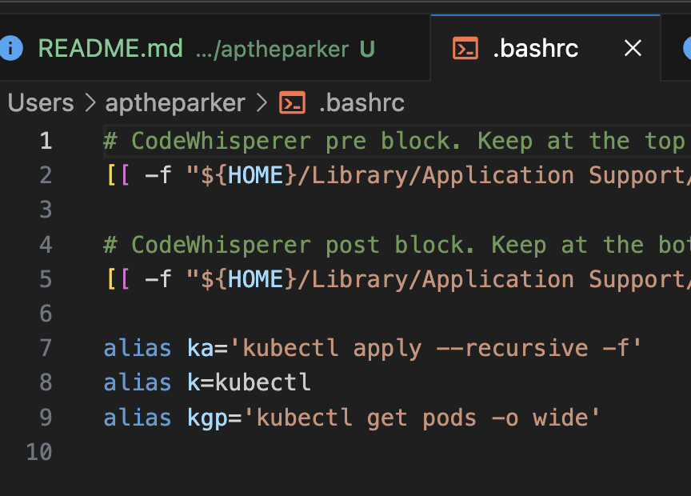
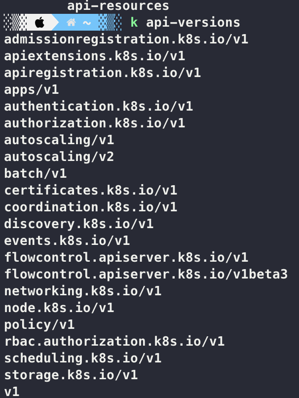
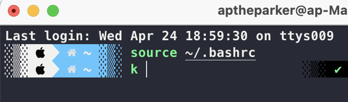
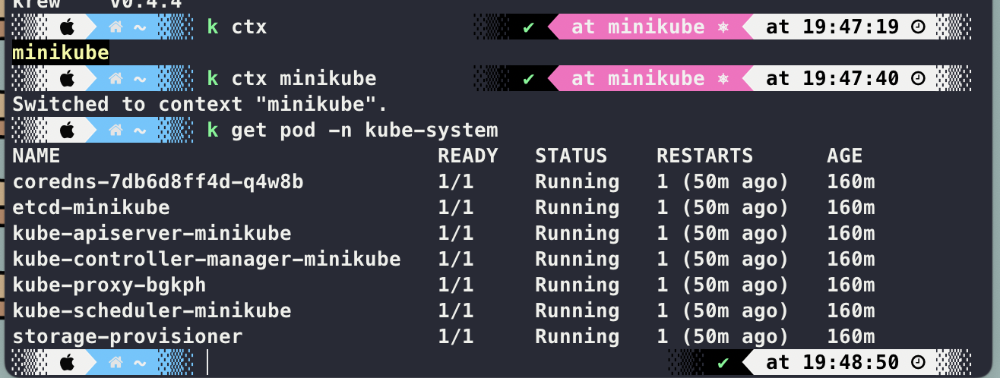
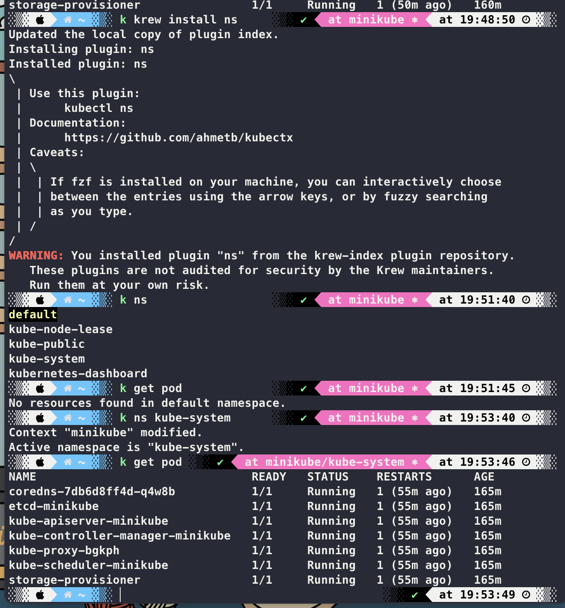

aptheparker's 과제

1. kubectl 명령어의 자동 완성 기능을 설정하고 자주 사용하는 kubectl 명령어를 {HOME}/.bashrc 파일에 Alias로 지정합니다.

- 자주 사용하는 kubectl 명령어를 Alias로 지정하기 위해 아래 명령어를 실행합니다.

```bash
echo 'alias k=kubectl' >> ~/.bashrc
```

- {HOME}/.bashrc 파일을 다시 읽어 Alias를 적용하기 위해 아래 명령어를 실행합니다.

```bash
source ~/.bashrc
```





2. kubectl 명령어 환경에 필요한 플러그인의 설치와 관리를 도와주는 krew 도구를 설치합니다.

- 설치 후 명령어 사용:
  ```bash
  kubectl krew search
  ```
  , 네임스페이스 관리도구 (kube-ns), Prompt Status 관리 도구 (kube-ps1)를 설치합니다.

- ctx
  
- ns
  
- ps1
  
