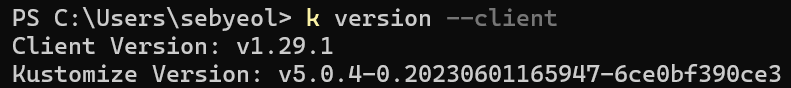
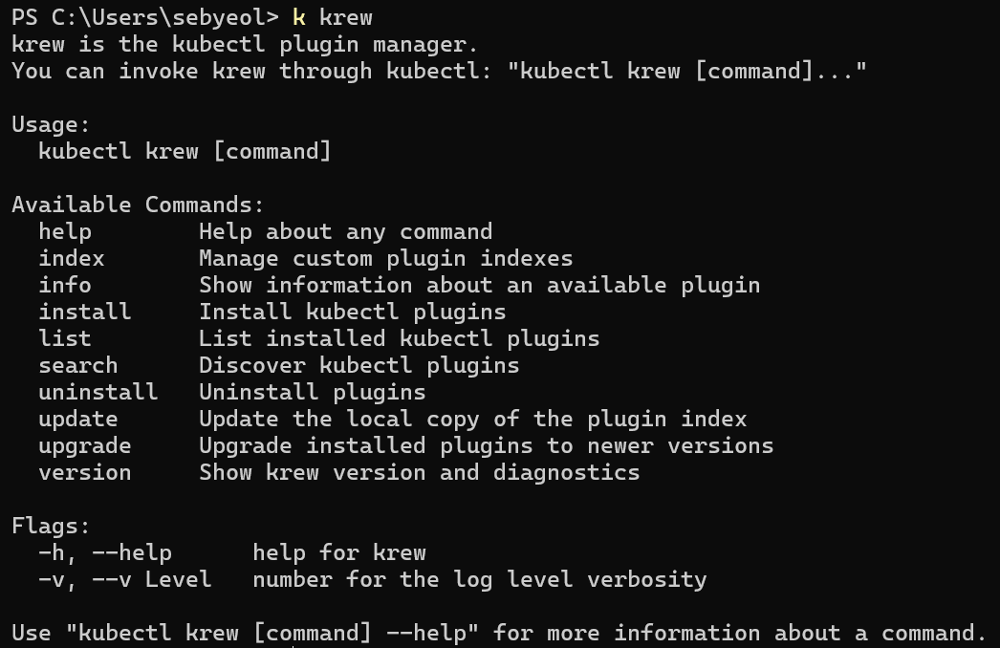
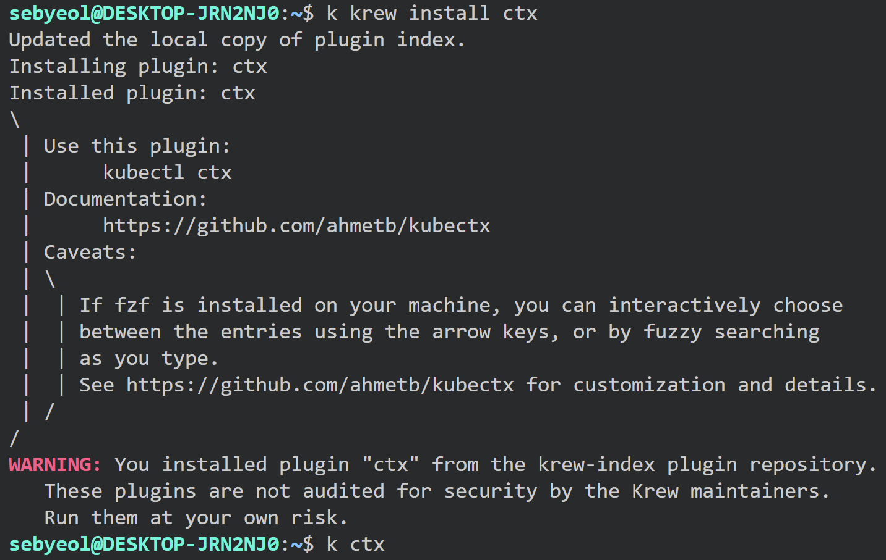
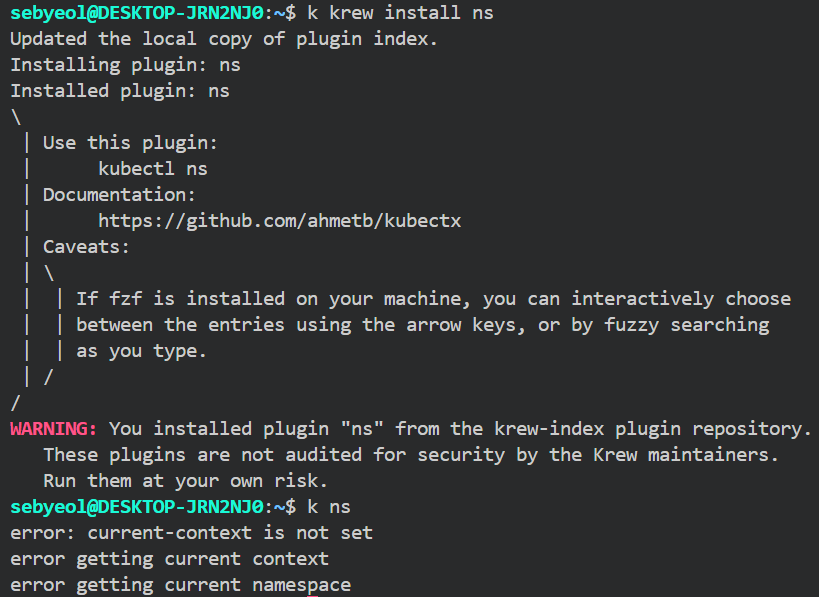
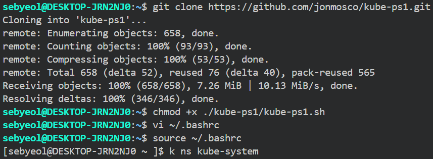

### #1

---

## kubectl 명령어의 자동 완성 기능을 설정하고 자주 사용하는 kubectl 명령어를 {HOME}/.bashrc 파일에 Alias로 지정합니다.

> alias



```powershell
echo "Set-Alias -Name k -Value kubectl" >> $PROFILE
```

> 자동 완성

```powershell
kubectl completion powershell >> $PROFILE
```

### #2

---

## kubectl 명령어 환경에 필요한 플러그인의 설치와 관리를 도와주는 krew 도구를 설치합니다.



```powershell
.\krew install krew
```

### #3

---

## 클러스터와 네임스페이스의 정보를 편리하게 변경해주는 쿠버네티스 컨텍스트 관리도구 (kube-ctx), 네임스페이스 관리도구 (kube-ns), Prompt Status 관리 도구 (kube-ps1)를 설치합니다.

> kube-ctx



> kube-ns



> kube-ps1


