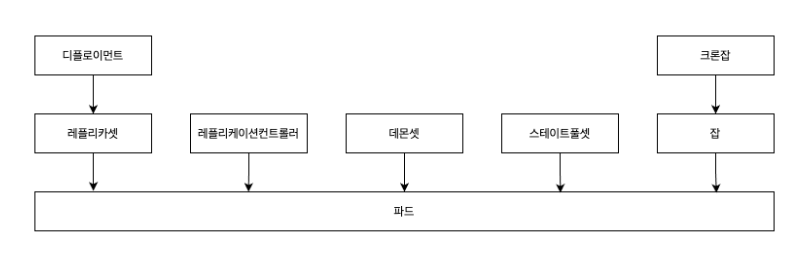

# 5. 워크로드 API

## 워크로드 API란?


- 워크로드 API 카테고리: 클러스터 위에서 컨테이너를 실행하는것을 관리한다.
- 워크로드 API 안의 리소스들은 서로 부모 자식 관계를 이루고, 상위 리소스는 하위 리소스를 관리한다.
- 파드는 최소 단위의 리소스이고 다른 리소스들은 다 파드 위의 상위 리소스이다.

## 파드
- 워크로드 리소스의 최소 단위
- 한개 이상의 IP가 동일한 컨테이너로 구성된다.
  - 서로 IP 주소를 공유하므로 localhost로 통신 가능하다
### 파드 디자인 패턴
- 파드에 여러개의 컨테이너가 존재할 떄 컨테이너 구성을 어떻게 하는가
- | 종류 | 설명 |
  |------|------|
  | 사이드카 | - 메인 컨테이너를 보조해줄 수 있는 기능을 가지고 있는 서브 컨테이너를 추가한다<br />예시로 깃 스토리지와 로컬 저장소를 동기화 해주는 컨테이너가 있다. |
  | 앰배서더 | - 메인컨테이너가 외부 시스템과 통신할 때 중간에서 중계해주는 서브 컨테이너를 추가한다<br />- 외부 서비스들이 메인 컨테이너들과 직접 연결하는 대신 서브 컨테이너와 연결된다.<br />- 메인 컨테이너가 외부의 다양한 서비스들과 통신해야 할때 다양한 외부 API들에 맞추어 데이터들을 주고받는건 앰배서더 컨테이너에 맞기고, 메인 컨테이너는 앰배서더 컨테이너와 통신하는 기능만 두어 기능을 단순화 시킬수 있다<br />- 메인 컨테이너가 보안이 필요한 API를 사용할 경우 메인 컨테이너와 외부 서비스 사이에 앰배서더 컨테이너를 두어 해당 API를 숨길 수 있다 |
  | 어댑터 | - 메인 컨테이너가 외부 요청과 맞지 않는 지정된 형식의 데이터만 제공하면 이를 요청과 일치하는 데이터로 변환해서 외부로 보내주는 서브 컨테이너를 추가한다 |

### 파드 생성
- 파드 매니페스트
  ```
  apiVersion: v1
  kind: Pod
  metadata:
    name: sample-pod
  spec:
    containers:
    - name: nginx-container
      image: nginx:1.16
  ```
- 파드 생성: ```kubectl apply -f sample-pod.yaml```
- 생성된 파드 확인: ```kubectl get pods```
  - 파드 이름, 컨테이너 개수(n/n), 상태 등 표시
- 두개의 컨테이너를 가지는 경우:
  ```
  apiVersion: v1
  kind: Pod
  metadata:
    name: sample-2pod
  spec:
    containers:
    - name: nginx-container
      image: nginx:1.16
    - name: redis-container
      image: redis:3.2
    ```
- 두 컨테이너를 모두 같은 port를 써서 port가 충돌하도록 할 경우 파드 생성시 에러가 뜬다.
  - 위의 생성된 파드를 확인할 때 준비된 컨테이너 수가 에러가 안났을 때보다 적도록 뜨고, 상태가 Running이 아닌 Error로 뜬다

### 명령어 실행
- 파드 컨테이너로 로그인: ```kubectl exec -it sample-pod -- /bin/bash```
  - 컨테이너에 직접 SSH로 로그인하는건 아니고, 가상 터미널을 만들어 /bin/sh를 실행하는 것
- 컨테이너 내부에서 정보 확인
  ```
  # 필요한 패키지 설치
  apt update && apt -y install iproute2 procps
  
  # IP 주소 확인
  ip a | grep "inet "

  # 해당 컨테이너가 통신하는 포트 확인
  ss -napt | grep LISTEN

  # 프로세스 목록 확인
  ps aux

  # 파드 안에서 ls 실행하기
  kubectl exec -it sample-pod -- /bin/ls
  kubectl exec -it sample-2pod -c nginx-container -- /bin/ls # 특정 컨테이너만 지정해서 실행하기
  kubectl exec -it sample-pod -- /bin/ls --all --classify # 기타 옵션들 추가
  kubectl exec -it sample-pod -- /bin/bash -c "ls --all --classify | grep lib" # 특정 문자열을 포함하는 경우
  ```
- command/args: 도커 이미지에 설정된 ENTRYPOINT와 CMD명령어를 덮어씌우고 대신 실행된다.
  - ```
    apiVersion: v1
    kind: Pod
    metadata:
      name: sample-pod
    spec:
      containers:
     - name: nginx-container
        image: nginx:1.16
        command: ["/bin/sleep"]
        args: ["3600"]
    ```
  - 이러면 컨테이너를 실행할 때 ```/bin/sleep 3600```이 실행된다
- spec.containers[].workingDir: 도커 파일의 WORKDIR 값을 대체하고 해당 값으로 작업 디렉토리를 변경한다
  - 명시된 디렉토리에서 프로세스들이 실행된다
  - ```pwd``` 명령어로 바뀐 작업 디렉토리를 확인할 수 있다

### 파드명 제한
- metadata의 name 값을 파드를 생성할때 검사해서 규칙에 맞지 않을 경우 생성에 실패한다.
  - 영어 소문자와 숫자
  - '-', '.'
  - 시작과 끝은 영어 소문자만 가능

### 네트워크 관련 설정
- 호스트의 네트워크 설정 사용하기
- DNS 서버 설정: spec.dnsPolicy값으로 설정한다
  - ClusterFirst
  - None
  - Default
  - ClusterFirstWithHostNet
- 정적 호스트명
  - spec.hostAliases: 파드 안의 모든 컨테이너들의 /etc/hosts 파일에 값을 추가할 수 있다
  ```
  apiVersion: v1
  kind: Pod
  metadata:
    name: sample-pod
  spec:
    containers:
    - name: nginx-container
      image: nginx:1.16
    hostAliases:
    - ip: 8.8.8.8
      hostnames:
      - google-dns
  ```

## 레플리카 셋

## 디플로이먼트

