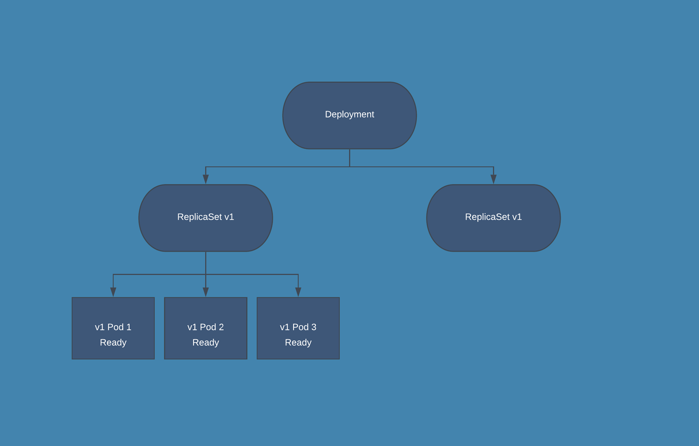

# 5. 워크로드 API

## 워크로드 API란?


- 워크로드 API 카테고리: 클러스터 위에서 컨테이너를 실행하는것을 관리한다.
- 워크로드 API 안의 리소스들은 서로 부모 자식 관계를 이루고, 상위 리소스는 하위 리소스를 관리한다.
- 파드는 최소 단위의 리소스이고 다른 리소스들은 다 파드 위의 상위 리소스이다.

## 파드

- 워크로드 리소스의 최소 단위
- 한개 이상의 IP가 동일한 컨테이너로 구성된다.
  - 서로 IP 주소를 공유하므로 localhost로 통신 가능하다

### 파드 디자인 패턴

- 파드에 여러개의 컨테이너가 존재할 떄 컨테이너 구성을 어떻게 하는가
- | 종류     | 설명                                                                                                                                                                                                                                                                                                                                                                                                                                                                                                                                                 |
  | -------- | ---------------------------------------------------------------------------------------------------------------------------------------------------------------------------------------------------------------------------------------------------------------------------------------------------------------------------------------------------------------------------------------------------------------------------------------------------------------------------------------------------------------------------------------------------- |
  | 사이드카 | - 메인 컨테이너를 보조해줄 수 있는 기능을 가지고 있는 서브 컨테이너를 추가한다<br />예시로 깃 스토리지와 로컬 저장소를 동기화 해주는 컨테이너가 있다.                                                                                                                                                                                                                                                                                                                                                                                                |
  | 앰배서더 | - 메인컨테이너가 외부 시스템과 통신할 때 중간에서 중계해주는 서브 컨테이너를 추가한다<br />- 외부 서비스들이 메인 컨테이너들과 직접 연결하는 대신 서브 컨테이너와 연결된다.<br />- 메인 컨테이너가 외부의 다양한 서비스들과 통신해야 할때 다양한 외부 API들에 맞추어 데이터들을 주고받는건 앰배서더 컨테이너에 맞기고, 메인 컨테이너는 앰배서더 컨테이너와 통신하는 기능만 두어 기능을 단순화 시킬수 있다<br />- 메인 컨테이너가 보안이 필요한 API를 사용할 경우 메인 컨테이너와 외부 서비스 사이에 앰배서더 컨테이너를 두어 해당 API를 숨길 수 있다 |
  | 어댑터   | - 메인 컨테이너가 외부 요청과 맞지 않는 지정된 형식의 데이터만 제공하면 이를 요청과 일치하는 데이터로 변환해서 외부로 보내주는 서브 컨테이너를 추가한다                                                                                                                                                                                                                                                                                                                                                                                              |

### 파드 생성

- 파드 매니페스트
  ```
  apiVersion: v1
  kind: Pod
  metadata:
    name: sample-pod
  spec:
    containers:
    - name: nginx-container
      image: nginx:1.16
  ```
- 파드 생성: `kubectl apply -f sample-pod.yaml`
- 생성된 파드 확인: `kubectl get pods`
  - 파드 이름, 컨테이너 개수(n/n), 상태 등 표시
- 두개의 컨테이너를 가지는 경우:
  ```
  apiVersion: v1
  kind: Pod
  metadata:
    name: sample-2pod
  spec:
    containers:
    - name: nginx-container
      image: nginx:1.16
    - name: redis-container
      image: redis:3.2
  ```
- 두 컨테이너를 모두 같은 port를 써서 port가 충돌하도록 할 경우 파드 생성시 에러가 뜬다.
  - 위의 생성된 파드를 확인할 때 준비된 컨테이너 수가 에러가 안났을 때보다 적도록 뜨고, 상태가 Running이 아닌 Error로 뜬다

### 명령어 실행

- 파드 컨테이너로 로그인: `kubectl exec -it sample-pod -- /bin/bash`
  - 컨테이너에 직접 SSH로 로그인하는건 아니고, 가상 터미널을 만들어 /bin/sh를 실행하는 것
- 컨테이너 내부에서 정보 확인

  ```
  # 필요한 패키지 설치
  apt update && apt -y install iproute2 procps

  # IP 주소 확인
  ip a | grep "inet "

  # 해당 컨테이너가 통신하는 포트 확인
  ss -napt | grep LISTEN

  # 프로세스 목록 확인
  ps aux

  # 파드 안에서 ls 실행하기
  kubectl exec -it sample-pod -- /bin/ls
  kubectl exec -it sample-2pod -c nginx-container -- /bin/ls # 특정 컨테이너만 지정해서 실행하기
  kubectl exec -it sample-pod -- /bin/ls --all --classify # 기타 옵션들 추가
  kubectl exec -it sample-pod -- /bin/bash -c "ls --all --classify | grep lib" # 특정 문자열을 포함하는 경우
  ```

- command/args: 도커 이미지에 설정된 ENTRYPOINT와 CMD명령어를 덮어씌우고 대신 실행된다.
  - ```
    apiVersion: v1
    kind: Pod
    metadata:
      name: sample-pod
    spec:
      containers:
     - name: nginx-container
        image: nginx:1.16
        command: ["/bin/sleep"]
        args: ["3600"]
    ```
  - 이러면 컨테이너를 실행할 때 `/bin/sleep 3600`이 실행된다
- spec.containers[].workingDir: 도커 파일의 WORKDIR 값을 대체하고 해당 값으로 작업 디렉토리를 변경한다
  - 명시된 디렉토리에서 프로세스들이 실행된다
  - `pwd` 명령어로 바뀐 작업 디렉토리를 확인할 수 있다

### 파드명 제한

- metadata의 name 값을 파드를 생성할때 검사해서 규칙에 맞지 않을 경우 생성에 실패한다.
  - 영어 소문자와 숫자
  - '-', '.'
  - 시작과 끝은 영어 소문자만 가능

### 네트워크 관련 설정

- 호스트의 네트워크 설정 사용하기
  - 파드들에는 기본적으로 외부에서는 확인할 수 없는 kubenetes 노드와는 다른 IP 주소값이 설정된다
  - `spec.hostNetwork: true`로 호스트와 같은 네트워크 구성으로 파드를 가동시킬 수 있다
    - 사용할 port 번호를 명시해야 한다
      - containers 밑에 ports 항목에 hostPort와 containerPort값을 명시해줘야 하고 두 값이 같아야 한다
      - 각 파드의 hostIP, hostPort, portocol값의 세트는 고유해야 하기에 이 경우 파드 설정에 제한이 생길 수 있다
    - `NodePort`를 사용하는게 권장된다
- DNS 서버 설정: spec.dnsPolicy값으로 설정한다
  - ClusterFirst
    - 기본값
    - 클러스터 내부 DNS 서버에 문의 -> 여기서 해석 불가능할 때 업스트림 서버에 문의
    - 클러스터 내부의 dns 설정 파일: `etc/resolv.conf`
  - None: 클러스터 외부의 DNS 서버 사용
    - spec.dnsConfig에 사용하고자 하는 값을 작성
    - ```
      apiVersion: v1
      kind: Pod
      metadata:
        name: sample-dnspolicy-none
      spec:
        dnsPolicy: None
        dnsConfig:
          nameservers:
          - 8.8.8.8
          - 8.8.4.4
          searches:
          - example.com
          options:
          - name: ndots
            value: "5"
          containers:
        - name: nginx-container
          image: nginx:1.16
      ```
    - 설정시 etc/resolv.conf 값이 덮어쓰여지고 클러스터 내부 DNS는 사용 불가능하다
  - Default
    - spec.dnsPolicy의 기본값이 아니다
    - 파드를 호스트하는 쿠버네티스 노드의 DNS 데이터를 그대로 가져온다
    - 설정시 etc/resolv.conf 값이 덮어쓰여지고 클러스터 내부 DNS는 사용 불가능하다
  - ClusterFirstWithHostNet
    - 위의 hostNetwork 값을 true로 활성화한 경우에 DNS는 클러스터 내부의 DNS를 참조하고 싶을 때 사용한다
    - hostNetwork 사용시에는 기본적으로 spec.dnsPolicy의 기본값인 ClusterFirst가 아니라 호스트의 DNS 설정을 참조한다
- 정적 호스트명
  - 정적 호스트명: DNS 서버를 참조하기 전에 /etc/hosts 파일을 확인해서 해당 도메인이 명시되어 있으면 DNS 서버 대신 해당 파일의 값을 가져온다
  - spec.hostAliases: 파드 안의 모든 컨테이너들의 /etc/hosts 파일에 값을 추가할 수 있다
  ```
  apiVersion: v1
  kind: Pod
  metadata:
    name: sample-pod
  spec:
    containers:
    - name: nginx-container
      image: nginx:1.16
    hostAliases:
    - ip: 8.8.8.8
      hostnames:
      - google-dns
  ```

## 레플리카 셋/레플리케이션 컨트롤러

- 파드의 복제를 생성하고 지정된 파드의 개수를 유지하는 역할을 한다
- 레플리케이션 컨트롤러: 과거의 유산
- spec.replicas: 총 복제할 파드의 개수
- spec.template: 복제할 파드의 매니페스트
  ```
  apiVersion: apps/v1
  kind: ReplicaSet
  metadata:
  	name: sample-rs
  spec:
  	replicas: 3
  	selector:
  		matchLabels:
  			app: sample-app
  	template:
  		metadata:
  			labels:
  				app: sample-app
  		spec:
  			containers:
  			- name: nginx-container
  				image: nginx:1.16
  ```
- 여러개의 파드가 복제되어 생성될 때 각 파드는 개별적인 노드 위에 생성됨
  - 어떤 한 노드에 문제가 생겨도 다른 노드 위의 파드들에는 영향 적음

### 파드 자동 복구

- 노드나 파드에 문제가 생겨서 해당 파드를 사용하지 못하게 되었을때 `spec.replicas`에서 설정해준 파드의 수를 유지하기 위해 새로운 노드와 파드를 가동한다
- 파드 정지시키기: `kubectl delete pod sample-rs-9f9kr`
- 파드 숫자 변화 기록 확인:
  - ```
    $ kubectl describe replicaset sample-rs
    Name: sample-rs
    Namespace: default
    (중략)
    Annotations: Replicas: 3 current / 3 desired
    (중략)
    Events:
    	Type		Reason						Age		From		Message
    	Normal	SuccessfulCreate	11m		(생략)	Created pod: (pod 명)
    	Normal	SuccessfulCreate	11m		(생략)	Created pod: (pod 명)
    	Normal	SuccessfulCreate	11m		(생략)	Created pod: (pod 명)
    	Normal	SuccessfulCreate	3m1s	(생략)	Created pod: (pod 명) #나중에 생성된 새로운 pod
    ```

### 레이블(label)

- 쿠버네티스가 파드 수가 지정된 숫자가 맞는지 확인할때 사용하는 기준
- 복제된 파드들은 동일한 레이블을 가진다
- 같은 레이블을 가진 파드의 숫자가 너무 많으면 자동으로 삭제하고 너무 적으면 위와 같이 생성한다
- 레플리카 셋을 생성할 때 `spec.selector.matchLabels`의 값에 복제 파드들이 만족시켜야 하는 레이블 값을 명시한다
- 레플리카 셋의 `spec.template` 속 파드 템플릿에서 `metadata.labels`에 같은 값을 적는다
- 두 값이 다를 경우 에러가 나고 레플리카 셋이 생성되지 않는다
  - 검색했을때 `spec.selector.matchLabels`의 값을 레이블로 가진 파드들이 없음 -> 새로운 파드들을 생성 -> 새로 생성된 파드들도 레이블 값이 달라 검색했을떄 등장 안함 -> 무한반복
- 기존에 레플리카셋이 생성되어 있을 때 같은 레이블을 가진 파드를 하나 더 생성해서 개수 기준을 넘어버리면 파드 하나를 삭제해버린다
  - 레이블이 겹치지 않도록 규칙을 정해서 만드는것을 권장한다

### 레플리카셋 설정 변경

- 기존에 생성되어 있던 레플리카셋의 파드 숫자 변경
  - 메니페스트 수정하기
    - 기존의 yaml 파일에서 replicas의 숫자만 변경후 `kubectl apply`
      ```
      	$ sed -i -e 's|replicase: 3|replicas: 4|' sample-rs.yaml
      	$ kubectl apply -f sample-rs.yaml
      	replicaset.apps/sample-rs configured
      ```
  - 스케일링: 명시된 파라미터에 대해서 새로운 값을 설정해줌
    ```
    	$ kubectl scale replicaset sample-rs --replicas=5
    	replicaset./apps/sample-rs scaled
    ```

### 레플리카셋의 집합성 기준

- 기존의 레플리케이션 컨트롤러는 레이블로 파드를 검색할 때 `일치성 기준`을 사용
  - 일치성 기준: `=`나 `!=`조건 사용
- 레플리카셋은 여기에 `in`, `notin`, `exists`도 추가
  - 주어진 집합에 대한 연산
  - `env In [DEV, PROD]`

## 디플로이먼트

- 여러 레플리카셋을 관리해서 `롤링 업데이트`나 `롤백` 구현

### 업데이트 전략

- `spec.strategy.type`에서 설정

#### Recreate

- 모든 아웃데이트된 파드들을 다 한번에 삭제하고 새로운 파드들을 생성
- 일시적으로 기존 파드가 삭제되고 새 파드는 생성되지 않아 파드가 없는 상태 발생
  - 일시적인 서비스 중단의 위험
- 추가 리소스 사용 안함
- 일괄적으로 삭제하고 생성하기에 RollingUpdate 보다 비교적 속도 빠름

#### RollingUpdate

- `spec.strategy.type`의 기본값



0. 기존의 레플리카셋을 업데이트 할 필요가 생김
1. 새로운 레플리카셋을 생성
2. 신규 레플리카셋의 파드를 설정된 레플리카 숫자까지 하나씩 늘림
3. 기존 레플리카셋의 파드 수를 0개가 될때 까지 하나씩 줄임
4. 신규 레플리카셋이 제대로 기동되었는지, 정상적으로 작동하는지 확인

- 레플리카셋 전환 과정 중 동시에 존재할 수 있는 파드의 최대 개수 설정
  - `spec.strategy.rollingUpdate`
  - 파드의 생성, 삭제가 완벽하게 동시에 일어나지는 않음
  - 업데이트 과정중에 설정에 명시된 파드 수보다 더 많거나 적은 파드가 동시에 존재할 수 있다
  - maxSurge: 명시된 파드 개수보다 최대 몇개나 더 많은 파드들이 업데이트 중 존재할 수 있는가
    - 위의 영상의 예시는 `maxSurge=2`이다
  - maxUnavailable: 명시된 파드 개수보다 최대 몇개나 더 적은 파드들이 업데이트 중 존재할 수 있는가
    - `maxUnavailable=1/maxSurge=0`의 설정에서는 레플리카셋의 파드 수가 3개일때 업데이트 중에 최대 두개만 동시에 존재가 가능하므로 기존의 레플리카셋의 파드를 삭제한 뒤 신규 레플리카셋에 파드를 추가해야 한다
  - 두 값은 정수나 백분율로 지정할 수 있다
  - 두 값의 기본값은 25%이다
- Recreate, RollingUpdate의 공통 파라미터들: `spec` 바로 아래에 위치
  - `minReadySeconds`: 새 파드 생성 직후 잠시 대기 시간
  - `revisionHistoryLimit`: 디플로이먼트가 유지할 레플리카셋 개수
  - `progressDeadlineSeconds`: 타임아웃 시간

### 디플로이먼트 생성하기

- ```
  apiVersion: apps/v1
  kind: Deployment
  metadata:
  	name: sample-deployment
  spec:
  	replicas: 3
  	selector:
  		matchLabels:
  			app: sample-app
  	template:
  		metadata:
  			labels:
  				app: sample-app
  		spec:
  			containers:
  			- name: nginx-container
  				image: nginx:1.16
  ```
- `kind`값에 `'Deployment'`를 넣어서 생성
- `kubectl get deployments`로 확인
- 디플로이먼트 이름 뒤에 랜덤 스트링이 붙어서 레플리카셋이 생성되고, 이 뒤에 또 랜덤한 스트링이 붙어서 레플리카셋의 파드들의 이름이 생성된다
  - ex) `sample-deployment`, `sample-deployment-hrnkxy8jn4`, `sample-deployment-hrnkxy8jn4-koemd`
- 매니페스트 대신 명령어로 디플로이먼트 생성도 가능

  - `kubectl create deployment --image=han0495/flask-example-app:v1 flask-example-app`

    ```
    $ kubectl get all
    NAME READY STATUS RESTARTS AGE
    pod/flask-example-app-959c5f88d-k95wk 1/1 Running 0 4s

    NAME TYPE CLUSTER-IP EXTERNAL-IP PORT(S) AGE
    service/kubernetes ClusterIP 10.43.0.1 <none> 443/TCP 5m37s

    NAME READY UP-TO-DATE AVAILABLE AGE
    deployment.apps/flask-example-app 1/1 1 1 5s

    NAME DESIRED CURRENT READY AGE
    replicaset.apps/flask-example-app-959c5f88d 1 1 1 5s
    ```

```

- 기본 레이블: app=flask-example-app
- 간단한 작업에 사용: 사용된 이미지 확인 등

### 디플로이먼트 업데이트 상태 확인:

```

    $ kubectl rollout status deployment sample-deployment
    Waiting for deployment "sample-deployment" rollout to finish: 2 out of 3 new replicas have been updated...
    Waiting for deployment "sample-deployment" rollout to finish: 1 old replicas are pending termination...
    deployment "sample-deployment" successfully rolled out

```

- 업데이트 하면 새로운 레플리카셋이 생성되고 파드들도 해당 레플리카셋에 속해있는 파드들로 교체된다

### 디플로이먼트 업데이트 조건

- `spec.template`에 변경이 있는 경우 디플로이먼트 업데이트 실행
  - `spec.template`은 해당 레플리카셋 안 파드의 설정
  - 파드 이미지 변경 등
- 이전에 버려진 레플리카셋과 같은 파드 설정으로 다시 업데이트 되면 레플리카셋 재활용
  - pod-template-hash값 비교
  - 레플리카셋을 yaml형태로 출력시 spec.selector.matchLabels에 해당 레플리카의 파드들의 설정에 대한 해시값이 계산되어 있다

### 롤백

- 이전의 롤백 대상 레플리카셋을 선택해서 그 레플리카셋으로 롤링 업데이트를 한다
- 변경 이력 확인: `kubectl rollout history deployment sample-deployment`
- 특정 버전의 정보 확인: `kubectl rollout history deployment sample-deployment --revision 1`
- 특정 버전으로 롤백: `kubectl rollout undo deployment sample-deployment --to-revision 1`
  - 기본값은 `--to-revision 1`이다
- `kubectl rollout`대신 `kubectl apply` 명령어로 spec.template를 목표한 이전 버전의 값으로 되돌리는 방식으로도 할 수 있다

### 업데이트 일시중지

- `kubectl rollout pause  sample-deployment`: 명령어 실행 이후의 모든 업데이트 조건 트리거는 바로 실행되지 않고 펜딩된다
  - 롤백도 작동하지 않는다
- `kubectl rollout resume deployment sample-deployment`: 퍼즈 해제

### 디플로이먼트 스케일링

- 위의 레플리카셋과 유사하게 스케일링으로 디플로이먼트가 관리하는 레플리카셋의 파드 수 설정을 관리할 수 있다
```

$ kubectl scale deployment sample-deployment --replicas=5
deployment./apps/sample-deployment scaled

```

```
