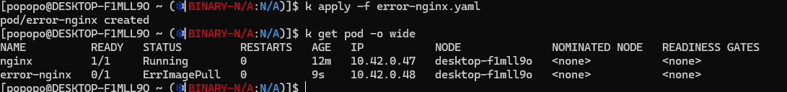

# 1. nginx yaml with wrong version

```yaml
apiVersion: v1
kind: Pod
metadata:
  name: errorNginx
spec:
  containers:
    - image: nginx:1.19.19
      name: nginx
```

# 2. run



# 3. describe


> now fix version to 1.19

# 4. Logs


# 5. get events


