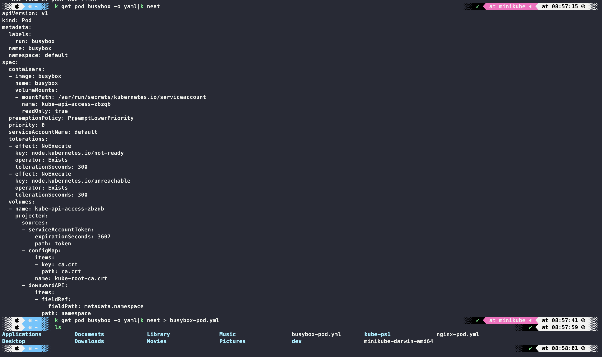
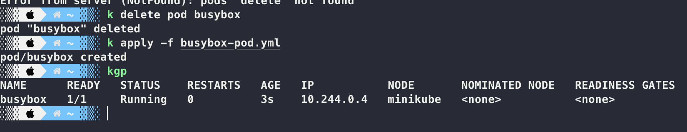

1. 쿠버네티스 리소스를 가독성이 뛰어난 YAML 파일 형태로 익스포트하는 kube-neat 플러그인을 설치합니다

2. 명령어를 사영해 busybox 파드를 실행합니다. busybox 파드를 YAML 파일 형태로 출력하고, YAML 파일을 텍스트 편집기를 이용해 command 옵션과 resource limits/requests 옵션을 추가합니다. 수정된 파일로 busybox 파드를 재배포합니다.

3. 쿠버네티스 환경에서 필요한 YAML 파일의 기본 문법을 정리합니다.

- 들여쓰기

  - 2칸 들여쓰기

- 배열 정의

  - '-' 기호를 사용

- 주석 처리
  - '#' 기호를 사용
