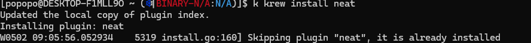
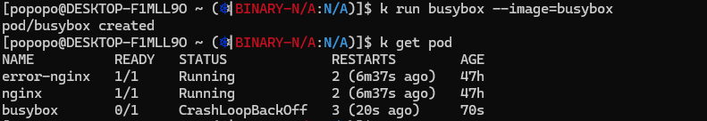
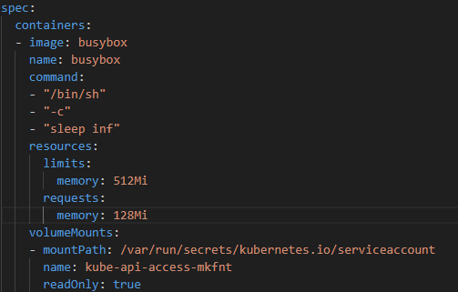
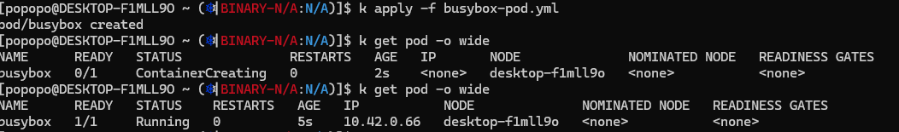

# 1. install kube-neat



# 2. run busybox



# 3. export yaml


# 4. put commands and resource constraints




# 5. syntax of yaml for kubernetes

## a. Indentation

Each layer is distinguished by indentation.

Indentation can be 2 or 4 spaces.

```yaml
metadata:
  labels:
    run: busybox
```

## b. List

List type is followed by its elements with `- ` prefix.

```yaml
command:
- '/bin/sh'
- '-c'
- 'sleep inf'
```

## c. Leaving Comment

Put `#` in front of comment line.

```yaml
# this is comment
apiVersion: v1
kind: Pod
metadata:
  labels:
    run: busybox
```
