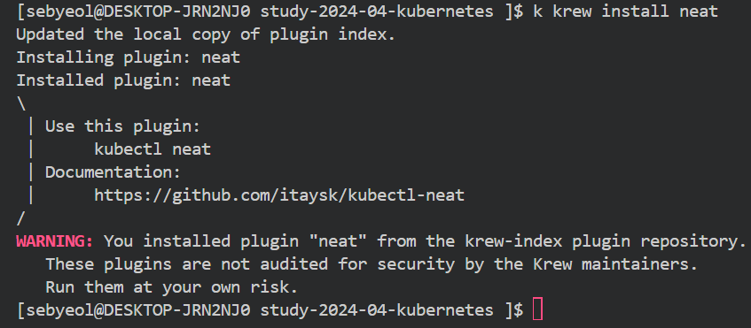
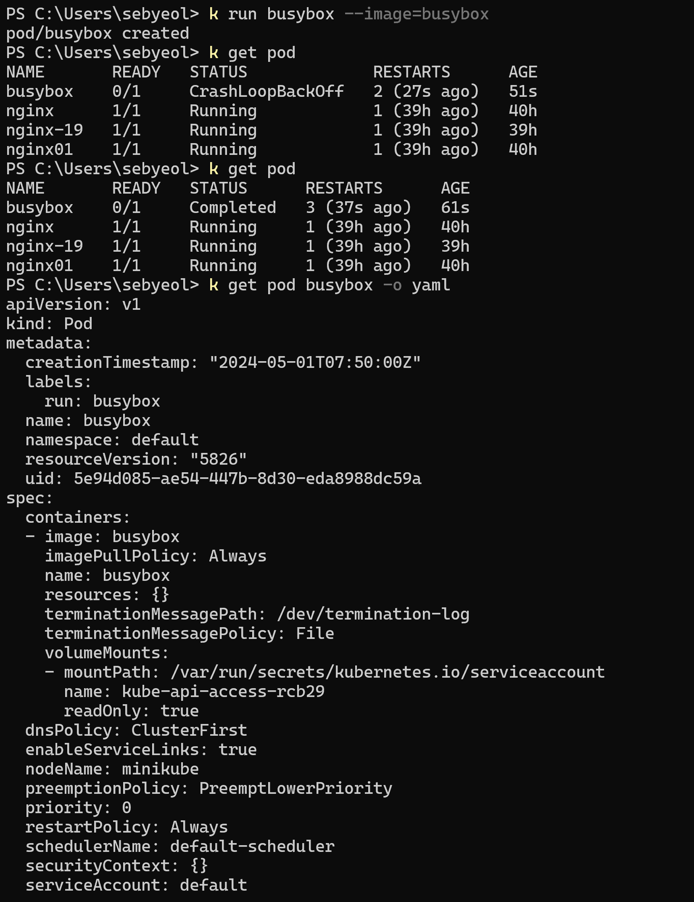
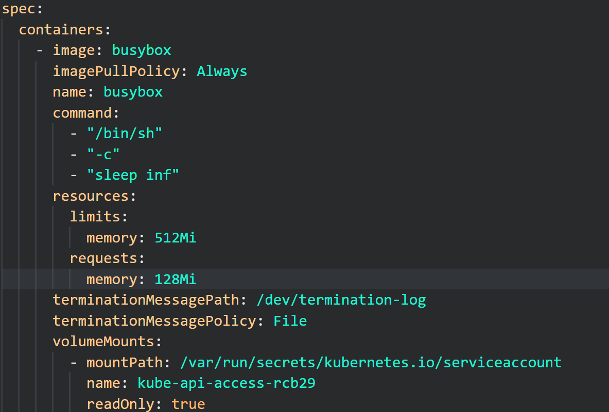
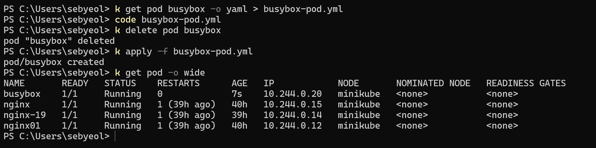

> 쿠버네티스 리소스를 가독성이 뛰어난 YAML 파일 형태로 익스포트하는 kube-neat 플러그인을 설치합니다

---

> 명령어를 사용해 busybox 파드를 실행합니다. busybox 파드를 YAML 파일 형태로 출력하고, YAML 파일을 텍스트 편집기를 이용해 command 옵션과 resource limits/requests 옵션을 추가합니다. 수정된 파일로 busybox 파드를 재배포합니다.

---

> 쿠버네티스 환경에서 필요한 YAML 파일의 기본 문법을 정리합니다.

## 들여쓰기

    각 개별 요소를 들여쓰기를 사용해 계층을 구분
    2칸 혹은 4칸 등 가능 (대부분 2칸이 기본값)

## 배열 정의

    배열 데이터 타입은 '-' 기호를 사용
    위에서부터 순서대로 나열

## 주석 처리

    '#' 기호를 사용
