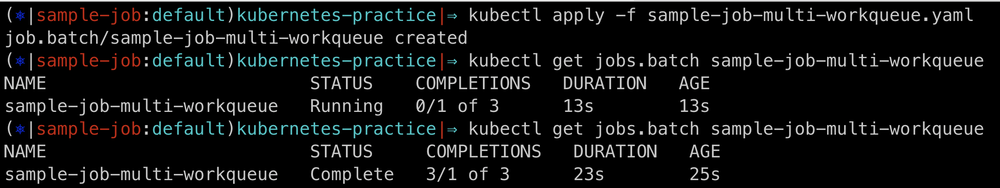

# 5.5. 데몬셋

- 레플리카셋의 특수한 형태

| .               | 레플리카셋 | 데몬셋                                        |
| --------------- | ---------- | --------------------------------------------- |
| 노드 당 파드 수 | N          | 1 or 0 (nodeSelector, 안티어피니티 예외 처리) |

- 노드 증가 -> 생성된 노드에서 자동으로 데몬셋 파드 기동
- -> 노드 단위 동작 프로세스에 사용
  - Fluentd(호스트 단위 로드 수집), 노드 모니터링(Datadog)

## 5.5.1. 데몬셋 생성

**추천: vsc kubernetes templates extension**

```yaml
apiVersion: apps/v1
kind: DaemonSet
metadata:
  name: sample-ds
spec:
  selector:
    matchLabels:
      app: sample-app
  template:
    metadata:
      labels:
        app: sample-app
    spec:
      containers:
        - name: nginx-container
          image: nginx:1.16
```

> two nodes
> 

```bash
kubectl apply -f sample-ds.yaml # 데몬셋 생성
```

> two daemonset pods
> 

> 노드 추가 -> 3개
> 

> 추가된 노드에 데몬셋 파드 자동 기동
> 

## 5.5.2. 데몬셋 업데이트 전략

### 5.5.2.1. On Delete

- 메니페스트 수정하더라도 기존 파드 업데이트 하지 않음
- 파드가 삭제되었다가 재생성될 시에 새로운 메니페스트로 업데이트 됨 혹은 수동으로 삭제하여 업데이트 가능

```yaml
apiVersion: apps/v1
kind: DaemonSet
metadata:
  name: sample-ds-ondelete
spec:
  updateStrategy:
    type: OnDelete
  selector:
    matchLabels:
      app: sample-app
  template:
    metadata:
      labels:
        app: sample-app # app to be updated
    spec:
      containers:
        - name: nginx-container
          image: nginx:1.16
```

데몬셋 템플릿 업데이트 후 아래와 같이 수동으로 파드 삭제시 하나의 파드만 업데이트된 버전으로 재생성됨

```bash
kubectl delete pod [pod-name]
```

### 5.5.2.2. Rolling Update

```yaml
apiVersion: apps/v1
kind: DaemonSet
metadata:
  name: sample-ds-ondelete
spec:
  updateStrategy:
    type: RollingUpdate
    rollingUpdate:
      maxUnavailable: 2 # 파드 한 번에 두 개씩 업데이트
  selector:
    matchLabels:
      app: sample-app
  template:
    metadata:
      labels:
        app: sample-app # app to be updated
    spec:
      containers:
        - name: nginx-container
          image: nginx:1.16
```

# 5.6. 스테이트풀셋

- db와 같이 stateful한 워크로드에 사용하기 위한 레플리카셋의 특수한 형태

레플리카셋과의 차이

- 파드명 뒤에 인덱스 붙음
  - sample-statefulset-0, sample-statefulset-1 ...
- 파드명 불변
- 데이터를 영구적으로 저장하는 구조
  - 영구 볼륨 사용하면 파드 재기동 시에 같은 디스크를 사용하여 생성

## 5.6.1. 스테이트풀셋 생성

```yaml
apiVersion: apps/v1
kind: StatefulSet
metadata:
  name: sample-ss
spec:
  selector:
    matchLabels:
      app: sample-app # has to match .spec.template.metadata.labels
  serviceName: sample-ss
  replicas: 3 # by default is 1
  template:
    metadata:
      labels:
        app: sample-app # has to match .spec.selector.matchLabels
    spec:
      containers:
        - name: nginx-container
          image: nginx:1.16
          volumeMounts:
            - name: www
              mountPath: /usr/share/nginx/html
  volumeClaimTemplates:
    - metadata:
        name: www
      spec:
        accessModes: ["ReadWriteOnce"]
        resources:
          requests:
            storage: 1G
```


> suffix: index

## 5.6.2. 스테이트풀셋 스케일링

```bash
# 메니페스트 수정-적용하여 스케일링
$ sed -i -e 's|replicas: 3|replicas:4' sample-ss.yaml
$ kubectl apply -f sample-ss.yaml

# kubectl scale 이용
$ kubectl scale statefulset sample-ss --replicas=5 # or kubectl scale statefulset.apps sample-ss --replicas=5
```

- Scale Out
  - index 작은 순
  - 하나씩 생성 - 생성한 파드가 Ready 상태가 되면 다음 파드 생성
- Scale In

  - index 큰 순

> 레플리카셋의 경우 무작위로 파드 삭제하기 때문에 특정 파드가 마스터인 경우 문제 발생. 스테이트풀셋의 경우 0번 파드를 마스터 노드로 사용하면 가장 먼저 생성되고 가장 나중에 삭제되기 때문에 이중화 구조 애플리케이션에 적합하다

## 5.6.3. 스테이트풀셋의 라이프사이클

- spec.podManagementPolicy
  - OrderedReady가 default
  - Parallel로 설정하면 레플리카셋과 같이 병렬적으로 동시에 파드가 기동

## 5.6.4. 스테이트풀셋 업데이트 전략

- OnDelete
- RollingUpdate

### Rolling Update

- 영속성 데이터가 있기 때문에 디플로이먼트와 다르게 추가 파드를 생성하서 롤링 업데이트 불가
- 파드마다 Ready 상태인지 체크하고 하나씩 업데이트
  - maxUnavailable 설정 불가
  - spec.podManagementPolicy가 Parallel이어도 병렬 업데이트 X

**Partition**

```yaml
apiVersion: apps/v1
kind: StatefulSet
metadata:
  name: sample-ss-rollingupdate
spec:
  updateStrategy:
    type: RollingUpdate
    rollingUpdate:
      partition: 3 # 3이상 인덱스 파드만 업데이트 (0, 1 인덱스 파드 업데이트 X)
  selector:
    matchLabels:
      app: sample-app # has to match .spec.template.metadata.labels
  serviceName: sample-ss-rollingupdate
  replicas: 5 # by default is 1
  template:
    metadata:
      labels:
        app: sample-app # has to match .spec.selector.matchLabels
    spec:
      containers:
        - name: nginx-container
          image: nginx:1.16
```

## 5.6.5. 영구 볼륨 데이터 저장 확인

> 메니페스트에 설정한 mount path에 free disk 마운트되어 있음
> 

> 마운트된 볼륨에 할당된 디스크에 sample.html 생성
> 

> 삭제 전 ip 확인
> 

> 삭제 후 ip가 바꼈지만 재기동된 파드에 여전히 파일 존재
> 

## 5.6.6. 스테이트풀셋 삭제와 영구 볼륨 삭제

스테이트풀셋을 삭제하고 영구 볼륨 클레임으로 확보한 영구 볼륨을 해제하지 않으면 계속 해당 디스크 공간이 확보된 상태로 유지된다. 이때 다시 스테이트풀셀을 생성하면 해당 디스크로 공간으로 영구 볼륨이 마운트된다. 당연히 데이터 역시 유지된다.


디스크가 확보된 상태로 방치할 경우 비용이 발생하므로 스테이트풀셋을 삭제하고 더 이상 쓰지 않는 영구 볼륨이라면 해제하도록 하자.

> 영구 볼륨 클레임 해제
> 

> 영구 볼륨 삭제 확인
> 

# 5.7. 잡

## 5.7.1. 잡의 용도

잡의 경우 레플리카셋고 다르게 기동 중인 파드의 정지가 작업을 끝내고 정상종료되는 것을 의미한다. 레플리카셋은 정상 종료 횟수를 카운트할 수 없기 때문에 배치 작업은 잡을 사용하자.

## 5.7.2. 잡 생성

> 쿠버네티스가 uuid를 자동으로 생성하기 때문에 selector와 labels를 지정하지 않는 것을 권장

```yaml
apiVersion: batch/v1
kind: Job
metadata:
  name: sample.job
  namespace: default
spec:
  completions: 1
  parallelism: 1
  backoffLimit: 10
  template:
    spec:
      containers:
        - name: tools-container
          image: amsy810/tools:v2.0
          command: ["sleep"]
          args: ["60"]
      restartPolicy: Never
```

> 잡의 경우 Ready 상태의 파드 수가 아닌 정상종료한 completions 상태의 파드 수를 표시함
> 

## 5.7.3. restartPolicy에 따른 동작 차이

- spec.template.spec.restartPolicy
  - onFailure : 파드 장애 -> 동일한 파드로 잡 재시작
  - Never : 파드 장애 -> 신규 파드 생성

### 5.7.3.1. OnFailure

```yaml
apiVersion: batch/v1
kind: Job
metadata:
  name: sample-job-onfailure-restart
  namespace: default
spec:
  completions: 1
  parallelism: 1
  backoffLimit: 10
  template:
    spec:
      containers:
        - name: tools-container
          image: amsy810/tools:v2.0
          command: ["sh", "-c"]
          args: ["$(sleep 3600)"]
      restartPolicy: OnFailure
```

> 파드의 잡 실행 실패 후 동일한 파드로 잡 재시작
> 

- 동일한 파드가 재시작하기 때문에 ip가 변경되지는 않지만 영구 볼륨 또는 노드의 파일 시스템의 영역(hostPath)에 파드의 볼륨을 마운트하지 않은 경우 데이터가 유실된다.
  - 호스트 노드의 파일 시스템 영역(hostpath)을 볼륨으로 하여 파드에 마운트할 수 있음. 따라서 동일 노드 내의 파드들끼리 리소스 공유가 가능하고 파드에서 노드의 해당 영역 데이터에 접근하는 것도 가능

### 5.7.3.2. Never

```yaml
apiVersion: batch/v1
kind: Job
metadata:
  name: sample-job-never-restart
  namespace: default
spec:
  completions: 1
  parallelism: 1
  backoffLimit: 10
  template:
    spec:
      containers:
        - name: tools-container
          image: amsy810/tools:v2.0
          command: ["sh", "-c"]
          args: ["$(sleep 3600)"]
      restartPolicy: Never
```

> 파드의 잡 실행 실패 후 새로운 파드를 생성 하여 잡 재시도
> 

## 5.7.4. 태스크와 작업 큐 병렬 실행

| 워크로드                    | completions | parallelism | backoffLimit |
| --------------------------- | ----------- | ----------- | ------------ |
| 1회만 실행하는 태스크       | 1           | 1           | 0            |
| N개 병렬 실행 태스크        | M           | N           | P            |
| 한 개씩 실행하는 작업 큐    | 미지정      | 1           | P            |
| N개 병렬로 실행하는 작업 큐 | 미지정      | N           | P            |

**매니페스트 수정**

- completions
  - immutable
- parallelism
  - mutable
- backoffLimit
  - mutable

### 5.7.4.1. One Shot Task: 1회만 실행하는 태스크

| completions | parallelism | backoffLimit |
| ----------- | ----------- | ------------ |
| 1           | 1           | 0            |

성공 유무 관계없이 1회만 실행됨

### 5.7.4.2. Multi Task: N개 병렬로 실행시키는 태스크

| completions | parallelism | backoffLimit |
| ----------- | ----------- | ------------ |
| M           | N           | P            |

- M=5 & N=3 & P=5
  - 파드 3개 생성 -> 3개 정상 종료 -> 파드 2개 생성 -> 2개 정상 종료
  - 3개 정상 종료 후 파드 3개가 재생성되지 않고 남은 성공 횟수에 맞춰서 생성된다.

### 5.7.4.3. Multi WorkQueue: N개 병렬로 실행되는 작업 큐

- 여러 개의 파드를 하나의 잡을 처리하기 위해 병렬적으로 실행
- 하나라도 정상 종료하면 그 이후에는 파드를 생성하지 않음
- 정상 종료하는 파드가 나왔을 때 이미 실행 중인 파드는 강제로 종료하지 않고 개별 처리를 정상 종료할 때까지 그대로 동작

```yaml
apiVersion: batch/v1
kind: Job
metadata:
  name: sample-job-multi-workqueue
spec:
  # default completions: 1
  parallelism: 3
  backoffLimit: 1
  template:
    spec:
      containers:
        - name: tools-container
          image: amsy810/tools:v2.0
          command: ["sleep"]
          args: ["20"]
      restartPolicy: Never
```



### 5.7.4.4. Single WorkQueue: 한 개씩 실행하는 작업 큐

```yaml
apiVersion: batch/v1
kind: Job
metadata:
  name: sample-job-single-workqueue
spec:
  # default completions: 1
  parallelism: 1
  backoffLimit: 1
  template:
    spec:
      containers:
        - name: tools-container
          image: amsy810/tools:v2.0
          command: ["sleep"]
          args: ["20"]
      restartPolicy: Never
```

> 1개 정상 종료할 때까지 파드 1개씩 잡 실행
> 

**parallelism을 증가시켜 multi work queue로 변경 가능**


## 5.7.5. 일정 기간 후 잡 삭제

잡은 종료 후 삭제되지 않고 계속 남아 있는 리소스.
`spec.ttlSecondsAfterFinished`를 설정하여 잡이 종료된 후 일정 시간 후 삭제되도록 설정 가능.

```yaml
apiVersion: batch/v1
kind: Job
metadata:
  name: sample-job-ttl
spec:
  ttlSecondsAfterFinished: 20
  template:
    spec:
      containers:
        - name: tools-container
          image: amsy810/tools:v2.0
          command: ["sleep"]
          args: ["10"]
      restartPolicy: Never
```

> 3(apply) + 10(job) + 20(ttl)
> 

## 5.7.6. 매니페스트를 사용하지 않고 잡을 생성

```shell
kubectl create job sample-job-by-cli --image=amsy810/tools:v2.0 -- sleep 30
```

**크론잡을 기반으로 잡 생성**

```shell
kubectl create jobo sample-job-from-cronjob --from cronjob/sample-cronjob
```

# 5.8. 크론잡

디플로이먼트와 레플리카셋의 관계처럼 크론잡이 잡을 관리하고 잡이 파드를 관리하는 구조

## 5.8.1. 크론잡 생성

```yaml
apiVersion: batch/v1 # version check (v1beta1)
kind: CronJob
metadata:
  name: sample-cronjob
  namespace: default
spec:
  schedule: "*/1 * * * *"
  concurrencyPolicy: Allow
  startingDeadlineSeconds: 30
  successfulJobsHistoryLimit: 5
  failedJobsHistoryLimit: 3
  suspend: false
  jobTemplate:
    spec:
      completions: 1
      parallelism: 1
      backoffLimit: 0
      template:
        spec:
          containers:
            - name: tools-container
              image: amsy810/random-exit:v2.0
          restartPolicy: Never
```


> 스케줄링 설정 시간이 되면 잡 생성됨
> 

## 5.8.2. 크론잡 일시정지

> suspend=true
> 

## 5.8.3. 임의의 시점에 크론잡 실행

- 크론잡으로 잡을 생성 가능

```shell
kubectl create job sample-job --from cronjob/sample-cronjob
```

## 5.8.4. 동시 실행 제어

- 스케줄링 시간 간격 내에 이전 잡이 정상 종료되지 못한 경우

| spec.concurrencyPolicy | policy                                                  |
| ---------------------- | ------------------------------------------------------- |
| Allow                  | 동시 실행 제한 없음                                     |
| Forbid                 | 이전 잡이 종료되지 않았을 경우 다음 잡은 실행 하지 않음 |
| Replace                | 이전 잡을 삭제하고 다음 잡 실행                         |

## 5.8.5. spec parameter

`startingDeadlineSeconds`

- 실행 데드라인
- 설정한 값 내에 잡이 생성되지 않으면 그 이후에는 실행하지 않음
  `successfulJobsHistoryLimit`
- 성공한 잡을 저장하는 개수
- 성공한 잡들을 설정 개수까지만 삭제하지 않고 남겨둠
  - (잡은 원래 정상종료 이후에도 삭제되지 않고 남아있음)
  - 로그도 남아있는 파드에 한해서만 확인 가능
    `failedJobsHistoryLimit`
- 실패한 잡을 저장하는 개수

## 5.8.7. 매니패스트를 사용하지 않고 크론잡 생성

```shell
kubectl create cronjob sample-cronjob-by-cli \
--image amsy810/random-exit:v2.0 \
--schedule "*/1 * * * *" \
--restart Never
```
