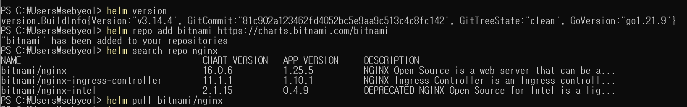
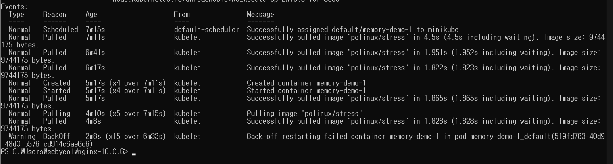
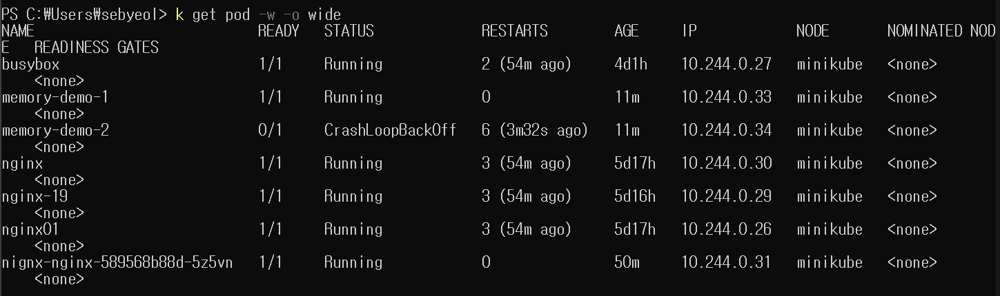

> 헬름 파트를 이용해 Nginx 애플리케이션을 설치합니다. 실습을 통해 헬름 애플리케이션 관리의 라이프사이클과 헬름의 3가지 주요 요소인 헬름 차트, 헬렘 리포지토리, 헬름 템플릿의 개념을 이해합니다.

---

> 헬름 파트의 템플릿 변수 파일을 이용해 파드의 리소스에 대한 Requests/Limits 설정을 변경해서 템플릿 변수 파일의 사용법을 이해합니다.

