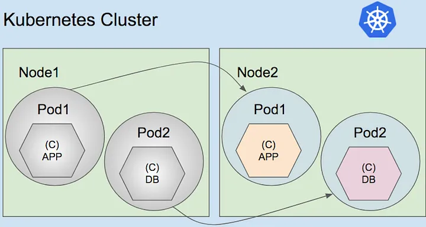
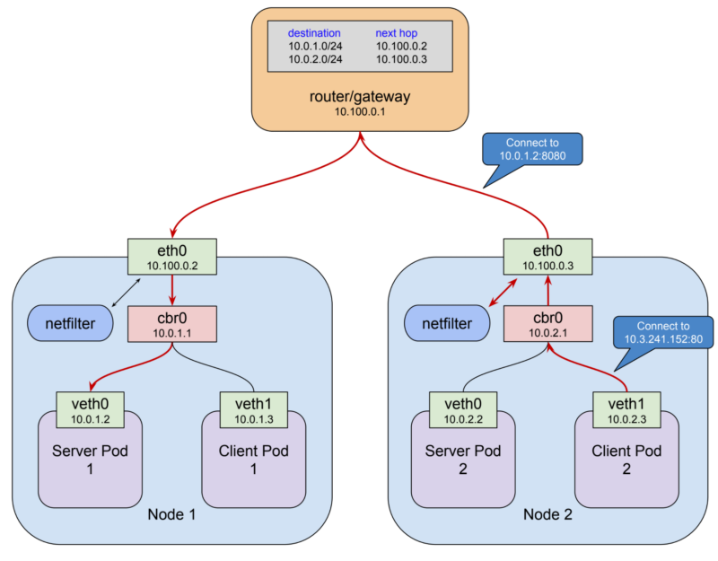
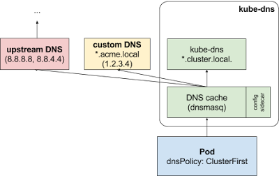

# Chapter 6. 서비스 API 카테고리 (~ 6.6 LoadBalancer 서비스)

> 발표일 `24.05.09`
>
> 발표자 `박지환`
>
> Chapter 6. 서비스 API 카테고리 (~ 6.6 LoadBalancer 서비스)

## 목차

1. [6.1] 서비스 API 카테고리 개요
2. [6.2] 쿠버네티스 클러스터 네트워크와 서비스s
3. [6.3] ClusterIP 서비스
4. [6.4] ExternalIP 서비스
5. [6.5] NodePort 서비스
6. [6.6] LoadBalancer 서비스s

<br>

## 6.1 서비스 API 카테고리 개요

- 5가지 쿠버네티스 리소스 카테고리

  - 워크로드 API
  - 서비스 API
  - 컨피그 & 스토리지 API
  - 클러스터 API
  - 메타데이터 API

- 서비스 API: 클러스터 내부 및 외부로 서비스를 노출하는 방법을 정의 (엔드포인트 제공 및 컨테이너 디스커버리)
  - 서비스 유형
    - ClusterIP
    - ExternalIP
    - NodePort
    - LoadBalancer
    - Headless
    - ExternalName
    - None-Selector

## 6.2 쿠버네티스 클러스터 네트워크와 서비스

- 노드-파드-컨테이너 구조
  

  - 로컬호스트 네트워크: 컨테이너 간 통신
  - 노드 (외부) 네트워크: 노드 간 통신
  - 파드 (내부) 네트워크: 파드 간 통신

### 6.2.1 파드에 트래픽 로드 밸런싱 (부하 분산)



- 서비스를 사용하면 파드의 IP 주소를 자동으로 조회 가능.
- `spec.selector.app` 필드를 사용하여 서비스가 어떤 파드를 찾아야 하는지 지정 가능.
- 예시:
  ```yaml
  apiVersion: v1
  kind: Service
  metadata:
    name: my-service
  spec:
    selector:
      app: sample-app
    ports:
      - protocol: TCP
        port: 80
        targetPort: 9376
  ```
- `spec.selector.app: sample-app` 필드를 통해 `app=sample-app` 레이블을 가진 파드를 찾음.
- `apply` 명령어로 서비스를 생성, `kubectl get svc` 명령어로 서비스 조회 가능, `kubectl describe svc my-service` 명령어로 서비스 상세 정보 조회 가능 (endpoints 확인 가능).

- 추가적인 내용:
  - 여러 포트 사용: http/https를 구분하기 위해 여러 포트를 사용할 수 있음. (spec.ports)
  - 이름을 사용한 포트 참조: 포트 번호 대신 이름을 사용하여 포트를 참조할 수 있음. (spec.ports.name로 지정하고, targetPort에 이름을 사용)

### 6.2.2 클러스터 내부 DNS와 서비스 디스커버리

- 서비스 디스커버리: 클러스터 내부에서 서비스를 찾는 방법 (endpoint 판별)

- 서비스 디스커버리 방법

  - 환경 변수: 파드의 환경 변수에 서비스 IP 주소를 설정
  - DNS A 레코드: 서비스명 + 포트 (metadata.name을 사용, immutable 유지)
  - DNS SRV 레코드: 포트명 + 프로토콜 + 서비스명

- 추가내용:
  - 노드 로컬 DNS 캐시: 파드가 노드의 로컬 DNS 캐시를 사용하여 DNS 조회 성능을 향상시킴.
    

## 6.3 ClusterIP 서비스

- ClusterIP: 클러스터 내부에서만 서비스를 노출하는 방법
  - 클러스터 내부에서만 서비스를 노출하고, 외부에서는 접근 불가능.
  - 파드 간 통신을 위해 사용.

### 6.3.1 ClusterIP 서비스 생성

- ClusterIP 서비스 생성 예시:
  ```yaml
  apiVersion: v1
  kind: Service
  metadata:
    name: my-service
  spec:
    type: ClusterIP
    ports:
      - protocol: TCP
        port: 80
        targetPort: 9376
    selector:
      app: sample-app
  ```
- `type: ClusterIP` 필드를 통해 ClusterIP 서비스를 생성.

### 6.3.2 ClusterIP 가상 IP 정적 지정

- DNS 레코드를 사용하지 않고 가상 IP를 정적으로 지정 가능.
- `spec.clusterIP` 필드를 사용하여 가상 IP를 지정 가능.
- 예시:
  ```yaml
  apiVersion: v1
  kind: Service
  metadata:
    name: my-service
  spec:
    type: ClusterIP
    clusterIP: 10.3.251.194
  ```
- 서비스가 생성된 후에는 clusterIP를 변경할 수 없음.

## 6.4 ExternalIP 서비스

- ExternalIP: 클러스터 외부에서 서비스를 노출하는 방법
  - 클러스터 외부에서 서비스를 노출하고, 외부 IP 주소를 사용하여 접근 가능.
  - 외부 IP 주소를 사용하여 서비스에 접근 가능.

### 6.4.1 ExternalIP 서비스 생성

- ExternalIP 서비스 생성 예시:

  ```yaml
  apiVersion: v1
  kind: Service
  metadata:
    name: my-service
  spec:
    type: ExternalIP
    externalIPs:
      - 10.178.0.61 # 외부 IP 주소
      - 10.178.0.62 # 외부 IP 주소
    ports:
      - protocol: TCP
        port: 80
        targetPort: 9376
    selector:
      app: sample-app
  ```

- 열려있는 노드:
  - 10.178.0.61
  - 10.178.0.62
- 안 열려있는 노드:
  - 10.178.0.63 (외부 IP 주소로 사용 불가능)

## 6.5 NodePort 서비스

- NodePort: 클러스터 외부에서 서비스를 노출하는 방법
  - 클러스터 외부에서 서비스를 노출하고, 노드의 IP 주소와 NodePort를 사용하여 접근 가능.
  - 외부 IP 주소와 NodePort를 사용하여 서비스에 접근 가능.

**\*NodePort 서비스는 모든 노드의 IP 주소와 NodePort를 사용하여 서비스에 접근 가능. (0.0.0.0:NodePort)**

### 6.5.1 NodePort 서비스 생성

- NodePort 서비스 생성 예시:

  ```yaml
  apiVersion: v1
  kind: Service
  metadata:
    name: my-service
  spec:
    type: NodePort
    ports:
      - protocol: TCP
        port: 80
        targetPort: 9376
        nodePort: 30000
    selector:
      app: sample-app
  ```

- 주의사항:
  - NodePort는 30000 ~ 32767 사이의 포트를 사용해야 함.
  - NodePort를 지정하지 않으면 쿠버네티스가 자동으로 포트를 할당함.
  - 같은 노드포트를 사용할 수 없음.

## 6.6 LoadBalancer 서비스

- LoadBalancer: 서비스 환경에서 클러스터 외부로부터 트랙픽을 수신.

### 6.6.1 LoadBalancer 서비스 생성

- LoadBalancer 서비스 생성 예시:

  ```yaml
  apiVersion: v1
  kind: Service
  metadata:
    name: my-service
  spec:
    type: LoadBalancer
    ports:
      - protocol: TCP
        port: 80
        targetPort: 9376
    selector:
      app: sample-app
  ```

- `type: LoadBalancer` 필드를 통해 LoadBalancer 서비스를 생성.

### 6.6.2 LoadBalancer에 할당되는 가상 IP 정적 지정

- `spec.loadBalancerIP` 필드를 사용하여 가상 IP를 지정 가능.
- 예시:

  ```yaml
  apiVersion: v1
  kind: Service
  metadata:
    name: my-service
  spec:
    type: LoadBalancer
    loadBalancerIP: xx.xx.xx.xx
  ```

### 6.6.3 LoadBalancer 방화벽 정책 설정

- 기본적으로 모든 IP 주소에서 LoadBalancer 서비스에 액세스 가능.
- `spec.loadBalancerSourceRanges` 필드를 사용하여 허용할 IP 주소 범위를 지정 가능.
- 예시:

  ```yaml
  apiVersion: v1
  kind: Service
  metadata:
    name: my-service
  spec:
    type: LoadBalancer
    loadBalancerSourceRanges:
      - 10.0.0.0/8
  ```
