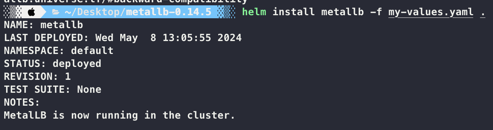

1. 로드밸런서에 할당할 외부에서 접속 가능한 IP 대역을 지정합니다.

- 노드가 사용하는 IP 대역을 확인.
  

- 할당하려는 IP 대역 확인.
  

2. 헬름을 이용해 MetalLB를 설치합니다.

- MetalLB repo 추가.
  

- MetalLB 설치. (교재 내용은 deprecated 되었으므로 아래와 같이 설치)
  
  

3. 테스트 용도의 데모 ‘voting-app’ 애플리케이션을 설치합니다. 프론트엔드 웹에서 사용하는 서비스 타입을 LoadBalancer로 지정합니다. 각 파드에 정상적으로 부하분산이 되는지 확인합니다

- voting-app clone
  

- voting-app 실행
  

- Load Balancer 적용
  

- vote에 LoadBalancer
  

- result에 LoadBalancer
  

- 부하분산
  
