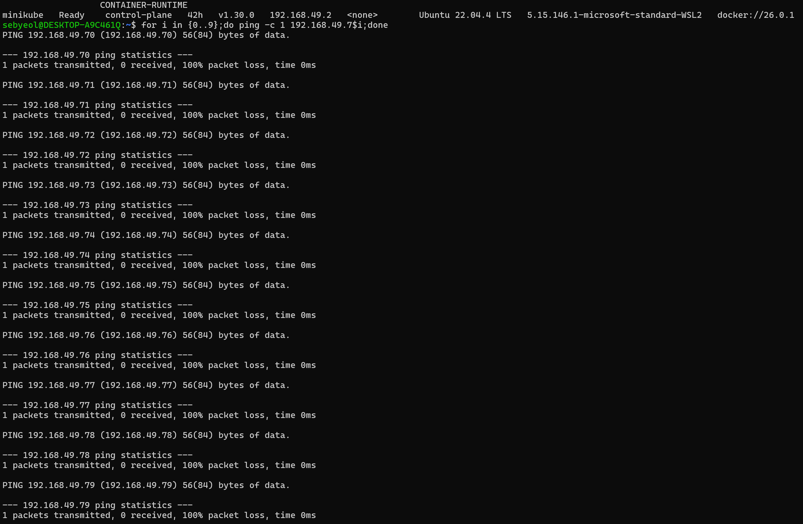
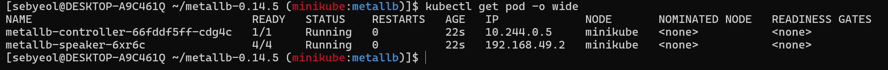
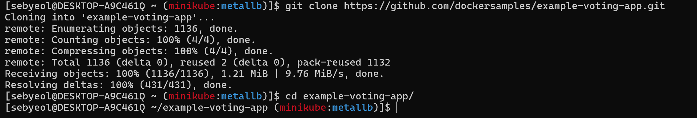
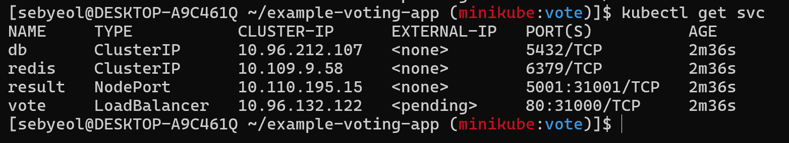
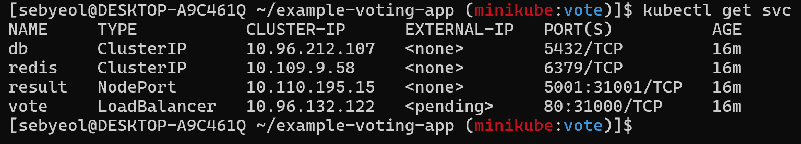

> 로드밸런서에 할당할 외부에서 접속 가능한 IP 대역을 지정합니다.
> 

---

> 헬름을 이용해 MetalLB를 설치합니다.

---

> 테스트 용도의 데모 ‘voting-app’ 애플리케이션을 설치합니다. 프론트엔드 웹에서 사용하는 서비스 타입을 LoadBalancer로 지정합니다. 각 파드에 정상적으로 부하분산이 되는지 확인합니다

