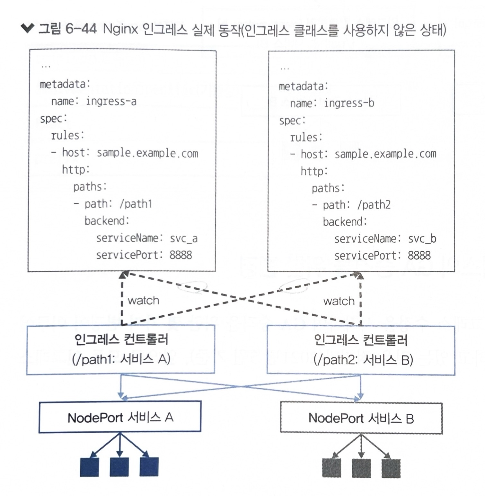

<h2> 그 외 서비스 기능 </h2>

세션 어피니티
- 서비스의 spec.sessionAffinity 필드에 ClusterIP를 넣으면 

<h2> 헤드리스 서비스 </h2>

- 특정 애플리케이션들이 파드 간에 직접적이고 안정적인 통신을 할 수 있도록 지원하는 서비스로, 상태를 가진(stateful) 애플리케이션을 쿠버네티스에 배포할 때 특히 유용하다.
- 일반적인 서비스와 달리, 헤드리스 서비스는 고정된 IP 주소를 갖지 않는다. 대신, 서비스를 요청하는 쪽이 서비스를 제공하는 파드의 IP 주소들을 DNS 조회를 통해 직접 얻게 된다.
- 로드 밸런싱이나 단일 서비스 IP 없이 파드들에게 직접 연결할 수 있다. 이게 아니었다면 모든 통신이 proxy로 일어났을 것이다.

`(Ex)` MySQL 데이터베이스 클러스터를 쿠버네티스 클러스터 내에서 배포하는 경우, 각 MySQL 인스턴스는 고유한 식별자와 직접적인 네트워크 연결이 필요하다. 이러한 설정은 각 인스턴스가 마스터 또는 복제본으로서의 역할을 수행하며 데이터 일관성을 유지할 수 있게 한다. 헤드리스 서비스를 사용하면, 각 파드를 직접 관리하고 필요에 따라 특정 데이터베이스 서버에 직접 연결할 수 있다.

```yaml
# headless service
apiVersion: v1
kind: Service
metadata:
  name: mysql
spec:
  clusterIP: None  # Makes the service headless
  ports:
    - port: 3306
      name: mysql
  selector:
    app: mysql
```
```yaml
# stateful set
apiVersion: apps/v1
kind: StatefulSet
metadata:
  name: mysql
spec:
  serviceName: mysql
  replicas: 3
  selector:
    matchLabels:
      app: mysql
  template:
    metadata:
      labels:
        app: mysql
    spec:
      containers:
      - name: mysql
        image: mysql:5.7
        ports:
        - containerPort: 3306
        env:
        - name: MYSQL_ROOT_PASSWORD
          value: "yourpassword"
        command:
          - "bash"
          - "-c"
          - |
            # Set MySQL to listen on all addresses
            echo "Setting MySQL to listen on all IPs."
            sed -i 's/bind-address\s*=\s*127.0.0.1/bind-address = 0.0.0.0/' /etc/mysql/my.cnf
            # Run different commands based on the hostname
            if [ "$HOSTNAME" = "mysql-0" ]; then
              echo "Starting MySQL as Master"
              docker-entrypoint.sh mysqld
            else
              echo "Starting MySQL as Replica"
              docker-entrypoint.sh mysqld
            fi
        volumeMounts:
        - name: mysql-data
          mountPath: /var/lib/mysql
  volumeClaimTemplates:
  - metadata:
      name: mysql-data
    spec:
      accessModes: ["ReadWriteOnce"]
      storageClassName: "standard"
      resources:
        requests:
          storage: 10Gi
```

<h2> ExternalName 서비스 </h2>

- 클러스터 내에서 사용하는 서비스 이름을 통해 외부의 DNS 이름으로 매핑하고 싶을 때 유용하다.
- 외부 서비스의 URL이나 IP가 바뀌어도 ExternalName 서비스 설정만 갱신하면 된다. 따라서 다수의 애플리케이션이나 서비스에서 해당 외부 서비스를 참조할 때, 각각의 설정을 일일이 수정할 필요가 없어 관리가 훨씬 용이해진다.

```yaml
  # external name service
  apiVersion: v1
  kind: Service
  metadata:
    name: my-external-db
  spec:
    type: ExternalName
    externalName: example.mysql.whichimade
```
```yaml
  # pod
  apiVersion: v1
  kind: Pod
  metadata:
    name: my-app
  spec:
    containers:
    - name: my-app-container
      image: my-app-image
      env:
        - name: DATABASE_HOST
          value: "my-external-db"
        - name: DATABASE_PORT
          value: "3306"
```

<h2> None-Selector </h2>


<h2> 인그레스 </h2>
인그레스 클래스에 의한 인그레스 분리

- 인그래스 컨트롤러는 L7 로드 밸런서인 것처럼 작동하기에, 아무 설정이 없으면 아래와 같이 

