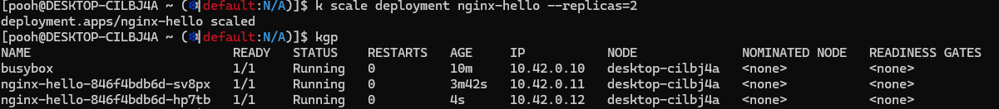

# 1. create ClusterIP service

# 2. wget from busybox

failed.png)

# 3. service discovery

New pod(...-sv8px) is discovered

# 4. Load Balancing

Pod sv8px and hp7tb

Traffic distributed with rate 1:2

# 5. Connect between different namespaces

# 6. Connect from outside of cluster

curl works well

# 7. Configuring Load Balancing

kube-proxy doesn't exist?