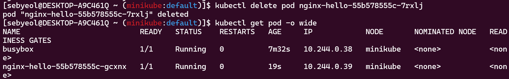

> 클러스터 내부 파드와 파드 간 연결을 이해하기 위해 클러스터IP 타입의 서비스를 생성합니다. 서비스에서 기존 파드가 삭제되고 파드가 새로 생성될 때 자동으로 새로운 파드를 인식하는지 확인합니다. 그리고 파드 수량을 증가시켜 서비스가 새로운 파드를 자동으로 등록하는지 확인합니다(서비스 디스커버리).

---

> NGINX 디플로이먼트를 생성합니다. 파드 레이블을 app:nginx로 지정합니다.

---

> 클러스터 IP(ClusterIP) 타입의 NGINX 서비스를 생성합니다. 정상적으로 서비스 엔드포인트(endpoint)가 추가되는지 확인합니다.

---

> busybox 파드를 실행합니다. 기존의 실행 중인 NGINX 파드와 서비스 이름을 도메인으로 사용해 연결합니다.

---

> 실행 중인 NGINX 파드를 강제로 종료해서 새로운 파드를 실행합니다. 새로운 파드가 busybox 파드에서 서비스 이름으로 자동 발견되는지 확인합니다. 이후 파드의 수량을 증가시킵니다(1개에서 2개로). 동일하게 busybox 파드에서 연결 테스트를 수행합니다.

