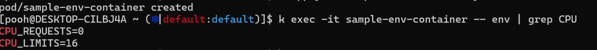

# Chapter 7. 컨피그 & 스토리지 API ( ~ 7.4 컨피그맵)

> 발표일 `24.05.16`
> 
> 발표자 `공병규`

## 7.1 개요

시크릿, 컨피그맵은 쿠버네티스 리소스의 하나로 각각 기밀 정보나 설정 값을 관리할 때 사용한다

## 7.2 쿠버네티스에서의 환경변수

개별 파드에 환경변수를 전달할 때는 템플릿에 `env` 또는 `envForm`을 지정한다

### 7.2.1 정적 설정

```yaml
apiVersion: v1
kind: Pod
metadata:
  name: sample-env
  labels:
    app: sample-app
spec:
  containers:
  - name: nginx-container
    image: nginx:1.16
    env:
    - name: MAX_CONNECTION
      value: "100"
```

env 필드를 통해 개별 컨테이너에 대해 환경변수 설정 가능

### 7.2.2 파드 정보

```yaml
(생략)
spec:
  containers:
  - name: nginx-container
    image: nginx:1.16
    env:
    - name: K8S_NODE
      valueFrom:
        fieldRef:
          fieldPath: spec.nodeName
```

`fieldRef`를 통해 파드에 대한 동적 정보를 가져올 수 있다

### 7.2.3 컨테이너 정보

```yaml
apiVersion: v1
kind: Pod
metadata:
  name: frontend
spec:
  containers:
  - name: app
    image: images.my-company.example/app:v4
    resources:
      requests:
        memory: "64Mi"
        cpu: "250m"
      limits:
        memory: "128Mi"
        cpu: "500m"
```

```yaml
(생략)
spec:
  containers:
  - name: nginx-container
    image: nginx:1.16
    env:
    - name: CPU_REQUESTS
      valueFrom:
        resourceFieldRef:
          containerName: nginx-container
          resource: requests.cpu
    - name: CPU_LIMITS
      valueFrom:
        resourceFieldRef:
          containerName: nginx-container
          resource: limits.cpu
```

`resourceFieldRef`를 이용해서 컨테이너에 대한 동적 정보를 가져올 수 있다



### 명령어에 사용

```yaml
apiVersion: v1
kind: Pod
metadata:
  name: sample-env-fail2
  labels:
    app: sample-app
spec:
  containers:
  - name: nginx-container
    image: nginx:1.16
    command: ["echo"]
    args: ["$(TESTENV)", "$(HOSTNAME)"]
    env:
    - name: TESTENV
      value: "100"
```

> 100 $(HOSTNAME)

`$()`로 매니페스트 내부에 정의된 환경변수만 참조 가능

### 한계점

매번 파드에 환경변수를 설정해야 하니 여러 파드에 적용할 경우에 불편

## 7.3 시크릿

기밀 정보를 컨테이너로 전달하는 방법
- 도커 빌드 시 컨테이너 이미지에 추가
    > 보안상 좋지 않음, 기밀 정보 바뀔 때마다 빌드해야함
- 매니페스트를 통해 전달
    > 보안 이슈, 여러 파드가 같은 기밀 정보를 사용할 경우 관리 어려움

물론 시크릿을 정의하는 매니페스트도 base64로만 인코딩되어 있어 깃헙 등에 업로드하긴 힘듦 (암호화 솔루션은 13장에서 등장)

### 시크릿 분류


| 종류                                | 개요                        |
| ----------------------------------- | --------------------------- |
| Opaque                              | 일반적인 범용 용도          |
| kubernetes.io/tls                   | tls 인증서용                |
| kubernetes.io/basic-auth            | 기본 인증용                 |
| kubernetes.io/dockerconfigjson      | 도커 레지스트리 인증 정보용 |
| kubernetes.io/ssh-auth              | SSH 인증 정보용             |
| kubernetes.io/service-account-token | 서비스 어카운트 토큰용      |
| bootstrap.kubernetes.io/token       | Bootstrap 토큰용            |


일반적인 사용자명과 패스워드 같은 인증 정보는 스키마가 없는 Opaque타입 이용

이외의 타입들은 정해진 스키마가 있음 (e.g. `tls.crt` & `tls.key`)

### 7.3.2. Opaque 시크릿 생성

하나의 시크릿에 여러개의 키-밸류 쌍 저장 가능

#### A. kubectl로 파일에서 값을 참조

```shell
$ kubectl create secret generic --save-config sample-db-auth \
--from-file=./username --from-file=./password
```

```shell
$ kubectl get secrets sample-db-auth -o json | jq .data
{
  "password":(생략),
  "username":(생략)
}
```

#### B. kubectl로 envfile에서 값을 참조
도커에서 --env-file 옵션을 이용하여 컨테이너를 가동한 경우에 이 방법을 이용해서 이관 가능

#### C. kubectl로 직접 값을 전달
```shell
$ kubectl create secret generic --save-config sample-db-auth \
--from-literal=username=root --from-literal=password=1234
```

#### D. 매니페스트에서 생성

```yaml
apiVersion: v1
kind: Secret
metadata:
  name: sample-db-auth
type: Opaque
data:
  username: cm9vdA== # root
  password: cm9vdHBhc3N3b3Jk # rootpassword
```
base64로 인코딩된 값을 넣어야함(`stringData`를 쓰면 그냥 값 넣을 수 있음)

### 7.3.3 TLS 타입 시크릿

```yaml
$ kubectl create secret tls --save-config tls-sample --key ~/tls.key --cert ~/tls.crt
```
## 7.3.7 시크릿 사용

#### A. 환경변수로 전달


`secretKeyRef`를 이용해서 시크릿의 특정 키를 불러올 수 있다

```yaml
apiVersion: v1
kind: Pod
metadata:
  name: sample-secret-single-env
spec:
  containers:
  - name: secret-container
    image: nginx:1.16
    env:
    - name: DB_USERNAME
      valueFrom:
        secretKeyRef:
          name: sample-db-auth
          key: username
```
시크릿 전체 불러오기
```yaml
(생략)
    envFrom:
    - name: sample-db-auth
```

```yaml
(생략)
    envFrom:
    - secretRef:
        name: sample-db-auth1
      prefix: DB1_
    - secretRef:
        name: sample-db-auth2
      prefix: DB2_

```

#### B. 볼륨으로 마운트

특정 키를 마운트

```yaml
apiVersion: v1
kind: Pod
metadata:
  name: sample-secret-single-volume
spec:
  containers:
  - name: secret-container
    image: nginx:1.16
    volumeMounts:
    - name: config-volume
      mountPath: /config
  volumes:
  - name: config-volume
    secret:
      secretName: sample-db-auth
      items:
      - key: username
        path: username.txt
```
지정한 path의 파일에 저장됨

> 동적 마운트된 시크릿에서는 일정 기간마다 `kube-apiserver`로 변경을 확인하고 파일을 업데이트함 (기본 60초마다)

## 7.4 컨피그맵

설정정보를 키-값 쌍으로 저장할 수 있는 리소스

nginx.conf 등의 설정 파일 자체도 저장 가능

### 7.4.1 컨피그맵 생성

#### 파일에서 참조

```yaml
$ kubectl create configmap --save-config sample-configmap --from-file=./nginx.conf
```

#### 직접 값 전달

```yaml
$ kubectl create configmap --save-config sample-configmap \
--from-literal=connection.max=100
```

#### 매니페스트로 생성

```yaml
apiVersion: v1
kind: ConfigMap
metadata:
  name: sample-configmap
data:
  thread: "16"
  connection.max: "100"
  connection.min: "10"
  sample.properties: |
    property.1=value-1
    property.2=value-2
    property.3=value-3
  nginx.conf: |
    user nginx;
    worker_processes auto;
    error_log /var/log/nginx/error.log;
    pid /run/nginx.pid;
  test.sh: |
    #!/bin/bash
    echo "Hello, kubernetes"
    sleep infinity
```

### 7.4.2 컨피그맵 사용

#### 환경변수로 전달

```yaml
apiVersion: v1
kind: Pod
metadata:
  name: sample-configmap-single-env
spec:
  containers:
  - name: configmap-container
    image: nginx:1.16
    env:
    - name: CONNECTION_MAX
      valueFrom:
        configMapKeyRef:
          name: sample-configmap
          key: connection.max
```

```yaml
    envFrom:
    - configMapRef:
      name: sample-configmap
```

#### 볼륨으로 마운트

```yaml
apiVersion: v1
kind: Pod
metadata:
  name: sample-configmap-single-volume
spec:
  containers:
  - name: configmap-container
    image: nginx:1.16
    volumeMounts:
    - name: config-volume
      mountPath: /config
  volumes:
  - name: config-volume
    configMap:
      name: sample-configmap
      items:
      - key: nginx.conf
        path: nginx-sample.conf
```

### 7.4.3 시크릿과 컨피그맵의 공통 주제

시크릿 값은 평소에는 etcd에 저장되어 있다가 실제 시크릿을 쓰는 파드가 있을 때만 노드 상의 임시 영역인 tmpfs에 SSL/TLS로 전송된다

etcd의 접속 권한만 잘 관리하면 안전

#### 마운트 시 퍼미션 설정

```yaml
apiVersion: v1
kind: Pod
metadata:
  name: sample-configmap-scripts
spec:
  containers:
  - name: configmap-container
    image: nginx:1.16
    command: ["/config/test.sh"]
    volumeMounts:
    - name: config-volume
      mountPath: /config
  volumes:
  - name: config-volume
    configMap:
      name: sample-configmap
      items:
      - key: test.sh
        path: test.sh
        mode: 493 # 8진수 0755
```

```yaml
apiVersion: v1
kind: Pod
metadata:
  name: sample-secret-secure
spec:
  containers:
  - name: secret-container
    image: nginx:1.16
    volumeMounts:
    - name: config-volume
      mountPath: /config
  volumes:
  - name: config-volume
    secret:
      secretName: sample-db-auth
      defaultMode: 256
```
