# 과제 도서 21장: 쿠버네티스 보안 도구 활용

1. kubescape 설치 및 사용

- kubescape 설치
  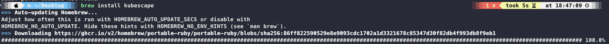

- kubescape 버전 확인
  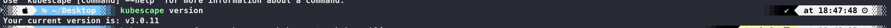

- kubescape 사용
  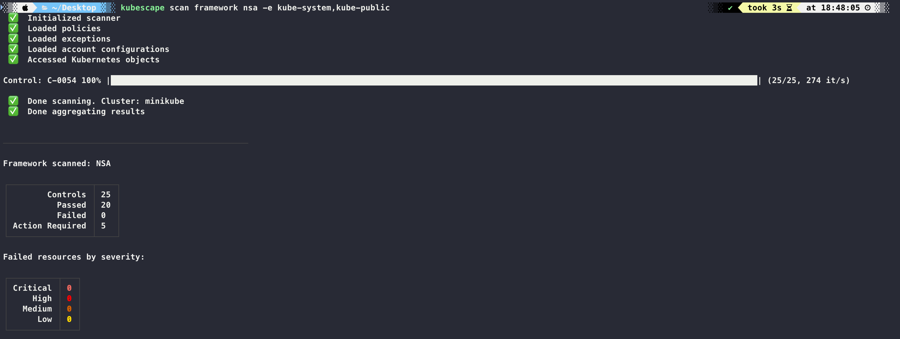
  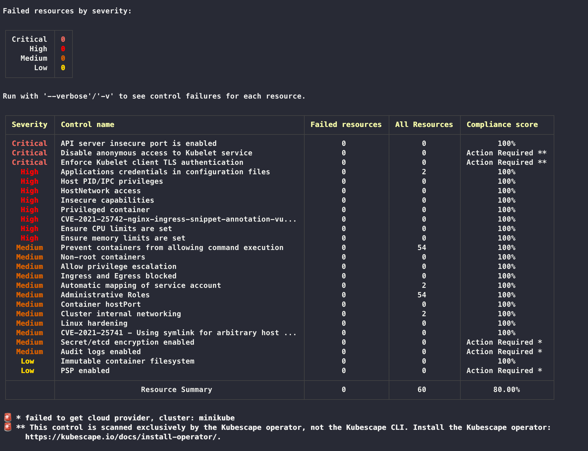

- portal.armo.cloud
  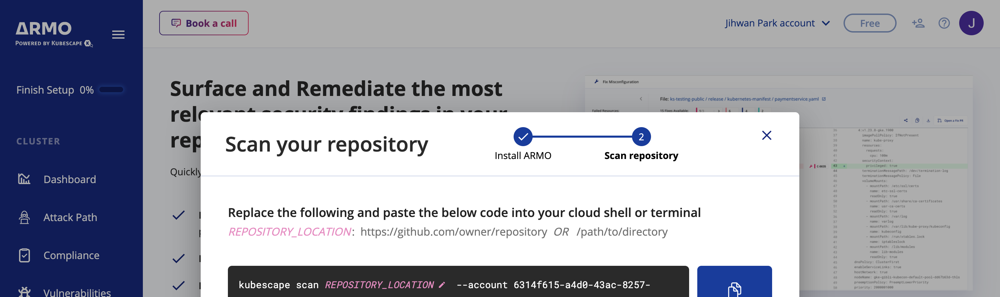
  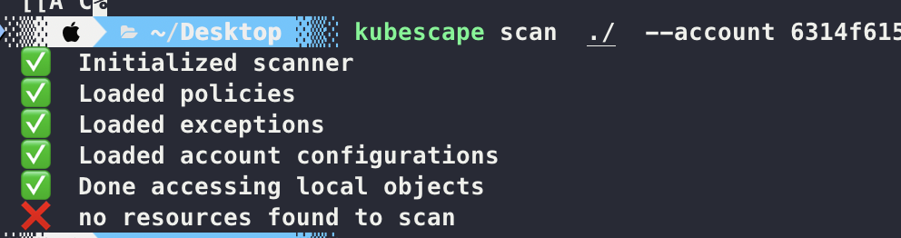

2. polaris 설치 및 사용

- redis 설치
  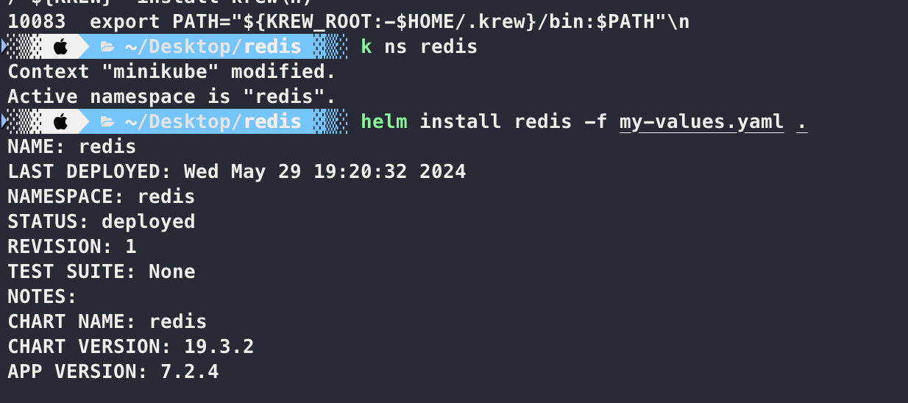
  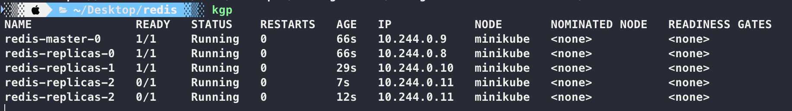

- polaris 설치
  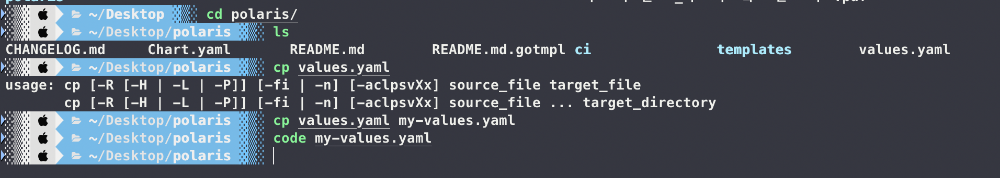
  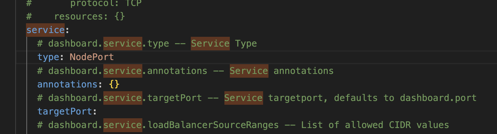
  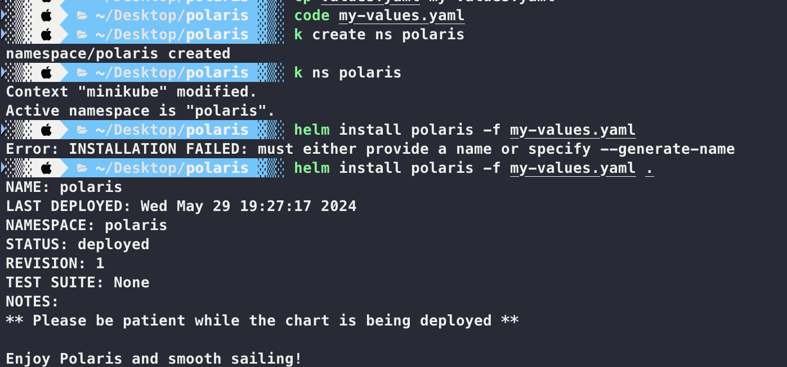
  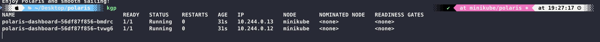

- polaris dashboard
  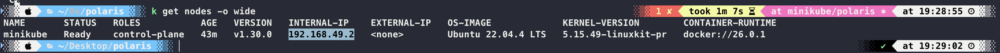
  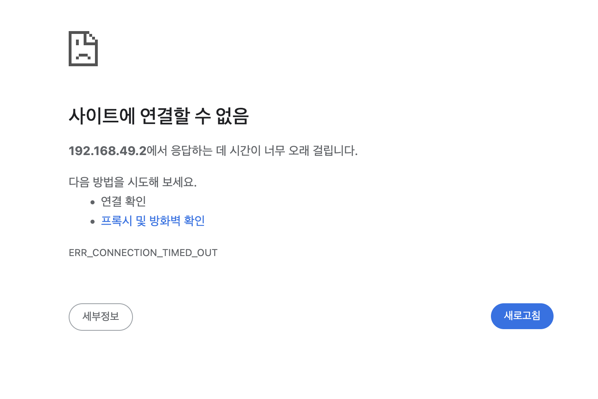

- update redis
  
  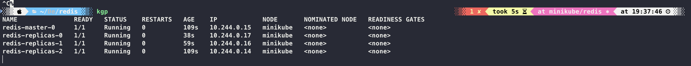
