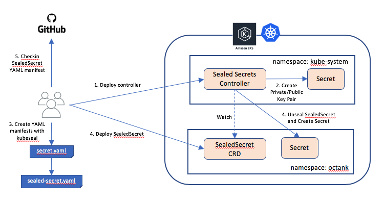

# 보안

## 파드 보안 정책: PodSecurityPolicy

- 보안 정책을 설정해서 클러스터에 제한을 둔다
  - 파드에 대한 제한사항 설정
  - 보안 컨텍스트들에 대한 기본값 설정
  - https://k8s-dev-ko.netlify.app/docs/concepts/policy/pod-security-policy/#what-is-a-pod-security-policy 여기서 보안 정책 항목들 목록 확인 가능
- 기본적으로 비활성화 되어있음
- 파드 보안정책 활성화: `$ gcloud beta container clusters update k8s --enabel-pod-security-policy --zone asia-northeast3-a`
- 화이트리스트 방식: 허용되는것들을 명시해 줘야함
  - 단순히 활성화만 된 상태에서는 파드 생성 불가능
  - 하나 이상의 파드 보안 정책들을 생성해야 함
  - GKE에서는 기본적으로 파드 보안정책을 활성화 할 때 몇개의 파드 보안 정책이 생성되므로 해당 default 파드 정책들에 부합하는 파드들은 처음부터 생성가능
- 여러개의 파드 보안정책이 있을 때 하나 이상의 정책과 맞는 파드들만 생성 가능
  - `Error from server (Forbidden): error when creating "sample-pod.yaml": pods "sample-pod" is forbidden: unabel to validate against any pod security policy: []`
- 예시
  ```
  # sample-podsecuritypolicy.yaml
  apiVersion: policy/v1beta1
  kind: PodSecurityPolicy
  metadata:
    name: sample-podsecuritypolicy
  spec:
    privileged: false
    runAsUser:
      rule: RunAsAny
    allowPrivilegeEscalation: true
    allowedCapabilities:
    - '*'
    allowedHostPaths:
    - pathPrefix: "/etc"
    fsGroup:
      rule: RunAsAny
    supplementalGroups:
      rule: RunAsAny
    seLinux:
      rule: RunAsAny
    volumes:
    - '*'
  ```
- 파드 보안 정책 생성: `$ kubectl apply -f sample-podsecuritypolicy.yaml`
- 클러스터롤에 파드 보안 정책 연결:
  ```
  kubectl create --save-config clusterrole psp-test-clusterrole \
  --verb=use \
  --resource=podsecuritypolicy \
  --resource-name=sample-podsecuritypolicy
  ```
- 서비스 어카운트에 클러스터롤 연결:
  ```
  kubectl create --save-config clusterrolebinding psp-test-clusterrolebinding \
  --clusterrole=psp-test-clusterrole \
  --serviceaccount=default:psp-test
  ```
- 이제 일반 파드는 생성 가능
- 위 yaml 파일의 정책과 맞지 않는 설정을 가진 파드는 생성 불가능
- 레플리카셋의 파드 보안 정책
  - 레플리카셋을 만들때는 레플리카셋이 파드를 생성하기 때문에 파드에 레플리카셋의 보안 정책이 적용된다
  - kube-system의 replicaset-controller 서비스 어카운트를 사용
  - 해당 어카운트에는 파드 보안 정책이 추가되어있지 않아 레플리카셋이 파드 생성이 불가능하다
  - 레플리카셋 매니페스트의 파드 템플릿에 serviceAccountName을 추가해서 해당 서비스 어카운트가 보안정책에 대한 권한을 가지고 있다면 해당 레플리카셋에 권한이 없더라도 해당 보안정책 안에서 파드를 생성할 수 있다
  - `$ kubectl get pods -o custom-columns-'NAME:.mtadata.name,SERVICEACCOUNT:.spec.serviceAccountName'`으로 파드들의 serviceAccountName을 확인 가능
- 파드 보안 정책 비활성화: `$ gcloud beta container clusters update k8s --no-enable-pod-security-policy --zone asia-northeast3-a`

## 네트워크 정책

- 파드간 통신에 대한 규칙
- 네트워크 정책으로 특정 파드들 사이만 통신 가능하도록 제한
- 네트워크 정책 사용하기
  - 온프레미스 환경: 네트워크 정책을 지원하는 CNI 플러그인이 있어야 함 (ex: Calico)
  - GKE의 경우 명시적으로 활성화 가능
- 네임스페이스 별로 각각 생성해야 함

### 네트워크 정책 생성

```
apiVersion: networking.k8s.io/v1
kind: NetworkPolicy
metadata:
  name: sample-networkpolicy
  namespace: default # 보안 정책을 생성할 네임스페이스 지정
spec:
  podSelector:
    # 설정할 대상 파드를 여기에 기입
    # 레이블 셀렉터이므로 복수의 파드를 대상으로 할 수 있음.
  policyTypes:
  - Ingress # 인그레이스 룰을 생성하는 경우 명시
  - Egress # 이그레스 룰을 생성할 경우 명시
  ingress:
  - from:
      # 인그레스 룰을 여기에 기입(이그레스 룰과 형식은 동일）
    ports:
      # 이 인그레스 룰로 허가할 수신 포트 번호와 프로토콜 기입
  egress:
  - to:
      # 이그레스 룰을 여기에 기입(인그레스 룰과 형식은 동일）
    ports:
      # 이 이그레스 룰로 허가할 송신 포트 번호와 프로토콜 기입
```

- ingress: 들어오는 방향의 통신 규칙 지정
- egress: 송신 방향의 통신 규칙 지정
- | podSelector             | namespaceSelector                                   | ipBlock                    |
  | ----------------------- | --------------------------------------------------- | -------------------------- |
  | 특정 파드와의 통신 허가 | 특정 네임스페이스 안의 모든 파드들에 대한 통신 허가 | 특정 IP 주소와의 통신 허가 |
- 모든 트래픽 차단:

```
apiVersion: networking.k8s.io/v1
kind: NetworkPolicy
metadata:
  name: deny-all-networkpolicy
spec:
  podSelector: {}
  policyTypes:
  - Ingress
  - Egress
```

- 모든 트래픽 허용:

```
apiVersion: networking.k8s.io/v1
kind: NetworkPolicy
metadata:
  name: allow-all-networkpolicy
spec:
  podSelector: {}
  egress:
  - {}
  ingress:
  - {}
  policyTypes:
  - Ingress
  - Egress
```

- 클라우드 에서는 수신 방향은 전체를 차단하고 발신은 전체를 허용해주는것이 일반적

- 네트워크 정책 생성: `$ kubectl apply -n <namspace> -f <네트워크 정책 yaml 파일>`
- 네트워크 정책 조회: `$ kubectl get networkpolicy`
- 네트워크 정책 삭제: `$ kubectl delete networkpolicy <policy-name>`

- 네트워크 규칙 예시
  - 특정 파드에서 오는 통신만 허용
  ```
  apiVersion: networking.k8s.io/v1
  kind: NetworkPolicy
  metadata:
  	name: sample-podselector-ingress-networkpolicy
  spec:
  	podSelector:
  		matchLabels:
  			app: np2
  	policyTypes:
  	- Ingress
  	ingress:
  	- from:
  		- podSelector:
  				matchLabels:
  					app: np1
  		ports:
  		- protocol: TCP
  			port: 80
  ```
  - 특정 네임스페이스에서 오는 통신만 허용
  ```
  apiVersion: networking.k8s.io/v1
  kind: NetworkPolicy
  metadata:
  	name: sample-namespaceselector-ingress-networkpolicy
  	namespace: nptest
  spec:
  	podSelector:
  		matchLabels:
  			app: np3
  	policyTypes:
  	- Ingress
  	ingress:
  	- from:
  		- namespaceSelector:
  				matchLabels:
  					ns: default
  		ports:
  		- protocol: TCP
  			port: 80
  ```
  - 특정 IP와의 통신만 허용
  ```
  apiVersion: networking.k8s.io/v1
  kind: NetworkPolicy
  metadata:
  	name: sample-ipblock-ingress-networkpolicy
  	namespace: nptest
  spec:
  	podSelector:
  		matchLabels:
  			app: np4
  	policyTypes:
  	- Ingress
  	ingress:
  	- from:
  		- ipBlock:
  				cidr: 10.24.0.10/32 # 허용할 파드의 IP 주소
  		ports:
  		- protocol: TCP
  			port: 80
  ```
- https://github.com/ahmetb/kubernetes-network-policy-recipes
- 한 파드를 대상으로 한 networkPolicy가 여러개일 경우 조건들이 합집합으로 적용됨

## 인증/인가 & 어드미션 컨트롤

- 어드미션 컨트롤(admission control): 클러스터에 들어오는 API 요청을 중간에서 접수해서 해당 요청을 허용할지 판단하거나 요청을 수정할 수 있다
- 사용자가 요청을 보낼 때
  - 인증: 토큰, 비밀번호 등으로 사용자가 정상 사용자인지 확인
  - 인가: 사용자가 해당 요청에 대한 권한이 있는지 확인
  - 어드미션 컨트롤: 해당 요청을 처리함
- 어드미션 컨트롤의 두가지 종류
  - Mutating Admission Controller: 요청을 쿠버네티스 클러스터 관리자가 변형 가능
    - 사용하는 리소스에 제한 걸기
    - 생성하는 객체의 설정 수정 등
  - Validating Admission Controller: 해당 요청을 허가할지 판단함
    - 파드 정책에 어긋나지는 않는가?
- `/etc/kubernetes/manifests/kube-apiserver.yaml` 파일의 `--enable-admission-plugins` 플래그에 사용할 어드미션 컨트롤 종류를 추가한다

```
spec:
  containers:
  - name: kube-apiserver
    image: k8s.gcr.io/kube-apiserver:v1.19.0
    command:
    - kube-apiserver
    - --enable-admission-plugins=NodeRestriction,ResourceQuota,PodPreset
		# 이하 생략
```

## 파드 프리셋

- 어드미션 컨트롤러의 한 종류
- 사용자가 파드 추가를 위한 요청을 보낼 때 생성되는 파드의 설정값을 수정
  - 특정 파드에 환경 변수 추가
  - /var/log 영역에 영구 볼륨 할당

```
# sample-podpreset.yaml
apiVersion: settings.k8s.io/v1alpha1
kind: PodPreset
metadata:
  name: sample-podpreset
  namespace: default
spec:
  selector:
    matchLabels:
      app: podpreset
  env:
    - name: SAMPLE_ENV
      value: "SAMPLE_VALUE"
  volumeMounts:
    - mountPath: /cache
      name: cache-volume
  volumes:
    - name: cache-volume
      emptyDir: {}
```

- 파드 프리셋 활성화: `$ kubectl apply -f sample-podpreset.yaml`
- 파드 프리셋에 명시된 `spec.selector.matchLabels`와 생성되는 파드가 일치하면 파드 프리셋 적용
  - 위의 예시에서는 환경변수에 `SAMPLE_ENV=SAMPLE_VALUE`가 추가되고 `cache-volume` 볼륨이 마운트된다
- API 요청에 담겨있는 파드의 정보와 파드 프리셋의 설정이 하나라도 충돌하면 파드 프리셋 전체가 적용 되지 않음
  - ex) 파드의 SAMPLE_ENV 환경변수 값에 다른 값이 들어있는 경우
  - 이를 최대한 방지하기 위해서 파드 프리셋을 최대한 잘게 분리하는것이 좋다
- 파드를 파드 프리셋 실행 대상에서 제외하기: `podpreset.admission.kubernetes.io/exclude: true`

  ```
  apiVersion: v1
  kind: Pod
  metadata:
  	name: sample-preset-pod
  	annotations:
  		podpreset.admission.kubernetes.io/exclude: "true"
  	labels:
  		app: podpreset
  spec:
  	containers:
  		- name: nginx-container
  			image: nginx:1.12
  ```

## 시크릿 리소스 암호화

- 쿠버네티스 시크릿을 데이터 저장소에 보관할 때 강한 암호화 필요
- 기본적으로 base64 encoding밖에 안되어있어 이를 업로드하려면 별도의 추가적인 암호화 필요

### kubesec

- Google Cloud KMS, GnuPG 등을 사용해 암호화
- 파일의 데이터 구조는 유지하고 값만 암호화 해서 가독성 좋음
- kubesec 설치:
  ```
  $ sudo curl -o /usr/local/bin/kubesec -sL \ https://github.com/shyiko/kubesec/releases/download/0.9.2/kubesec-0.9.2-darwin-amd64
  $ sudo chmod +x /usr/local/bin/kubesec
  ```
- Google Cloud KMS(Key Management Service)
  - GCP에서 제공하는 관리형 서비스
  - GCP 콘솔에서 Google Cloud KMS를 활성화해야 사용 가능
  - gcloud 인증 필요: `$ gcloud auth application-default login`
  - 인증 정보는 `~/.config/gcloud/` 안에 저장됨
  - keyrings 생성: `$ gcloud kms keyrings create sample-keyring --location global`
  - 키 생성:
    ```
    $ gcloud kms keys create --purpose encryption \
    --keyring sample-keyring --location global kubesec-key
    ```
  - 생성된 키 확인: `$ gcloud kms key list --keyring sample-keyring --location global`
  - `projects/{프로젝트명}/locations/global/keyRings/sample-keyring/cryptoKeys/kubesec-key`에 저장됨
  - 암호화:
    ```
    $ kubesec encrypt -i \
    --key=projects/{프로젝트명}/locations/global/keyRings/sample-keyring/cryptoKeys/kubesec-key \
    sample-db-auth.yaml
    ```
  - 암호화된 결과물에 사용된 키의 정보가 있어서 복호화 시에는 키를 따로 지정할 필요가 없음: `$ kubesec decrypt -i {암호화된 시크릿 yaml 파일}`
- GunPG
  - gpg 명령어를 사용함: `$ brew install gpg`
  - keyring 생성: `$ gpg --gen-key`
  - 결과물로 public 키가 생성됨
  - 암호화:
    ```
    $ kubesec encrypt -i \
    --key=pgp:{퍼블릭 키} \
    sample-db-auth.yaml
    ```
  - 복호화는 Google Cloud KMS와 동일
- 여러개의 키 사용
  - ```
    	$ kubesec encrypt -i \
    	--key=pgp:{퍼블릭 키} \
    	--key=projects/{프로젝트명}/locations/global/keyRings/sample-keyring/cryptoKeys/kubesec-key \
    	sample-db-auth.yaml
    ```
  - 사용자가 이 중 하나의 키라도 사용 가능하다면 해당 파일을 복호화 가능
  - 여러명의 사용자가 동시에 사용해야 하고, 키를 공유하고 싶지는 않을 때 유용

### SealedSecret



- kubeseal 설치: `$ brew install kubeseal`
- SealedSecret 설치: `$ kubectl apply -f https://github.com/bitnami-labs/sealed-secrets/releases/download/v0.12.4/controller.yaml`
- 설치시 비밀키 공개키 쌍이 생성된다
- ```
  	$ kubectl get secret -n kube-system \
  	-L sealedsecrets.bitnami.com/sealed-secrets-key \
  	-l sealedsecrets.bitnami.com/sealed-secrets-key
  ```
- kubeseal 명령어로 공개키를 사용해서 쿠버네티스 시크릿 리소스를 암호화해서 SealedSecret 리소스를 생성: `$ kubeseal -o yaml < sample-db-auth.yaml > sealed-sample-db-auth.yaml`
- 해당 SealedSecret 리소스를 쿠버네티스에 등록시 쿠버네티스 안의 SealedSecret 컨트롤러가 비밀키를 사용해서 리소스를 복호화해 시크릿 리소스를 생성한다
- 복호화 할때 사용되는 비밀키가 유출되었을 때는 새로운 키를 생성해야 함
  - 새로운 공개키로 SealedSecret을 재암호화: `kubeseal --re-encrypt < sealed-sample-db-auth.yaml > resealed-smaple-db-auth.yaml`
  - 새로 비밀키/공개키 쌍을 생성해도 이미 시크릿이 유출되었을 수 있으니 시크릿 리소스도 변경 필요

### ExternalSecret

- `AWS Secrets Manager`, `HashiCorp Vault`, `GCP Secret Manager` 등의 외부 시크릿 매니저 시스템을 사용한다
- 시크릿 리소스를 암호화 해서 쿠버네티스에 넣는것이 아니라 외부 시크릿 매니저에 key로 등록한다
- 해당 시크릿 리소스에 접속할 수 있는 권한을 쿠버네티스 서비스 어카운트에 부여한다
- 해당 키를 데이터로 사용하는 ExternalSecret 리소스를 생성한다
- ExternalSecret 리소스를 쿠버네티스에 업로드해서 해당 리소스가 명시하는 키를 바탕으로 ExternalSecret 컨트롤러가 외부 시크릿 매니저에서 시크릿 리소스를 가져온다

- 예시: GCP 시크릿 매니저

  - GCP 서비스 어카운트와 쿠버네티스 서비스 어카운트를 연결:
    - `gcloud iam service-accounts create external-secret-gsa`
    - ```
      	gcloud iam service-accounts add-iam-policy-binding \
      	--role roles/iam.workloadIdentityUser \
      	--member "serviceAccount:${PROJECT}.svc.id.goog[default/sample-es-kubernetes-external-secrets]" \ external-secrets-gsa@${PROJECT}.iam.gserviceaccount.com
      ```
  - ExternalSecret 설치:
    - `helm repo add external-secrets https://external-secrets.github.io/kubernetes-external-secrets/`
    - ```
      helm install sample-es \
      external-secrets/kubernetes-external-secrets \
      --version 4.0.0 \
      -f values.yaml
      ```
  - GCP Secret Manager에 기밀 등록:
    - ```
      gcloud secrets create sample-gsm-key \
      --replication-policy automatic \
      --data-file ./data.txt
      ```
  - `sample-gsm-key`에 GCP 서비스 어카운트가 접근할 수 있도록 권한 부여:
    - ```
      gcloud beta secrets add-iam-policy-binding --projet ${PROCJECT} \
      --role roles/secretmanager.secretAccessor \
      --member serviceAccount:external-secret-gsa@${PROJECT}.iam.gserviceaccount.com \
      sample-gsm-key
      ```
  - ExternalSecret 리소스:
    ```
    	apiVersion: kubernetes-client.io/v1
    	kind: ExternalSecret
    	metadata:
    		name: sample-external-secret
    	spec:
    		backendType: gcpSecretsManager
    		projectId: _PROJECT_
    		data:
    		- key: sample-gsm-key
    			name: sample-k8s-key
    			version: latest
    ```
  - ExternalSecret 리소스 생성: `kubectl apply -f sample-external-secret.yaml`
  - 생성된 시크릿 확인: `kubectl get externalsecrets sample-external-secret -o yaml`
