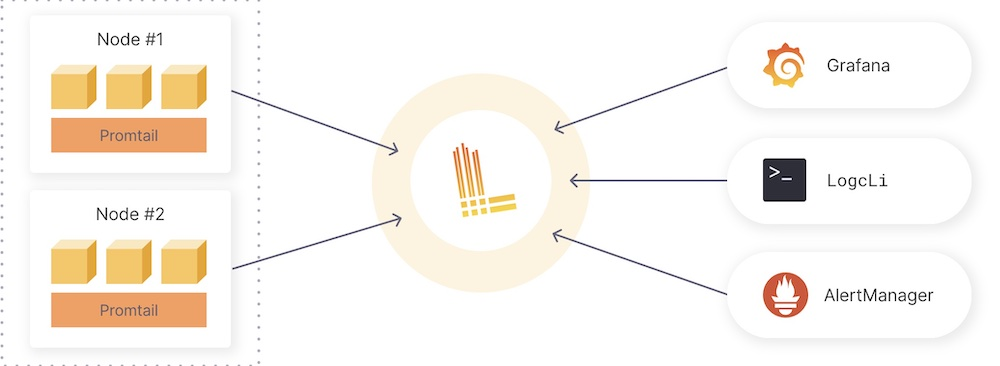

# 15장 모니터링, 16장 컨테이너 로그 집계

## 15장 모니터링

`kubectl top`으로 메트릭을 볼 수 있지만, 클러스터를 운영하기에는 부족하다. 모니터링 도구를 통해 호스트 중심의 모니터링 뿐만 아니라 복잡한 컨테이너의 동작을 추적할 수 있다.

### 1. [데이터독](https://docs.datadoghq.com/ko/getting_started/application/) (유료)

다양한 미들웨어, SaaS, 퍼블릭 클라우드와의 연동 기능을 제공하며 시계열로 다양한 메트립 수집/시각화/모니터링을 할 수 있다.

#### 1-1 데이터독 에이전트 아키텍처

- 쿠버네티스에 배포할 때는 데몬셋을 사용하여 데이터독 에이전트를 각 노드에 가동시킨다.

  

#### 1-2. 데이터독 설치

- https://artifacthub.io/packages/helm/datadog/datadog
- apikey, appkey => 데이터독의 SaaS 측 서버에 메트릭 통신할 때 필요
- tags => 여러 쿠버네티스 클러스터 존재 시 구분하기 위해 태그 사용

#### 1-3. 데이터독 대시보드

- 

- [단계별 활용법](https://www.datadoghq.com/blog/monitoring-kubernetes-era/)

#### 1-4. 데이터독 메트릭

- docker.* -> 도커 컨테이너 관련 메트릭
- kubernetes.* -> 쿠버네티스 관련 메트릭
- kubernetes_state.* -> 쿠버네티스 클러스터 수준의 메트릭

#### 1-5 데이터독 알림

- 이상 행위(Anomaly) 모니터링: 과거 상태와 비교하여 이상을 감지하는 모니터링
- 예측(Forecast) 모니터링: 미래 메트릭이 임계치를 넘는 것을 예측하는 모니터링
- 이상치(Outlier) 모니터링: 그룹 안에 있는 모니터링 대상들과 다른 행동을 감지하는 모니터링
- 단순 임계치 초과 시 알림 기능도 당연히 가능

### 2. 프로메테우스 (무료)

오픈소스 소프트웨어 모니터링 도구. 시계열로 여러 가지 메트릭을 수집/그래프화/모니터링할 수 있다.

#### 2-1. 프로메테우스 아키텍처

1. 프로메테우스 서버: 메트릭을 수집하고 저장, Pull 방식으로 데이터 소스에서 데이터를 수집해 가는 형태
2. 익스포터: 각종 데이터 소스에서 모니토링 항목 데이터를 추출하여 프로메테우스 서버가 이해할 수 있는 형식으로 응답을 반환. [예시](https://prometheus.io/docs/instrumenting/exporters/)
  - 또는 프로메테우스 클라이언트 라이브러리를 사용하여 애플리케이션에서 프로메테우스에 대응한 엔드포인트를 구현할 수도 있음
3. 푸시 게이트웨이: 단발성/배치형 시스템 메트릭처럼 Pull 방식보다 Push 방식이 적합한 경우에 사용, 프로그램에서 푸시 게이트웨이로 메트릭을 송신하면 프로메테우스가 푸시 게이트웨어를 Pull하는 형태
4. 알림 매니저: 모니터링 임계치를 초과했을 때 알림 매니저에게 발송 요청을 보내고, 알림 매니저가 그 정보를 가지고 각종 매체로 정보 전달
5. 데이터 시각화 -> 그라파나 등

#### 2-2. 프로메테우스 설치

- [교재](https://github.com/prometheus-operator/kube-prometheus)
- [헬름 차트](https://artifacthub.io/packages/helm/prometheus-community/prometheus)
- [기본 오퍼레이터](https://github.com/prometheus-operator/prometheus-operator)

#### 2-3. 프로메테우스 대시보드

- [예시](https://grafana.com/grafana/dashboards/315-kubernetes-cluster-monitoring-via-prometheus/)

## 16장 컨테이너 로그 집계

컨테이너에서 기동하는 애플리케이션은 기본적으로 표준 출력과 표준 에러 출력으로 로그를 출력한다. (kubectl logs로 확인 가능) 

그럼 **중장기적으로** 로그를 **안정적으로** 클러스터 외부 서비스에 전송하려면?
  1. 애플리케이션이 특정 파일에 로그를 남긴다.
  2. 애플리케이션에서 라이브러리를 사용하여 직접 외부로 전송한다.

### 1-1. 플루언트디(Fleuntd)

클러스터 외부로 로그를 전송하는 오픈소스 Data Collector

- 데몬셋을 사용하여 각 노드에 파드 한 대씩 기동
- 같은 노드에 실행 중인 모든 컨테이너의 로그를 수집하여 전송
  - 정확히는 도커 컨테이너 표준 출력으로 출력된 로그가 /var/log/containers에 쌓이고, 그 로그 파일을 플루언트디 파드가 tail로 읽어들여서 전송

### 1-2. 플루언트디 로그 저장소 선택

- 다양한 목적지 존재
- [공식 데몬셋](https://github.com/fluent/fluentd-kubernetes-daemonset?tab=readme-ov-file)
- [일반](https://www.fluentd.org/guides/recipes/elasticsearch-and-s3)

### 1-3. 플루언트디 & 플루언트비트(Fluent Bit)

- [비교](https://docs.fluentbit.io/manual/about/fluentd-and-fluent-bit), [비교2](https://betterstack.com/community/logging/fluentd-vs-fluent-bit/#7-user-interface-fluentd-wins)

- 간단 요약: 가볍지만 plugin이 적은 Fluentd = Fluent Bit

### 2. 데이터독 로그를 사용한 로그 집계

- [datadog.logs를 활성화](https://artifacthub.io/packages/helm/datadog/datadog#enabling-log-collection)

### 3. 그라파나 로키를 사용한 로그 집계

**그라파나 로키(Grafana Loki)**: 로그를 집계하는 오픈소스. 데몬셋으로 배포되어 **promtail**이라는 에이전트가 로그를 수집하고 **디플로이먼트로 배포된 로키**에 데이터를 집계하는 구조

**그라파나**: 시계열 매트릭 데이터를 시각화하는 오픈소스 ([playground](https://play.grafana.org/d/000000012/grafana-play-home?orgId=1))

로키에 집계된 로그 데이터는 **그라파나**를 통해 시각화할 수 있으며, 프로메테우스와 잘 맞음

### \* Loki? Prometheus?

**Like Prometheus, but for logs**