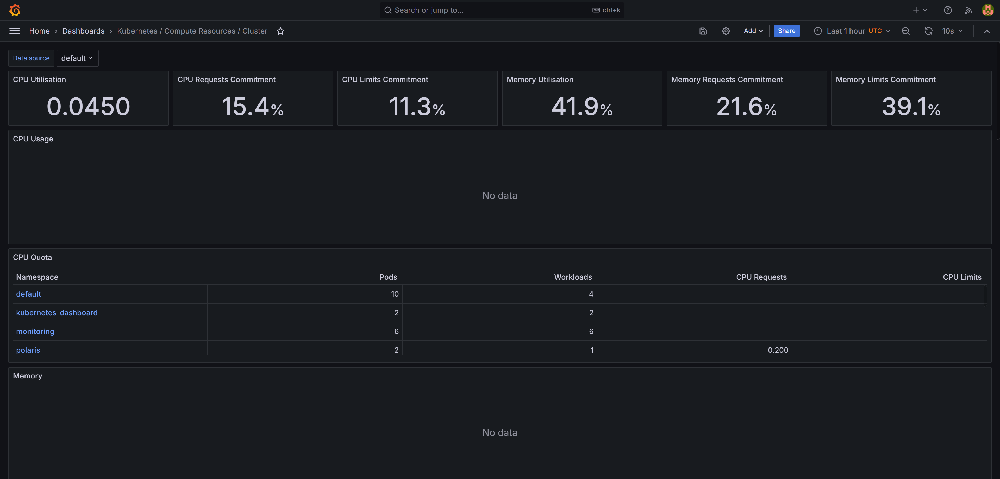
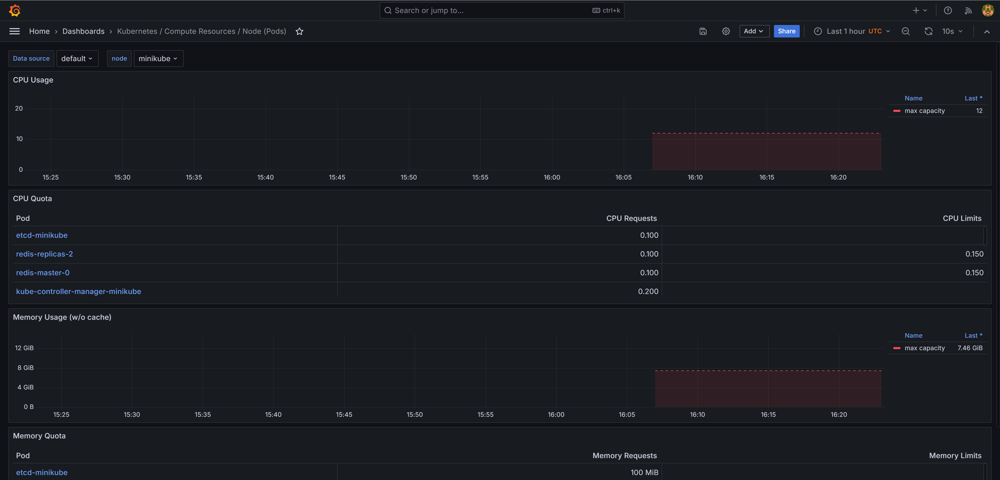
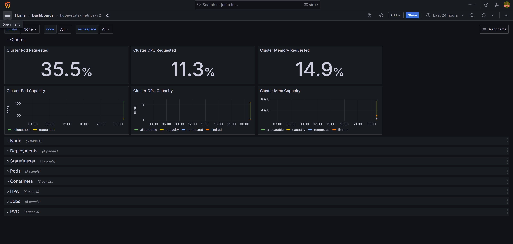
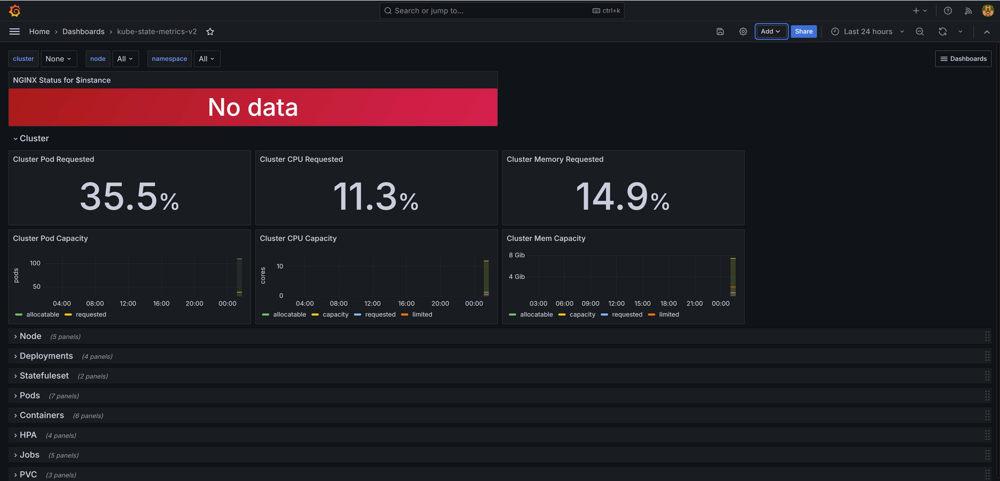
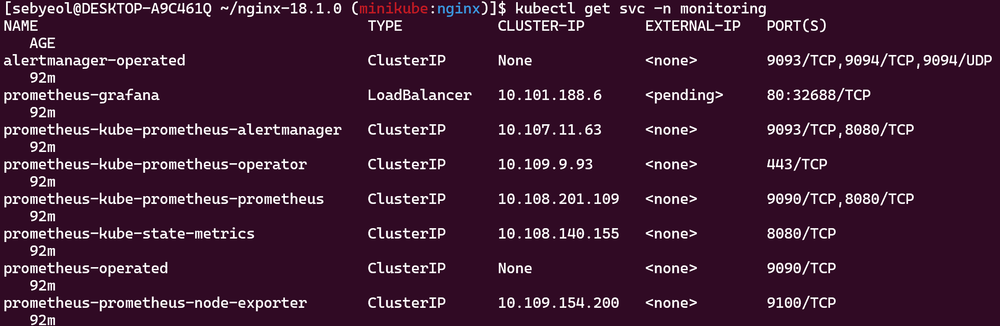
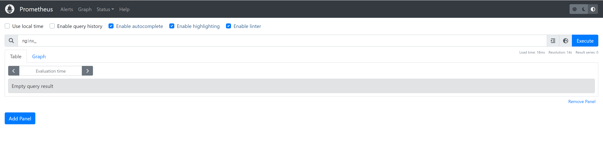

## 1. 프로메테우스-스택 헬름 차트에 기본적으로 포함된 다양한 모니터링 대시보드를 확인합니다. 이를 통해 1) 전반적인 쿠버네티스 리소스 현황을 파악하고, 2) 개별 파드와 노드별 자원 사용량을 확인합니다.

## 2. 그라파나 공식 홈페이지에서 다양한 글로벌 사용자가 공유한 대시보드를 확인합니다. 다운로드 수, 별점 분포 등으로 정렬해서 원하는 대시보드를 찾아 로컬 환경에 가져오기(IMPORT)합니다.

## 3. 특정 대시보드에서 원하는 패널만 다른 대시보드에 복사해서 나만의 새로운 대시보드를 만듭니다.

## 4. 새로운 애플리케이션을 설치하고 그라파나 대시보드에 모니터링 정보를 등록합니다. 헬름 차트로 NGINX 웹서버를 설치하고 프로메테우스 모니터링 옵션을 추가합니다. 프로메테우스에 NGINX 메트릭을 추가하고 프로메테우스 쿼리 언어(PromQL)로 NGINX 웹서비스의 커넥션 수를 보여주는 대시보드를 만듭니다.

