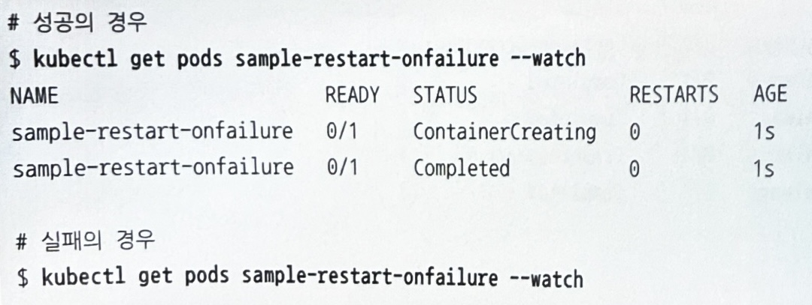
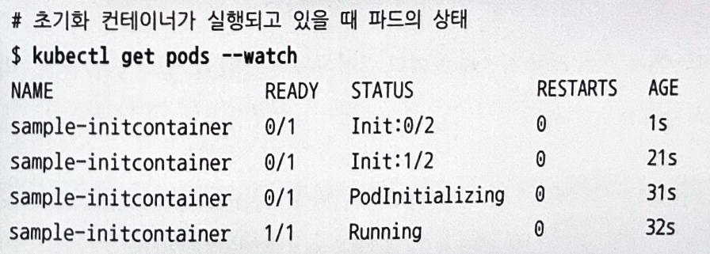

# 10장. 헬스 체크와 컨테이너 라이프사이클

## 목차

- [10장. 헬스 체크와 컨테이너 라이프사이클](#10장-헬스-체크와-컨테이너-라이프사이클)
  - [목차](#목차)
  - [1. 헬스 체크](#1-헬스-체크)
    - [1.1 세 가지 헬스 체크 방법(Liveness/Readiness/Startup Probe)](#11-세-가지-헬스-체크-방법livenessreadinessstartup-probe)
    - [1.2 세 가지 헬스 체크 방식](#12-세-가지-헬스-체크-방식)
    - [1.3 헬스 체크 간격](#13-헬스-체크-간격)
    - [1.4 헬스 체크 생성](#14-헬스-체크-생성)
    - [1.5 Liveness Probe 실패](#15-liveness-probe-실패)
    - [1.6 Readiness Probe 실패](#16-readiness-probe-실패)
  - [2. 컨테이너 라이프사이클과 재기동(restartPolicy)](#2-컨테이너-라이프사이클과-재기동restartpolicy)
      - [Always](#always)
      - [onFailure](#onfailure)
      - [Never](#never)
  - [3. 초기화 컨테이너](#3-초기화-컨테이너)
  - [4. 기동 직후와 종료 직전에 임의의 명령어를 실행(postStart/preStop)](#4-기동-직후와-종료-직전에-임의의-명령어를-실행poststartprestop)
  - [5. 파드의 안전한 정지와 타이밍](#5-파드의-안전한-정지와-타이밍)
  - [6. 리소스를 삭제했을 때의 동작](#6-리소스를-삭제했을-때의-동작)

## 1. 헬스 체크

### 1.1 세 가지 헬스 체크 방법(Liveness/Readiness/Startup Probe)

 </br> </br> </br>

 </br>
- 파드 내부의 컨테이너가 정상적으로 동작 중인지 확인하기 위한 헬스 체크
- 재시작 없이는 복구가 어려운 컨테이너에 사용 (ex. 장기간 실행하여 메모리 누수 등에 의해 응답하지 않을 때)
</br> </br> </br>

 </br>
- 파드가 요청을 받아들일 수 있는지 확인하기 위한 헬스 체크
- ex. 백엔드 데이터베이스에 정상적으로 접속되는지, 캐시에 로드가 끝났는지, 기동 시간이 오래 걸리는 프로세스가 기동을 완료했는지 등을 체크
</br> </br> </br>

 </br>
- 파드가 처음 기동이 완료되었는지 확인하기 위한 헬스 체크
- 끝날 때까지 Liveness Probe나 Readiness Probe가 시작되지 않음.
- 왜 필요한가? :: 처음 기동하는 데 시간이 걸리는 경우 Liveness Probe 대신 쓰려고 Startup Probe가 등장.
  ```yaml
  만약 Liveness Probe를 사용하려면, 첫 번째 체크 시작 시간을 연장하거나 실패라고 판단할 때까지 시간을 연장하여 사용해 왔다. 예를 들어 첫 번째 체크 시작 시간을 60초 후 등으로 설정하면, 최초 기동이 바로 끝나는 경우 60초간 체크가 없는 상태가 되거나 처음 기동에 60초 이상 걸리는 경우에는 체크가 실패하게 된다. 후자의 경우에는 몇 번이든 재기동을 반복하므로 결국 Liveness Probe 때문에 파드가 전혀 기동하지 않는 경우도 있다. 또 실패라고 판단할 때까지 시간을 연장하여 위의 문제는 발생하지 않지만, 그 결과 장애 발생 시 헬스 체크가 바로 실패라고 판단해주지 않는 문제도 발생하게 된다.
  ```
</br> </br> </br>

### 1.2 세 가지 헬스 체크 방식

 </br>
- 세 probe 모두 사용 가능한 method들.
- 헬스 체크는 컨테이너 별로 이루어지며, 어느 하나라도 실패하면 전체 파드가 실패한 것으로 간주됨.
</br> </br> </br>

 </br>
- 명령어를 직접 작성할 수 있으므로 가장 유연한 체크 방식임.
- 컨테이너별로 실행되는 거라 컨테이너별로 파일 가지고 있어야 함.
</br> </br> </br>

 </br>
- http get 요청의 status code로 확인함.
- 컨테이너에는 kubelet이 가진 파드용 네트워크 인터페이스 IP 주소로 요청이 감.
</br> </br> </br>

 </br>
- 직접 tcp 통신을 쏘는 것도 가능함.
</br> </br> </br>


### 1.3 헬스 체크 간격

 </br>
- 세 probe 모두 사용 가능한 interval들.
- Liveness Probe는 파드를 재시작해버리기 때문에 failureThreshold를 설정하는 게 좋다고 함.
- successThreshold는 1 이상이어야 하고, 특히 Liveness Probe와 Startup Probe는 1이어야 함. </br>
(뒤에서 예제로 보충 설명)
</br> </br> </br>


### 1.4 헬스 체크 생성

 </br>
 </br>
- probe는 여러 종류 동시에 지정해도 됨.
- 각 probe에 적절한 method 및 interval를 지정해주면 됨.
</br> </br> </br>


### 1.5 Liveness Probe 실패

 </br>
 </br>
- http://localhost:80/index.html에 http get 요청을 보냈을 때 status code가 200~399이면 정상이라고 체크하는 liveness probe를 붙인 예제이다.
- 체크가 실패하도록 index.html을 삭제하고 404가 오는 지를 확인해보자. </br> </br> </br>


</br> </br> </br>


### 1.6 Readiness Probe 실패

 </br>
- /usr/share/nginx/html/50x.html 파일이 있으면 정상이라고 체크하는 readiness probe를 붙인 예제이다.
- 체크가 실패하면 파드가 not ready 상태가 되는지 확인하자. </br> </br> </br>

 </br>
 </br>

</br> </br>
- 한편, 파드가 ready 상태임을 보이는 조건을 추가하고 싶다면 spec.readinessGates에 conditionType을 추가하면 된다. readiness gate가 설정된 파드의 경우, 파드가 ready 상태가 아니라면 deployment 업데이트를 해도 파드 변경이 안 일어난다.


## 2. 컨테이너 라이프사이클과 재기동(restartPolicy)

- 컨테이너 프로세스 정지 또는 헬스 체크 실패 시 컨테이너를 재기동할지를 지정할 수 있다.

 </br>


#### Always
- 파드가 정지하면 무조건 재기동함

 </br>
 </br>

#### onFailure
- 비정상 종료 시에만 재기동함

 </br>
 </br>

#### Never
- 비정상 종료해도 재기동 안 함

 </br>
</br> </br>


## 3. 초기화 컨테이너

- 파드 내부에서 메인이 되는 컨테이너를 기동하기 전에 별도의 컨테이너를 기동하기 위한 기능
- 서비스 제공에 필요한 최소 프로그램만 가진 상태로 서비스 공개
- ex. 저장소에서 파일 등을 가져오는 처리, 컨테이너 기동을 지연시키는 처리, 설정 파일을 동적으로 생성하는 처리, 서비스가 생성되어 있는지 확인하는 작업 등

 </br>

- 여러 컨테이너를 순차적으로 실행시킬 수 있다.

 </br>
 </br>

</br> </br> </br>


## 4. 기동 직후와 종료 직전에 임의의 명령어를 실행(postStart/preStop)

- 컨테이너 기동 후와 정지 직전에 임의의 명령어를 실행할 수 있음.

 </br>
 </br>

- postStart가 entrypoint 실행 전에 실행될 수도 있고 아닐 수도 있기 때문에 기동에 필요한 파일을 배치하는 용도로 쓰려면 초기화 컨테이너 사용이 더 적합함.
- postStart와 preStop은 자칫 여러 번 실행될 수도 있음. (주의해야 함.)
- postStart는 타임아웃도 없고, probe도 실행되지 않기 때문에 프로그램 측에 타임아웃 설정을 넣어야 함.


## 5. 파드의 안전한 정지와 타이밍

- graceful termination을 위한 여유 시간을 설정해줄 수도 있다.
- preStop 처리, SIGTERM 처리, 서비스에서 제외 처리가 동작하기 위한 여유 시간이다.
- 서비스 제외가 완료되기 전에 프로세스 종료되면 안돼서 그건 생각하고 만들어야 함.

 </br>

</br> </br> </br>


## 6. 리소스를 삭제했을 때의 동작

- 레플리카셋 등의 상위 리소스가 삭제되면 하위 리소스가 되는 파드 등을 삭제하기 위한 garbage collection이 수행된다.
- 레플리카셋이나 디폴로이먼트에 의해 생성된 파드에는 아래와 같이 레플리카셋에 대한 metadata가 저장되어있기에 가능하다.

 </br>

- 이때 이 추가 삭제 동작을 할 지 말 지 cascade 옵션을 통해 결정할 수 있다.

 </br>
</br> </br> </br>