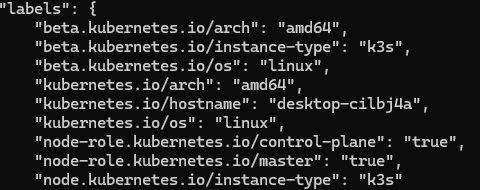
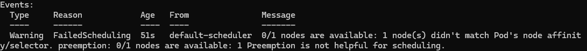

# 유연한 스케줄링 Part 1

## 1. 스케줄링 개요

스케줄링은 필터링 과정과 스코어링 과정으로 나뉨
- 필터링 : 스케줄링할 파드를 배치할 수 있는 노드를 계산
- 스코어링 : 필터링 된 노드에 순위를 매겨서 가장 최적의 노드를 탐색

스케줄링은 기본적으로 이미 설정된 디폴트 값이 있고, 매니페스트를 통해 추가 설정이 가능

## 2. 빌트인 노드 레이블

```cmd
$ k get nodes -o json | jq ".items[] | .metadata.labels"
```




기본적으로 호스트명, os, 아키텍쳐 등에 대한 정보가 존재

수동으로 부여할 수도 있음
```cmd
$ k label node {노드이름} {라벨이름}={값}
```
## 3. 스케줄링 설정 방식

- 사용하고 싶은 노드를 선택
  - nodeSelector
  - Node (Anti-)Afinity
  - Inter-Pod (Anti-)Afinity
- 사용하고 싶지 않은 노드를 지정
  - Taints / Tolerations

## 4. nodeSelector

- 단순한 노드 어피니티만 필요할 때 사용

- 5장에서 다뤘음

```yaml
apiVersion: v1
kind: Pod
metadata:
  name: nginx
  labels:
    env: test
spec:
  containers:
  - name: nginx
    image: nginx
    imagePullPolicy: IfNotPresent
  nodeSelector:
    disktype: ssd
```

- 라벨 disktype이 ssd인 노드에 배치

## 5. 노드 어피니티

```yaml
apiVersion: v1
kind: Pod
metadata:
  name: sample-node-affinity
spec:
  affinity:
    nodeAffinity:
      requiredDuringSchedulingIgnoredDuringExecution: # 필수조건 (필터링)
        nodeSelectorTerms:
        - matchExpressions:
          - key: disktype
            operator: In
            values:
            - hdd
          - key: cpugen
            operator: In
            values:
            - 3
      preferredDuringSchedulingIgnoredDuringExecution: # 우선조건 (스코어링)
      - weight: 1
        preference:
          matchExpressions:
          - key: kubernetes.io/hostname
            operator: In
            values:
            - gke-k8s-default-pool-9c2aa160-d2pl
  containers:
  - name: nginx-container
    image: nginx:1.16
```

- 필수조건을 만족하는 노드가 없으면 파드의 status : pending으로 스케줄링에 실패함



- 필수조건에는 우선조건과 다르게 nodeSelectorTerms라는 항목이 존재
  - nodeSelectorTerms는 하위 matchExpressions 들을 OR로 연결

  - matchExpressions는 하위 조건들을 AND로 연결

  - (A and B) or (C and D) 형식의 논리를 구현할 수 있음

- 우선조건에서는 weight가 존재
  - 높은 weight일수록 선호도가 높음을 의미
  - matchExpressions는 위와 동일하게 하위 조건을 AND로 연결
  - AND로 상황을 묘사하고 상황 별 우선순위를 weight를 통해서 설정해주면 됨

## 6. matchExpressions 오퍼레이터

- 집합성 기준을 사용 (set-based)
- 사용가능한 오퍼레이터


| 오퍼레이터 | 사용방법 | 의미 |
|-|-|-|
|In| A In [B,...] | 라벨 A의 값이 배열 내의 어떤 값과 일치 |
|NotIn| A NotIn [B,...] | 라벨 A의 값이 배열 내의 어떤 값과도 일치하지 않음 |
|Exists| A Exists [] | 라벨 A가 존재 |
|DoesNotExist| A DoesNotExist [] | 라벨 A가 존재하지 않음 |
|Gt| A Gt [B] | 라벨 A의 값이 B보다 큼 |
|Lt| A Lt [B] | 라벨 A의 값이 B보다 작음 |

## 7. 노드 안티어피니티

- 엄밀히 말해서 노드어피니티의 일종이지만 오퍼레이터 앞에 `Not`이 접두사로 붙은 형태

```yaml
requiredDuringSchedulingIgnoredDuringExecution:
  nodeSelectorTerms:
  - matchExpressions:
    - key: disktype
      operator: NotIn
      values:
      - hdd
```

## 8. 인터파드 어피니티

```yaml
apiVersion: v1
kind: Pod
metadata:
  name: sample-pod-affinity-zone-host
spec:
  affinity:
    podAffinity:
      requiredDuringSchedulingIgnoredDuringExecution: # 필수조건
      - labelSelector:
          matchExpressions:
          - key: app
            operator: In
            values:
            - sample-app
        topologyKey: failure-domain.beta.kubernetes.io/zone
      preferredDuringSchedulingIgnoredDuringExecution: # 우선조건
      - weight: 1
        podAffinityTerm:
          labelSelector:
            matchExpressions:
            - key: app
              operator: In
              values:
              - sample-app
          topologyKey: kubernetes.io/hostname
  containers:
  - name: nginx-container
    image: nginx:1.16
```

- podAffinity 키워드를 이용해 정의
- nodeAffinity와 마찬가지로 필수조건, 우선조건이 존재
- labelSelector로 파드를 묘사
- 그 아래 topologyKey로 묘사된 파드와 같은 값을 가질 라벨을 지정

- 위 예제에서는 라벨 sample-app의 파드와 반드시 같은 zone에 배치되고, 웬만해서는 같은 노드에 배치하는 방향으로 스케줄링됨

- 다른 labelSelector끼리는 OR로 연결됨

## 9. 인터파드 안티어피니티

- 접두사 `Not`을 붙이는 노드 안티어피니티와 다르게 `podAntiAffinity` 항목이 존재
  
```yaml
apiVersion: v1
kind: Pod
metadata:
  name: sample-pod-antiaffinity-host
spec:
  affinity:
    podAntiAffinity:
      requiredDuringSchedulingIgnoredDuringExecution:
      - labelSelector:
          matchExpressions:
          - key: app
            operator: In
            values:
            - sample-app
        topologyKey: kubernetes.io/hostname
  containers:
  - name: nginx-container
    image: nginx:1.16
```

의미 : app=sample-app인 파드가 돌아가는 노드의 hostname과 다른 hostname을 가진 노드에 스케줄링한다

topologyKey를 zone으로 해서 각 zone마다 하나씩 배포하도록 설정할 수도 있다
