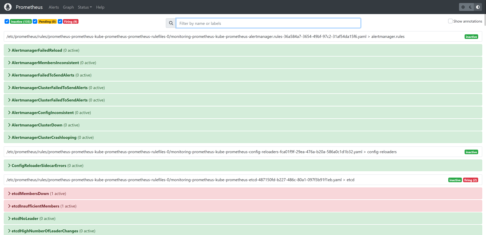
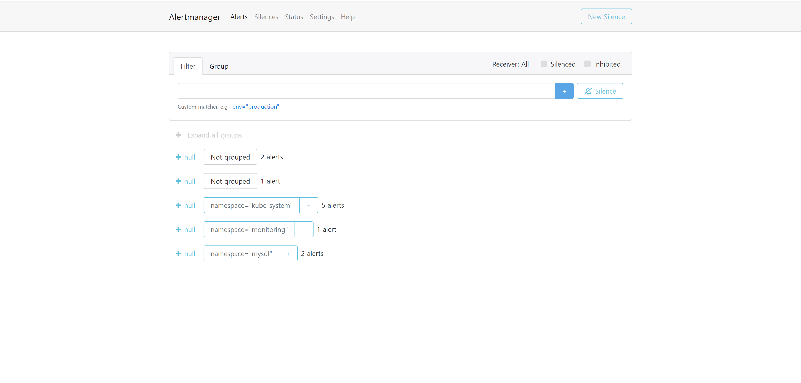
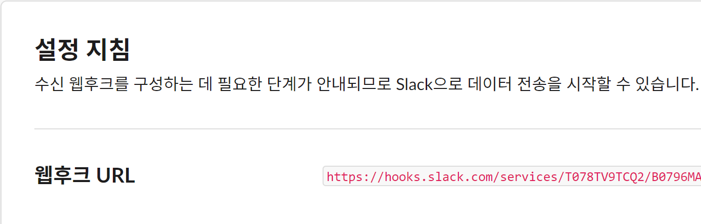
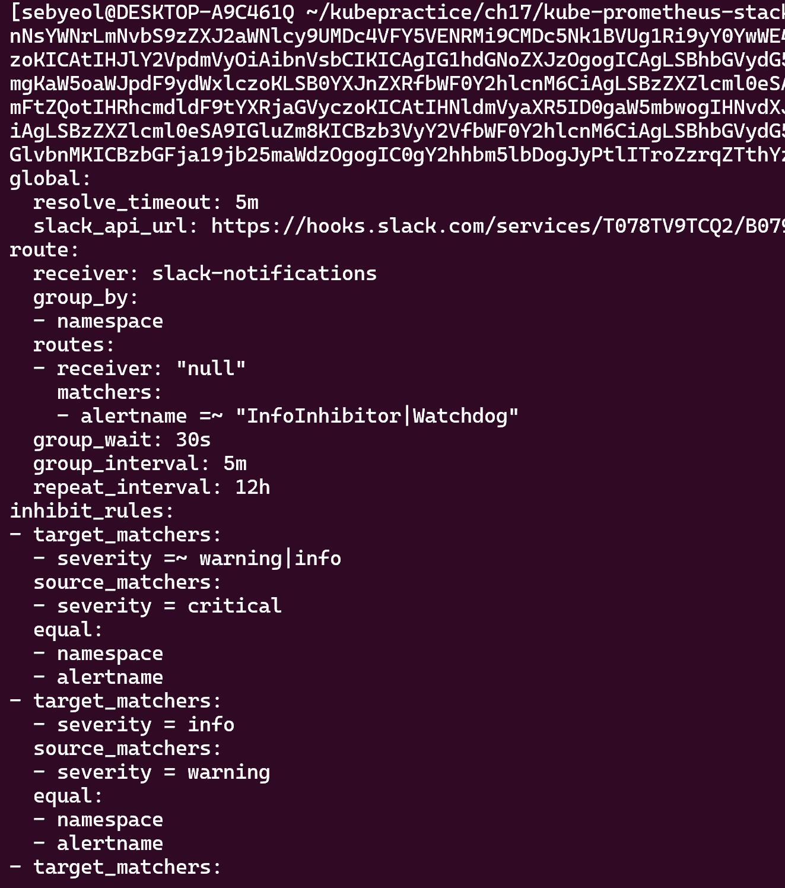
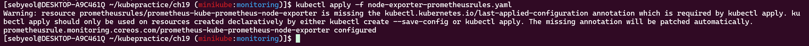

## 1. 프로메테우스, 얼럿매니저 웹서비스에서 경고(Alert) 메뉴의 주요 기능을 확인합니다.

## 2. 얼럿매니저 연동을 위해 별도의 슬랙 채널과 해당 채널의 웹훅 URL을 생성합니다. 웹훅 URL을 얼럿매니저 설정 파일(alertmanager.yoml)에 등록합니다.

## 3. 임의의 노드를 종료시켜 얼럿매니저에서 정상적으로 경고 메시지가 전달되는지 확인합니다. 헬름 차트로 사전 설치된 시스템 경고 메시지 정책(prometheusrules)의 상세 내용을 슬랙 채널에 전달된 메시지로 확인합니다.

## 4. 파일 시스템 사용량이 80% 이상인 경우 경보를 발생하도록 사용자 정의 시스템 경고 메시지 정책을 생성합니다. 기본으로 설정된 prometheusrules 정책을 수정합니다.

