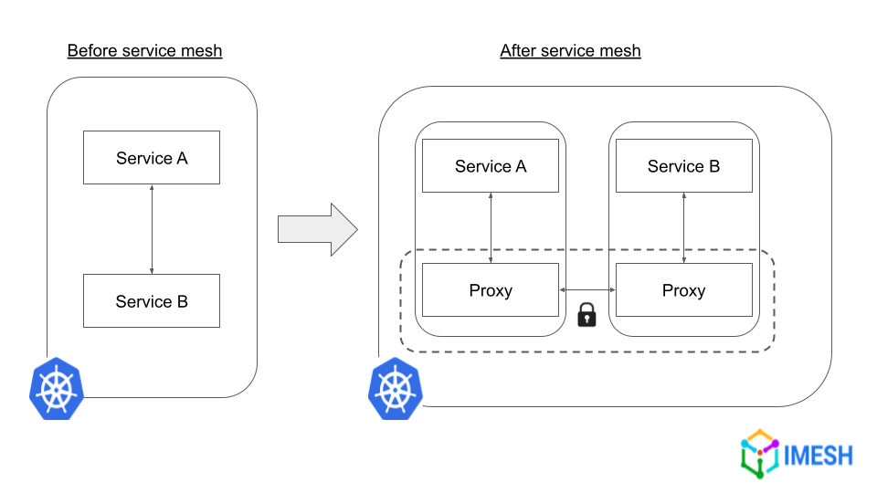
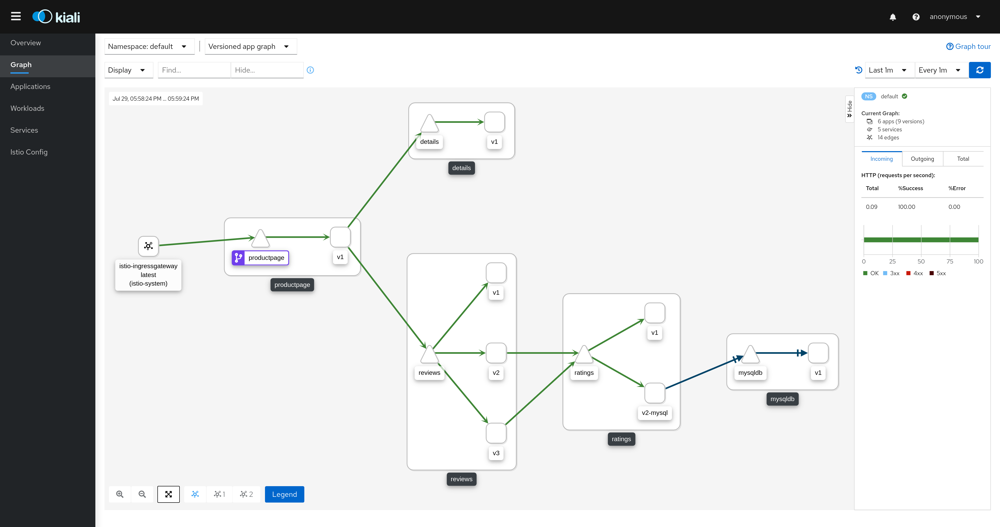
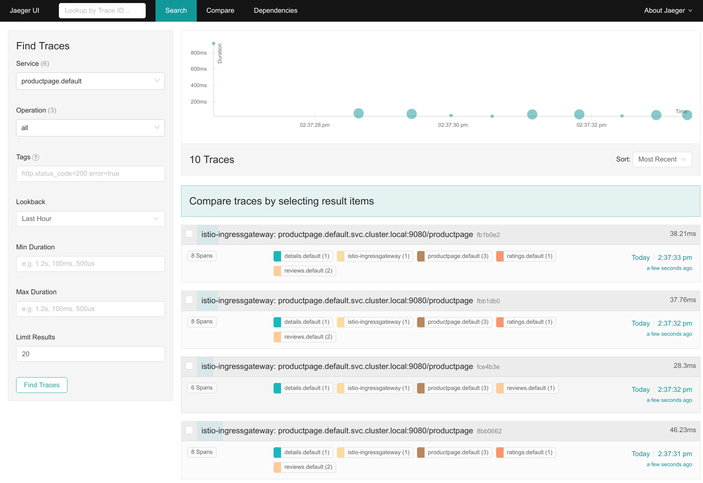

# 18. 마이크로서비스 아키텍처와 서비스 매시

## 18.1. 마이크로서비스 아키텍처

- 마이크로서비스 아키텍처: 시스템의 기능을 서비스 단위로 분리하고, 분리된 서비스들을 gRPC나 REST API 등으로 연결해서 시스템을 구성
- 모놀리식 아키텍처: 시스템 전체를 하나의 서비스로 구현

### 마이크로서비스 아키텍처의 장점

- 각 서비스 별로 독립적인 개발
  - 서비스 별 사용할 프레임워크 등의 기술 선택
  - 개별 서비스를 따로 확장 가능
  - 서비스 별 독립적인 업데이트
    - 배포 주기 단축
    - 문제 발생시 해당 서비스 단위에만 영향

### 마이크로서비스 아키텍처의 단점

- 시스템을 적당히 영향 크게 안미치도록 분리하는게 쉽지 않음
  - 구현 난이도가 모놀리식 보다 높음
- 시스템 전체를 한 눈에 보고 관리하기 어려움
  - 서비스 간 의존관계 파악하기
  - 에러 원인 파악하기
    - 이를 보완하기 위해 서비스 매시 사용

### 마이크로서비스 아키텍처와 쿠버네티스

- 하나의 마이크로 서비스 -> 하나의 컨테이너 이미지 -> 하나의 디플로이먼트
- 각 마이크로 서비스를 변경하고 싶을 때 디플로이먼트의 컨테이너 이미지 업데이트

## 18.2. 서비스 매시



- 마이크로서비스들 간의 통신을 제어
- 이스티오, 링커드 등의 오픈소스 소프트웨어 존재
- 파드 간 통신 경로에 프록시를 배칭해서 트래픽 모니터링과 제어를 함
- 트래픽 모니터링: 특정 요청의 정보 확인
  - 에러율, 요청 횟수/빈도, 통신하는데 걸리는 시간 등
  - 서비스 에러가 발생하거나 서비스 속도가 느릴 때 원인 파악에 용이
- 트래픽 컨트롤: 파드 간 요청에 대한 제어
  - 트래픽 시프팅: 트래픽의 목적지 제어
    - 조건에 맞는 특정 요청들을 분류해서 목표 디플로이먼트를 따로 지정해줄 수 있다
      - 테스트, 개발 단계의 요청들만 업데이트 후 최신 디플로이먼트로 전송
  - 서킷 브레이커: 목적지 마이크로서비스에 에러가 생겨서 서비스가 정지되었을 경우 접속을 차단하고 바로 요청자에 에러 전송
    - 목적지에 도달한 요청이 타임아웃 될때까지 계속 대기하면서 시간 잡아먹는것 방지
  - 폴트 인젝션: 의도적인 요청 지연이나 실패를 발생시킴
    - 특정 서비스의 장애 상태에서의 시스템과 다른 마이크로 서비스들의 기동 확인 가능
  - 속도 제한: 초당 API 요청 횟수 제한 가능
- 파드간 통신 보안 설정
  - 인증: [mTLS](https://imesh.ai/blog/what-is-mtls-and-how-to-implement-it-with-istio/)
  - 접근 제어: 서비스와 네임스페이스를 바탕으로 한 RBAC 규칙으로 요청들을 허가할지 결정

## 18.3. 이스티오

### 18.3.1. 이스티오 아키텍처

- 가장 유명한 서비스 매시 오픈소스 소프트웨어
- `Data Plane`과 `Control Plane`
- `Data Plane`: 실제로 트래픽을 받아 해당 요청을 처리해주는 파트
  - 각 파드 안에 엔보이 프록시 추가로 존재
  - 파드 간 요청 전송시 엔보이 프록시를 거쳐서 전송
    - 엔보이 프록시에서 트래픽분석, 제어 가능
  - Envoy 프록시: 경량 C++ 기반 프록시
    - HTTP, TCP 지원
    - 서킷 브레이커, 타임아웃 등 기능 지원
    - 서로 간에 mTLS로 연결됨
      - 엔보이 프록시에 접근하기 위해서 서비스들은 TCP로 접속해야 함
- `Control Plane`: `Data Plane`의 제어를 담당
  - 두뇌 역할
  - 쿠버네티스 리소스에 저장된 정보를 기반으로 각 엔보이들을 설정
    - 어떤 기능을 해야하는가
    - 통신을 어디로 연결해야 하는가
- 서비스 매시 확장: 기본적으로는 한 쿠버네티스 클러스터 안에 서비스 매시가 존재하지만 이 범위를 늘려 다른 클러스터나 아예 외부의 VM, 서버도 포함하도록 확장할 수 있다

### 18.3.2. 이스티오 사용하기

- istioctl 바이너리 다운로드: `$ curl -L https://istio.io/downloadIstio | ISTIO_VERSION=1.6.0 sh -`
- 다운받은 바이너리 배포: `$ sudo mv istio-1.6.0/bin/istioctl /usr/local/bin/istioctl`
- 이스티오의 컨트롤 플레인 배포: `$ istioctl manifest apply --set profile=demo`
- 파드에 envoy 프록시를 삽입하는 두가지 방법
  - 1.  `istioctl kube-inject` 명령어
    - ```
      $ istioctl kube-inject -f my-app.yaml -o my-app-injected.yaml
      $ kubectl apply -f my-app-injected.yaml
      ```
    - 파일 생성 없이 바로 반영: `istioctl kube-inject -f my-app.yaml | kubectl apply -f -`
  - 2.  `mutating webhook admission controller` 사용
    - 엔보이 프록시를 파드 생성시 자동으로 삽입
    - `$ kubectl label namespace default istio-injection=enabled`
    - `istio-injection` 활성화 잘 되었는지 확인: `$ kubectl get namespaces -L istio-injection`
    - 이후 매니페스트들을 `kubectl apply`시 자동으로 엔보이 프록시 삽입
      - 생성된 파드들을 `kubectl get pods`로 확인하면 `READY` 밑에 파드들마다 다 `2/2`로 표기된다
- 배포된 이스티오 매니페스트 삭제: `kubectl delete -f <(istioctl manifest generate --set profile=demo)`
- 트래픽 제어: 리소스 매니페스트를 생성 후 클러스터에 적용
  - `GateWay`: 클러스터 안과 바깥 사이의 통신 설정
    - 외부에서 오는 트래픽 수신
    - TLS같은 네트워크 보안 설정 적용
    ```
    apiVersion: gateway.networking.k8s.io/v1beta1
    kind: Gateway
    metadata:
    	name: bookinfo-gateway
    spec:
    	gatewayClassName: istio
    	listeners:
    	- name: http
    		port: 80
    		protocol: HTTP
    		allowedRoutes:
    			namespaces:
    				from: Same
    ```
  - `VirtualService`: 트래픽 라우팅 설정
    - 조건에 따라서 어떤 서비스로 해당 요청을 전송할것인지 결정
    - 미러링: 요청을 복제해서 테스트 용도로 사용
  - `DestinationRule`: 특정 요청에 대해 적용될 정책을 설정
    - 서킷 브레이커
    - 로드 밸런싱

### 18.3.3. 이스티오의 기능들

#### 트래픽 컨트롤

- `DestinationRule`에서 파드의 레이블을 바탕으로 파드들을 서브셋들로 분류
  - ```
    apiVersion: networking.istio.io/v1alpha3
    kind: DestinationRule
    metadata:
    	name: reviews
    spec:
    	host: reviews
    	subsets:
    	- name: v1
    		labels:
    			version: v1
    	- name: v2
    		labels:
    			version: v2
    	- name: v3
    		labels:
    			version: v3
    ```
- `VirtualService`에서 트래픽을 어떤 서브셋에 보낼지 판단
  - 설정이 따로 되어있지 않을때는 모든 서브셋으로 랜덤하게 전송
  - 전부 v1 서브셋으로 전송
    - ```
      apiVersion: networking.istio.io/v1alpha3
      kind: VirtualService
      metadata:
      	name: productpage
      spec:
      	hosts:
      	- productpage
      	http:
      	- route:
      		- destination:
      				host: productpage
      				subset: v1
      ```
  - 비율로 설정도 가능
    - ```
      apiVersion: networking.istio.io/v1alpha3
      kind: VirtualService
      metadata:
      	name: reviews
      spec:
      	hosts:
      		- reviews
      	http:
      	- route:
      		- destination:
      				host: reviews
      				subset: v1
      			weight: 80
      		- destination:
      				host: reviews
      				subset: v2
      			weight: 20
      ```

#### HTTP 결함 주입

- 의도적으로 통신 시간을 지연시키거나 통신을 중단하는 기능
- HTTP를 사용하는 통신에만 적용됨
- `spec.http`에 명시
- 예시: 50%의 확률로 2초의 레이턴시 발생
  ```
  apiVersion: networking.istio.io/v1alpha3
  kind: VirtualService
  metadata:
  	name: reviews
  spec:
  	hosts:
  		- reviews
  	http:
  	- route:
  		- destination:
  			host: reviews
  			subset: v1
  		fault:
  			delay:
  				percentage:
  					value: 50
  				fixedDelay: 2.000s
  ```
- 예시: 50%의 확률로 HTTP status 500 반환
  ```
  apiVersion: networking.istio.io/v1alpha3
  kind: VirtualService
  metadata:
  	name: reviews
  spec:
  	hosts:
  		- reviews
  	http:
  	- route:
  		- destination:
  			host: reviews
  			subset: v1
  		fault:
  			delay:
  				percentage:
  					value: 50
  				httpStatus: 500
  ```

#### 특정 요청만 적용

- 특정 조건에 맞는 요청에만 이스티오 설정을 적용 가능
- 보통 exact, prefix, regex 세 가지의 조건 형태가 존재
  - exact: 주어진 값과 완벽하게 일치
  - prefix: 앞부분이 주어진 값과 일치
  - regex: 정규표현식
- 예시: 쿠키에 `end-user=test`가 포함된 요청은 v2 서브셋으로 요청이 가고, 이외의 요청에 대해서는 v1 서브셋으로 간다.
  ```
  apiVersion: networking.istio.io/v1alpha3
  kind: VirtualService
  metadata:
  	name: reviews
  spec:
  	hosts:
  		- reviews
  	http:
  	- route:
  		- destination:
  			host: reviews
  			subset: v2
  		match:
  		- headers:
  			end-user:
  				exact: test
  	- route:
  		- destination:
  			host: reviews
  			subset: v1
  ```
- route 정의들은 위에서부터 차례대로 조건을 판정하기 때문에 기본 route는 제일 마지막에 넣어야 한다.

### 18.3.4. 이스티오 시각화

#### 그라파나

- 그라파나에 포트 포워딩을 설정해서 로컬 대시보드에 접속하면 프로메네우스에서 가져온 데이터로 모니터링 상황을 표시할 수 있다.
- `$ kubectl -n istio-system port-forward service/grafana 3000`
  

#### 키알리

- 키알리 서비스에서도 `http:/localhost:20001`에 접속해서 `id: admin, password: admin`으로 로그인하면 시각화된 자료를 볼 수 있다.
- 추가로 키알리에서는 쿠버네티스 서비스 리소스나 이스티오 설정 정보도 확인할 수 있다.
- `$ kubectl -n istio-system port-forward service/kiali 20001`
  

#### 예거

- 트레이싱 서비스에 로컬로 접속해서 트래픽 로그를 확인 할 수 있다.
- 요청을 처리하는데 소요되는 시간을 확인 가능하다.
- 디버깅이나 장애 발생 원인을 파악할 때 사용 가능하다.
- `$ kubectl -n istio-system port-forward service/tracing 8080:80`
  
