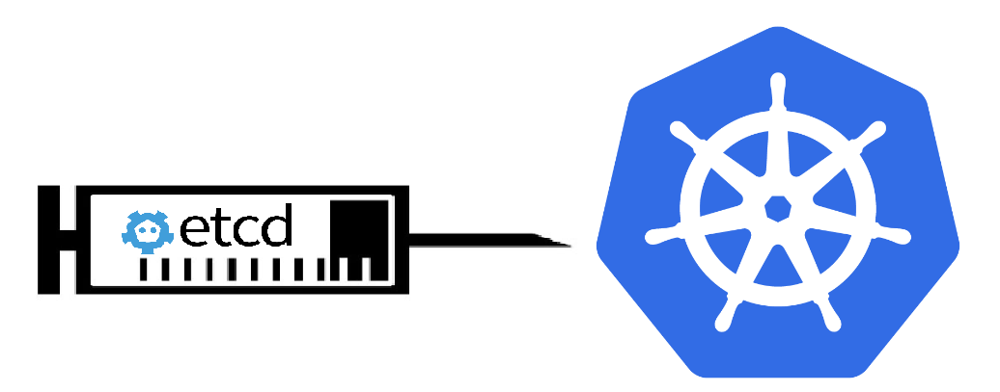
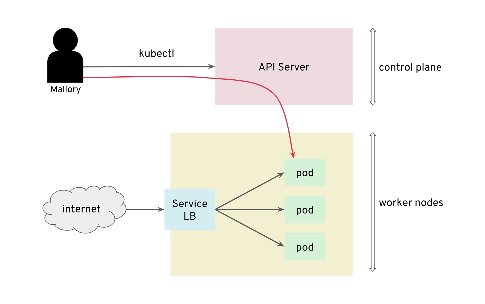
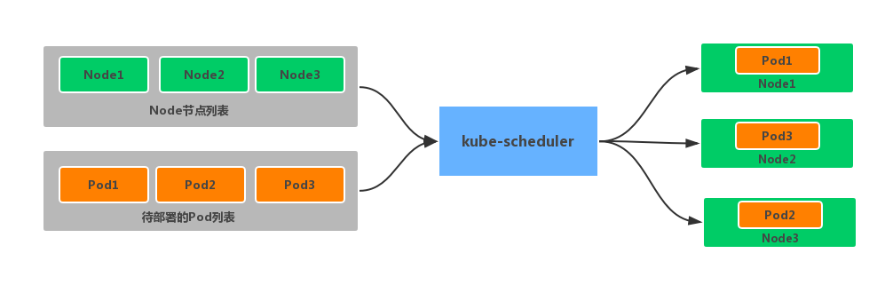
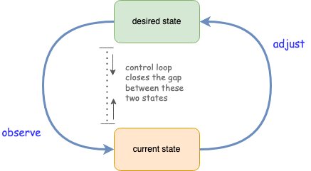
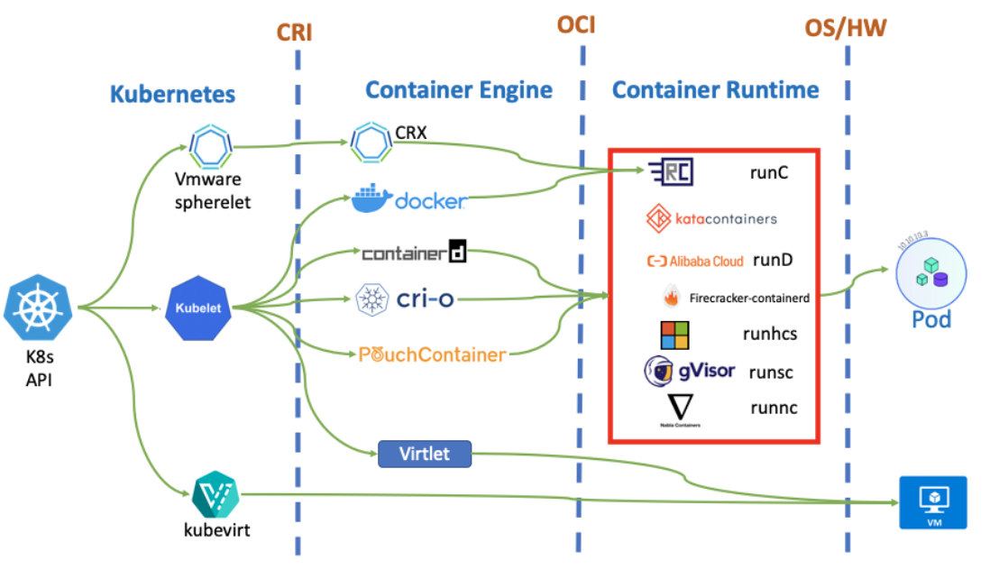
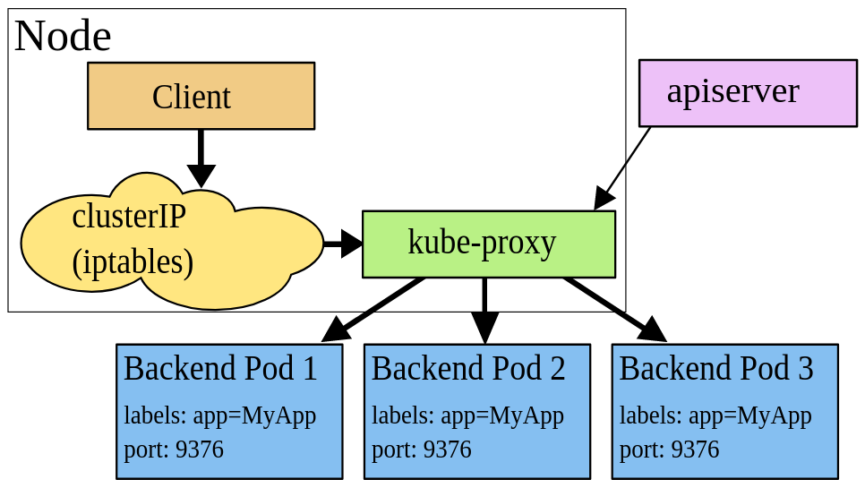
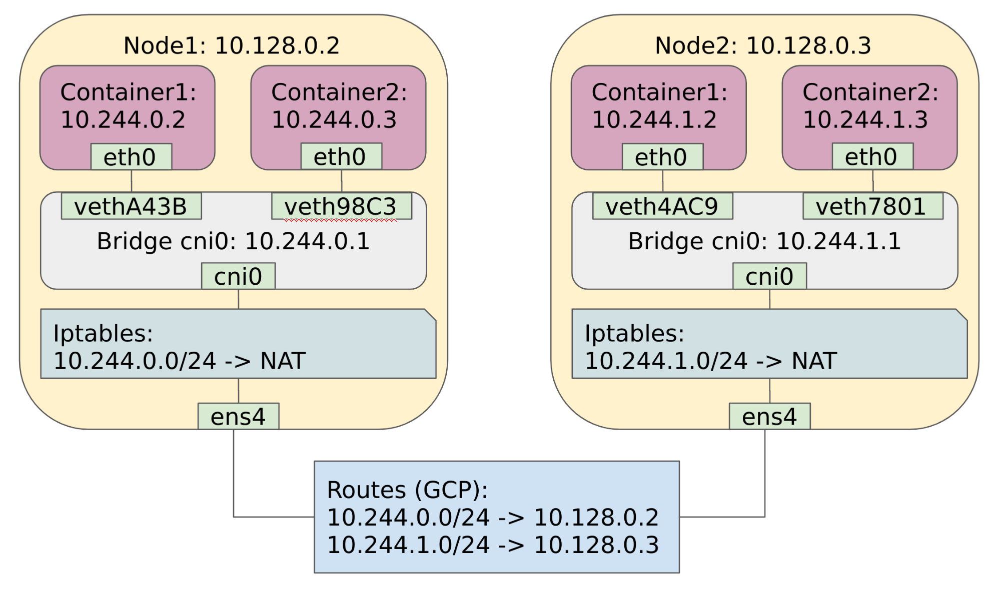
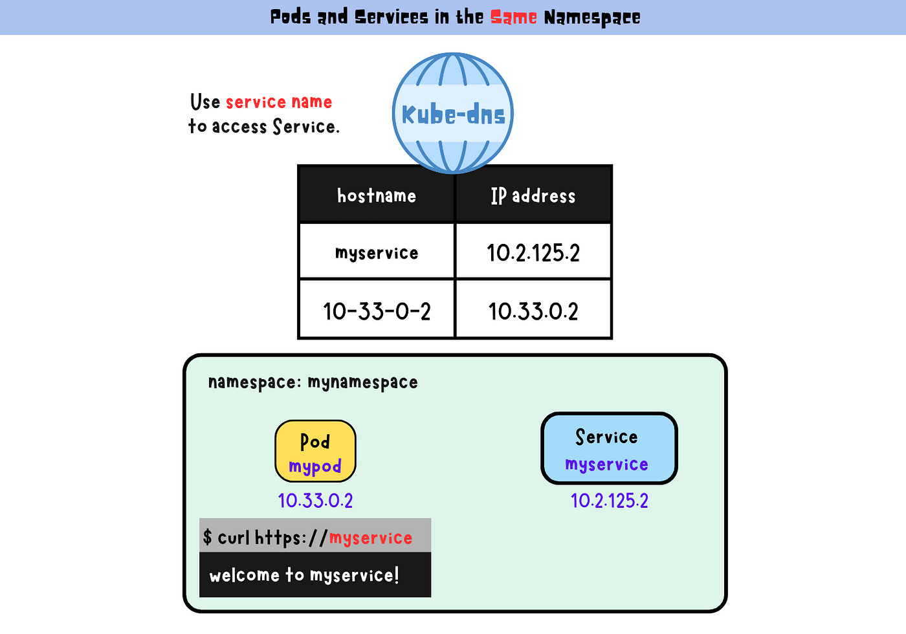
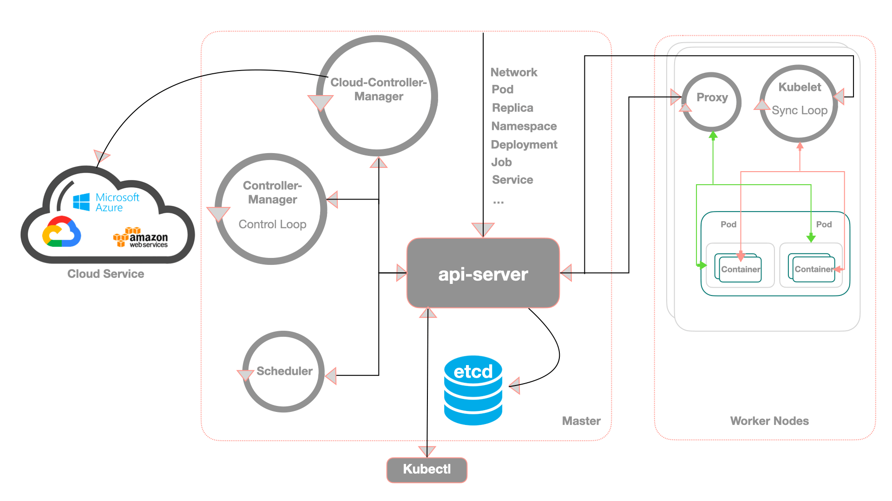
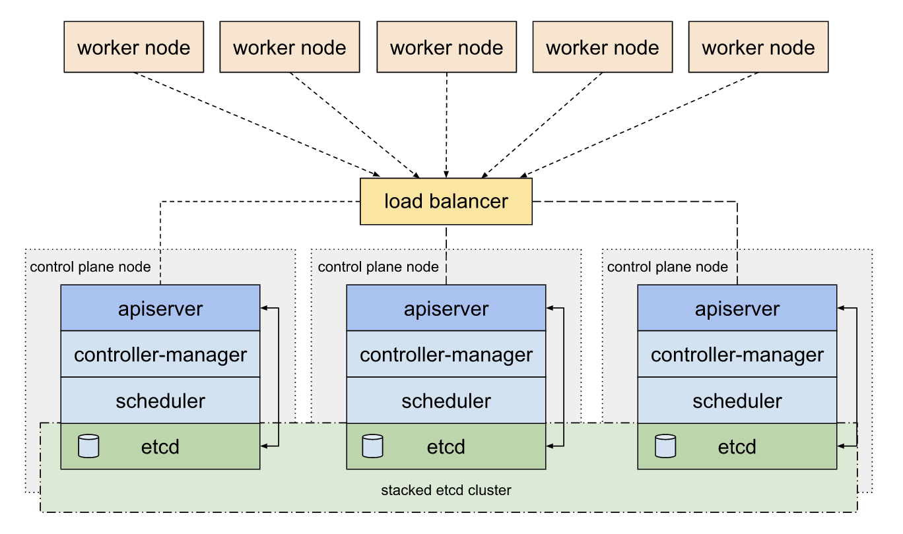

# 19장 쿠버네티스 아키텍처의 이해 & 20장 쿠버네티스와 미래

> 발표일 `24.07.09`
>
> 발표자 `박지환`

## 목차

- 쿠버네티스 아키텍처의 이해
- 쿠버네티스와 미래

## 쿠버네티스 아키텍처의 이해

1. etcd

- 코어OS에서 개발한 분산 KVS(Key-Value Store) 저장소.
- 쿠버네티스의 모든 정보를 저장하는 중앙 데이터베이스.
- 클러스터 구성은 분산 합의 알고리즘 `Raft`을 사용.
- etcd는 쿠버네티스 클러스터의 상태를 저장하고, 클러스터의 모든 노드에 걸쳐 일관성을 유지.



2. kube-apiserver

- 쿠버네티스의 API 서버.
- 클러스터의 모든 리소스를 생성, 수정, 삭제할 수 있는 REST API를 제공.
- kubectl 명령어 혹은 kube-scheduler, kube-controller-manager, kubelet 등의 컴포넌트가 API 서버와 통신.



3. kube-scheduler

- 기동할 노드 정보가 없는 파드를 감시하여 적절한 노드에 할당하는 역할.
- 파드를 어떤 노드에 배치할지 결정하는 정책을 가지고 있음. (Ex: 노드의 상태, 노드 어피니티, 인터파드 어피니티 등)



4. kube-controller-manager

- 쿠버네티스의 컨트롤러를 실행하는 컴포넌트.
- 컨트롤러는 클러스터의 상태를 관찰하고, 상태를 원하는 상태로 유지하기 위해 API 서버에 명령을 보냄. (Ex: 디플로이먼트, 레플리카셋 등)



5. kubelet

- 각 노드에서 실행되는 에이전트/구성 요소.
- 파드 스펙을 받아 파드를 실행하는 역할.
- kube-apiserver -> kube-scheduler -> kubelet 순으로 통신하여 파드를 실행.
- kubelet은 컨테이너 런타임과 통신하여 컨테이너를 실행하고, 컨테이너의 상태를 체크.



**컨테이너 런타임은 고수준(Docker, containerd, CRI-O)과 저수준(runc, runv, runsc)이 있음. (20장에서 자세히 다룸)**

6. kube-proxy

- 각 노드에서 실행되는 네트워크 프록시.
- 파드의 네트워크 트래픽을 로드 밸런싱하고, 파드 간 통신을 제공. (ClusterIP, NodePort)
- `--proxy-mode` 옵션을 통해 userspace, iptables, ipvs 모드를 선택할 수 있음.



7. CNI 플러그인

- 컨테이너 네트워크 인터페이스(CNI) 플러그인.
- 여러 노드에 걸쳐 파드 간 통신을 가능하게 하는 네트워크 플러그인.



8. kube-dns (CoreDNS)

- 쿠버네티스 클러스터 내부에서 DNS 서비스를 제공하는 역할.
- kube-dns는 내부에서 CoreDNS를 사용.
- 파드 간 통신을 위해 파드의 IP 주소를 DNS 이름으로 매핑.
- kube-api-server와 연계하고 있어, 파드 변경 시 DNS 레코드를 업데이트.



9. cloud-controller-manager

- 클라우드 제공자와 통신하는 컨트롤러.
- 클라우드 로드 밸런서 서비스와 연계 / 클라우드 경로 정보를 제어하는 처리.
- 클라우드 환경에서 자체 구축한 경우에는 환경에 맞는 컨트롤러를 구성해야 함.



10. 커스텀 리소스 데피니션과 오퍼레이터

- 쿠버네티스에서는 커스텀 리소스 데피니션(CRD)을 통해 사용자 정의 리소스를 정의할 수 있음.

**_예시: 커스텀 리소스 데피니션_**

```yaml
apiVersion: apiextensions.k8s.io/v1
kind: CustomResourceDefinition
metadata:
  name: crontabs.stable.example.com
spec:
  group: stable.example.com
  names:
    kind: Database
    listKind: DatabaseList
    plural: databases
    singular: database
  scope: Namespaced
  version: v1
```

**_예시: 커스텀 리소스 사용_**

```yaml
apiVersion: stable.example.com/v1
kind: Database
metadata:
  name: mysql
spec:
```



## 쿠버네티스와 미래

1. OCI (Open Container Initiative)

- 컨테이너 이미지와 런타임을 표준화하는 프로젝트.
- 구성:

  1. 컨테이너 런타임 표준 사양 (Runtime Specification)
  2. 컨테이너 이미지 형식 표준 사양 (Format Specification)
  3. 컨테이너 이미지 배포 표준 사양 (Distribution Specification).

- OCI를 준수하는 런타임은 같은 이미지를 사용할 수 있음.

2. CRI (Container Runtime Interface)

- 쿠버네티스와 컨테이너 런타임 간의 통신을 표준화하는 인터페이스.
- CRI를 준수하는 런타임은 쿠버네티스와 호환되어 사용할 수 있음.

3. CSI (Container Storage Interface)

- 쿠버네티스와 스토리지 시스템 간의 통신을 표준화하는 인터페이스.
- CSI 인터페이스를 구현해 두면, 쿠버네티스 클러스터에 다양한 스토리지 시스템을 연결할 수 있고 스토리지용 인터페이스를 개별적으로 구현할 필요가 없어서 유지보수가 용이.

4. CNI (Container Network Interface)

- 쿠버네티스와 네트워크 플러그인 간의 통신을 표준화하는 인터페이스.
- CNI 준거하는 대표적인 소프트웨어: Project Calico, Cilium.
